# DaVinci Codex Architecture Guide

## System Overview

The DaVinci Codex project implements a layered architecture that separates concerns while maintaining historical accuracy and computational rigor. This guide details the system architecture, component interactions, and extension points for contributors.

## High-Level Architecture

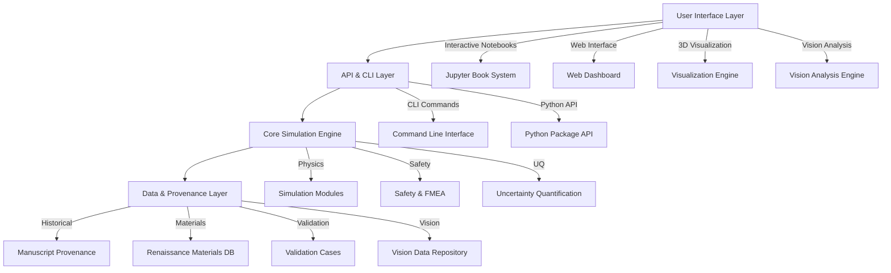

## Component Architecture

### 1. Research Foundation Layer

This layer ensures historical authenticity and academic rigor.

#### Manuscript Provenance System
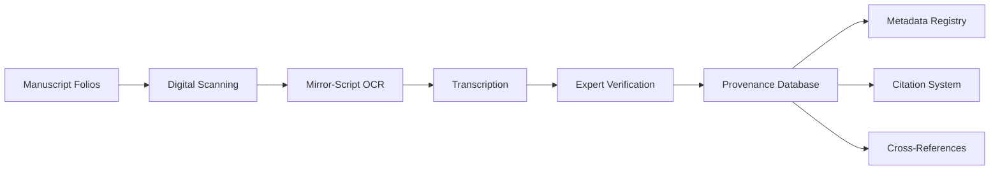

**Key Components:**
- **Folio Registry**: Complete catalog with archive identifiers
- **Transcription Pipeline**: OCR + paleographic verification
- **Metadata System**: Structured historical context
- **Citation Engine**: Academic reference management

#### Renaissance Materials Database
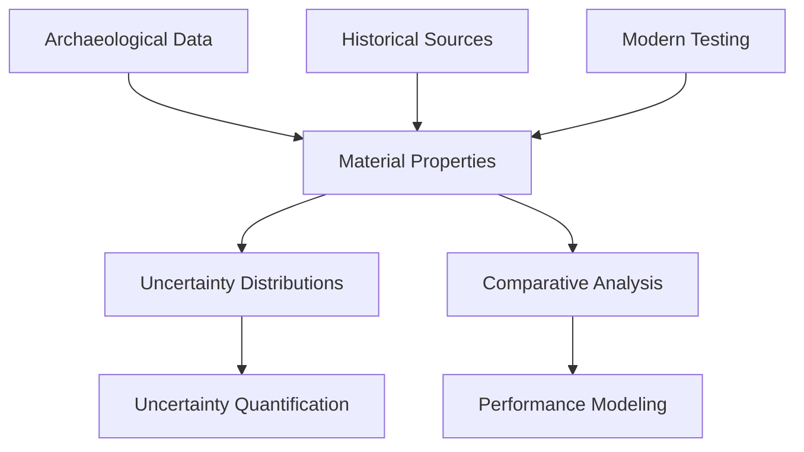

**Features:**
- Density, modulus, fatigue limits with uncertainty
- Archaeological validation from period sources
- Modern material comparison matrices
- Uncertainty propagation through simulations

### 2. Computational Modeling Core

The simulation engine that brings Leonardo's designs to life.

#### Physics Framework Architecture
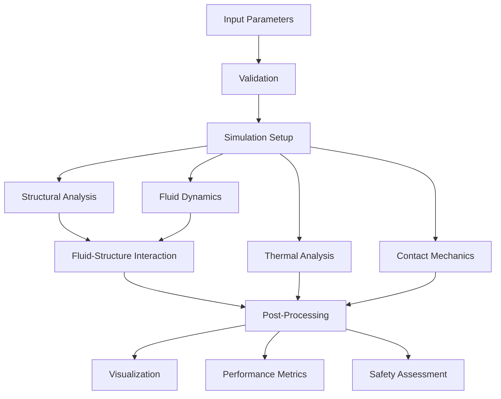

**Simulation Capabilities:**
- **Structural**: Finite element analysis with validated primitives
- **Fluid Dynamics**: CFD with URANS/LES for complex flows
- **FSI Coupling**: Unsteady aerodynamic-structural interaction
- **Tribology**: Friction, wear, and lubrication modeling
- **Uncertainty Quantification**: Monte Carlo and Sobol sampling

#### Primitive Mechanical Library
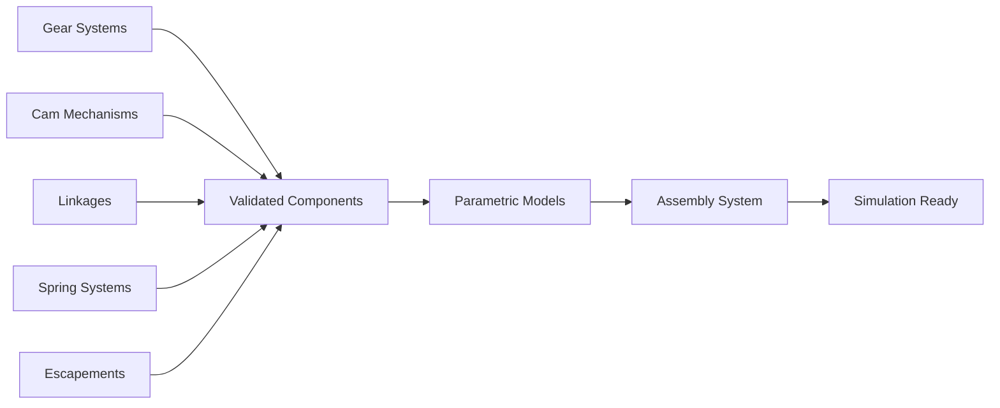

**Component Library:**
- Validated gear stress analysis (Lewis equation + FEA)
- Cam profile generation and contact modeling
- Four-bar linkage optimization
- Spring energy storage and release
- Escapement timing and regulation

### 3. Educational Interface Layer

Making complex research accessible and engaging.

#### Interactive Documentation System
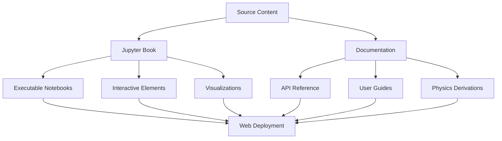

**Features:**
- Executable computational essays
- Interactive parameter exploration
- Progressive learning complexity
- Multi-modal content (text, equations, code, visualizations)
- Mobile-responsive design

#### Maker Integration Platform
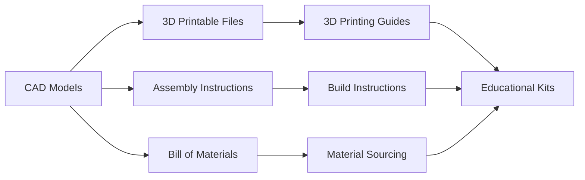

**Deliverables:**
- Parametric CAD models for all inventions
- 3D printable STL files with print settings
- Step-by-step assembly guides
- Educational curriculum integration

### 4. API & Integration Layer

Connecting to external systems and enabling extensions.

#### REST API Architecture
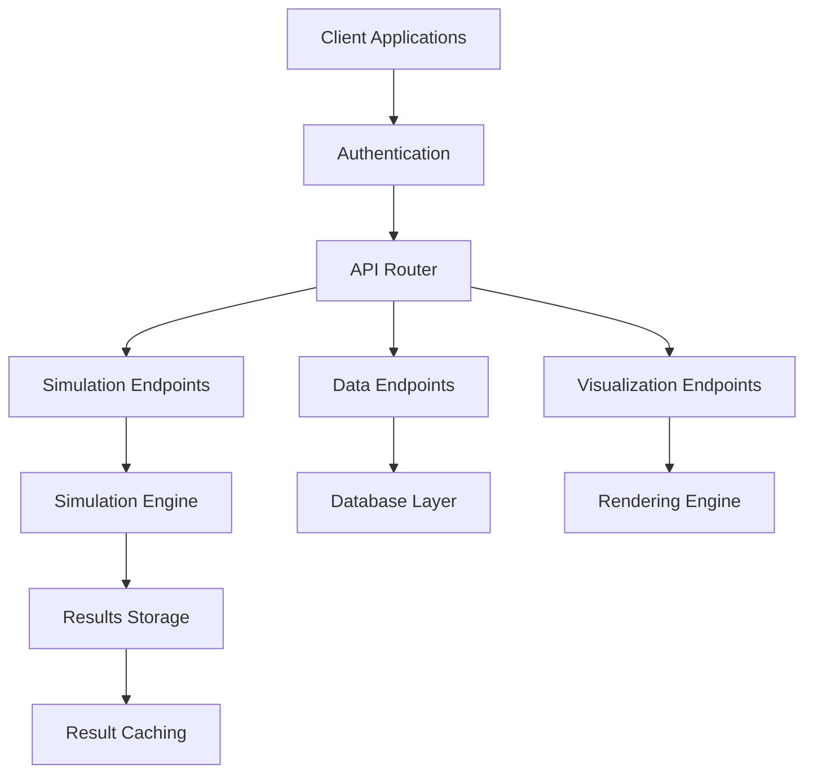

**API Endpoints:**
- `/api/v1/inventions/` - Invention catalog
- `/api/v1/simulate/{invention}` - Run simulations
- `/api/v1/visualize/{invention}` - Generate visualizations
- `/api/v1/provenance/{folio}` - Historical provenance
- `/api/v1/materials/` - Materials database

#### External Integrations
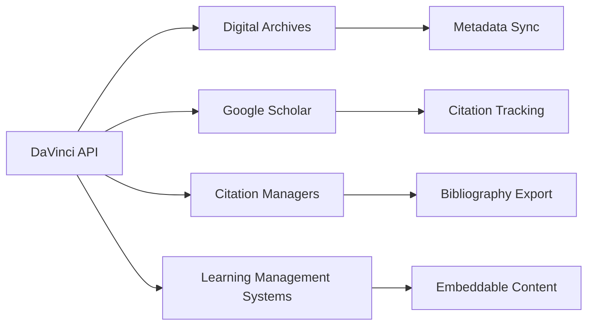

**Integration Points:**
- Digital manuscript archives (automatic sync)
- Academic citation systems (impact tracking)
- Learning management systems (curriculum delivery)
- Social platforms (community engagement)

## Data Flow Architecture

### Simulation Pipeline
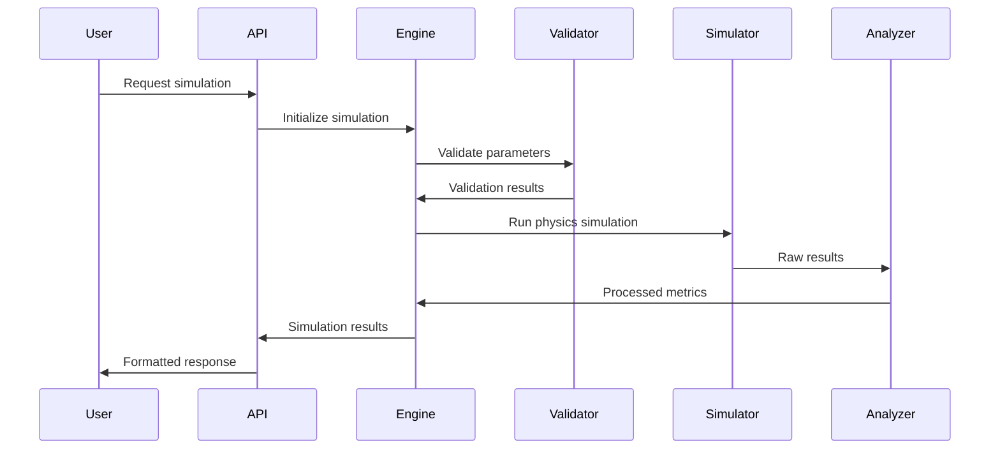

### Historical Research Workflow
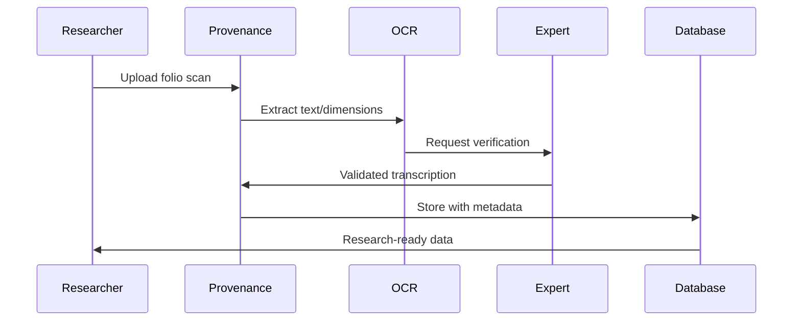

## Security Architecture

### Authentication & Authorization
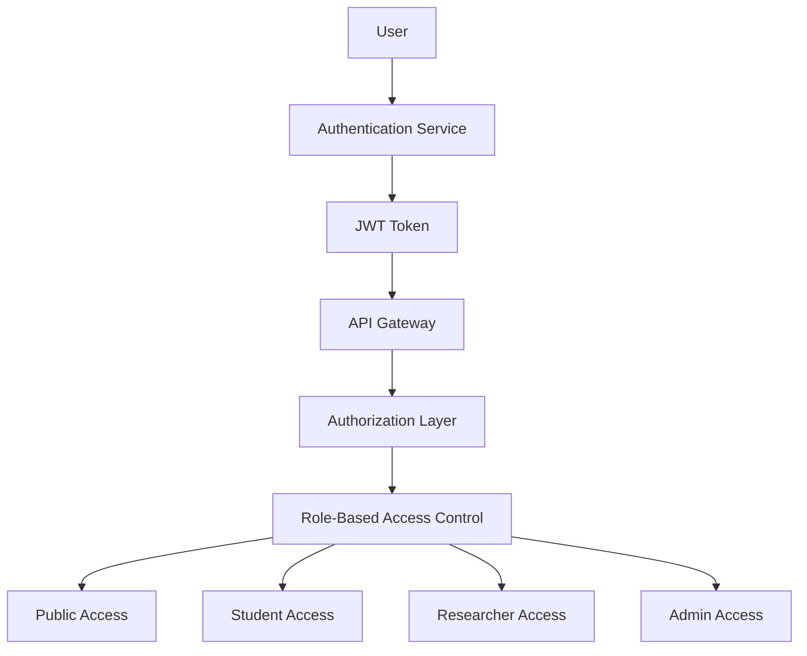

**Access Levels:**
- **Public**: Basic simulations, documentation
- **Student**: Educational content, guided tutorials
- **Researcher**: Advanced simulations, data export
- **Admin**: System management, user administration

### Data Protection
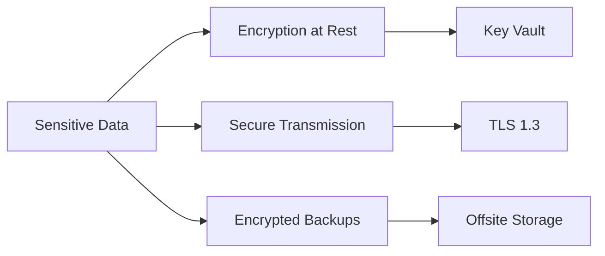

**Security Measures:**
- AES-256 encryption for sensitive data
- TLS 1.3 for all communications
- Regular security audits and penetration testing
- GDPR compliance for user data

## Performance Architecture

### Caching Strategy
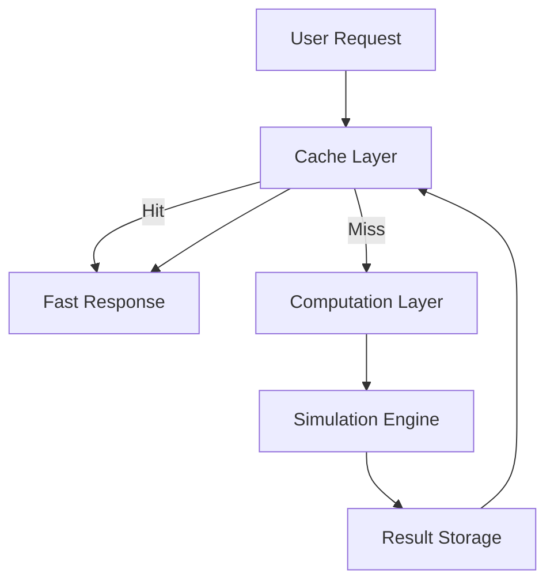

**Caching Layers:**
- **Memory Cache**: Frequently accessed simulations
- **Disk Cache**: Large visualization files
- **CDN Cache**: Static assets and documentation
- **Database Cache**: Query result optimization

### Scalability Design
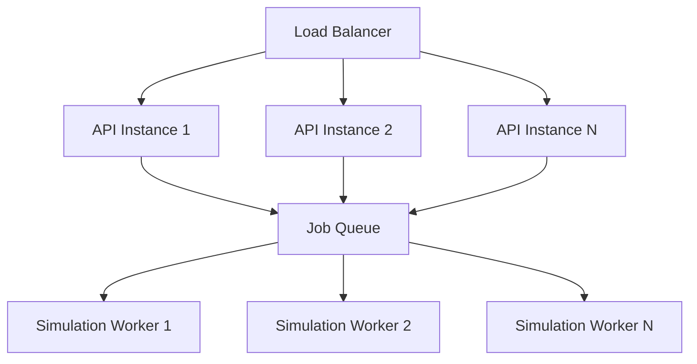

**Scalability Features:**
- Horizontal scaling for API servers
- Distributed job queue for simulations
- Auto-scaling based on demand
- Microservices architecture for components

## Extension Points

### Plugin Architecture
```python
class InventionPlugin:
    """Base class for invention plugins"""
    
    def __init__(self, config: PluginConfig):
        self.config = config
        self.metadata = self.load_metadata()
    
    def simulate(self, parameters: Dict) -> SimulationResults:
        """Run physics simulation"""
        raise NotImplementedError
    
    def visualize(self, results: SimulationResults) -> Visualization:
        """Create visualization"""
        raise NotImplementedError
    
    def analyze(self, results: SimulationResults) -> Analysis:
        """Perform analysis"""
        raise NotImplementedError
```

### Custom Material Models
```python
class MaterialModel:
    """Base class for material property models"""
    
    def get_properties(self, temperature: float, strain_rate: float) -> MaterialProperties:
        """Get material properties for conditions"""
        raise NotImplementedError
    
    def get_uncertainty(self) -> UncertaintyDistribution:
        """Get uncertainty distribution"""
        raise NotImplementedError
```

### Visualization Renderers
```python
class VisualizationRenderer:
    """Base class for visualization renderers"""
    
    def render_3d(self, geometry: Geometry, results: SimulationResults) -> Visualization3D:
        """Render 3D visualization"""
        raise NotImplementedError
    
    def render_chart(self, data: DataFrame, chart_type: str) -> Chart:
        """Render 2D chart"""
        raise NotImplementedError
```

## Development Guidelines

### Code Organization
```
src/davinci_codex/
├── core/              # Core simulation engine
├── inventions/        # Invention-specific modules
├── primitives/        # Reusable mechanical components
├── materials/         # Material property models
├── visualization/     # Rendering and visualization
├── api/              # REST API implementation
├── cli/              # Command-line interface
├── safety/           # FMEA and safety analysis
├── uncertainty/      # UQ and sensitivity analysis
└── utils/            # Utility functions
```

### Testing Strategy
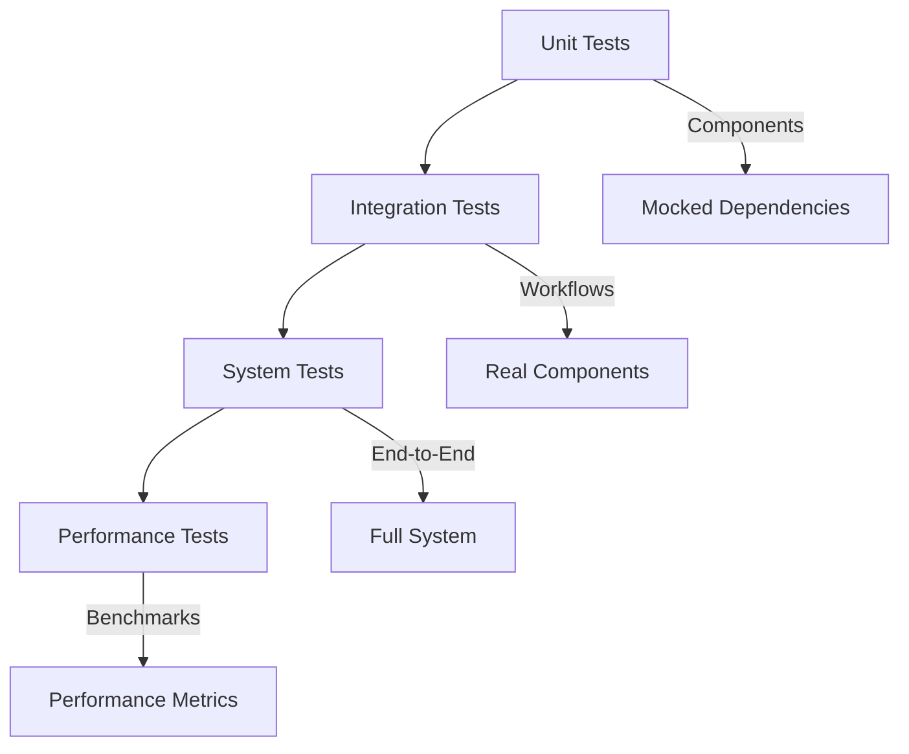

**Testing Levels:**
- **Unit Tests**: Individual component validation
- **Integration Tests**: Component interaction testing
- **System Tests**: End-to-end workflow validation
- **Performance Tests**: Benchmark and regression testing

### Documentation Standards
- **Code Documentation**: Comprehensive docstrings with examples
- **API Documentation**: OpenAPI specifications with interactive testing
- **User Documentation**: Step-by-step guides with screenshots
- **Technical Documentation**: Architecture and design decisions

## Deployment Architecture

### Production Environment
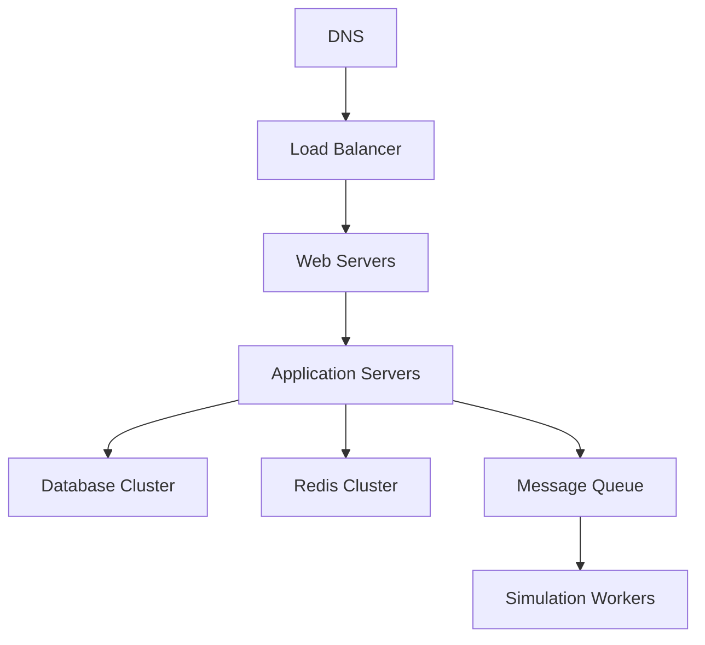

**Infrastructure:**
- **Web Tier**: Nginx reverse proxy with SSL termination
- **Application Tier**: Gunicorn WSGI servers
- **Database Tier**: PostgreSQL with read replicas
- **Cache Tier**: Redis cluster for session/result caching
- **Compute Tier**: Kubernetes for simulation workers

### CI/CD Pipeline
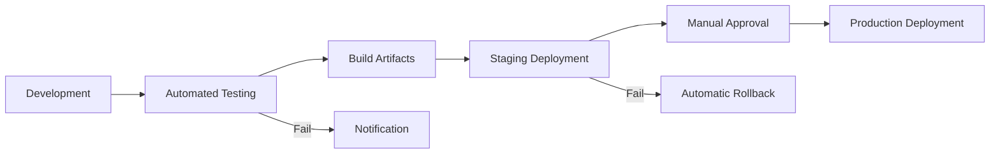

**Pipeline Stages:**
1. **Code Quality**: Linting, type checking, security scanning
2. **Testing**: Unit, integration, and performance tests
3. **Building**: Docker image creation and artifact packaging
4. **Staging**: Deployment to staging environment
5. **Production**: Blue-green deployment with health checks

---

This architecture guide provides the foundation for understanding and extending the DaVinci Codex system. For specific implementation details, refer to the individual component documentation and API references.