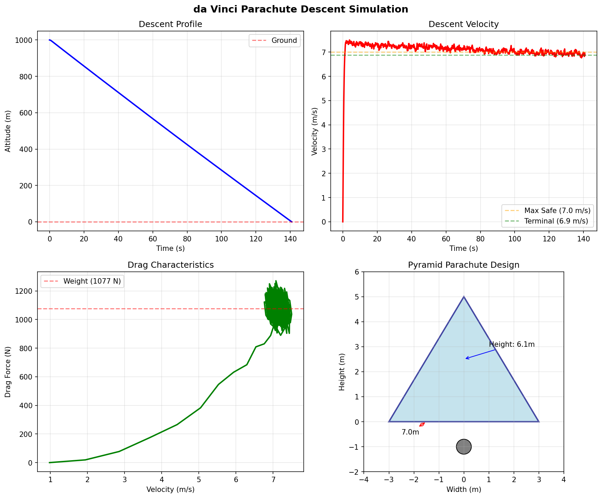
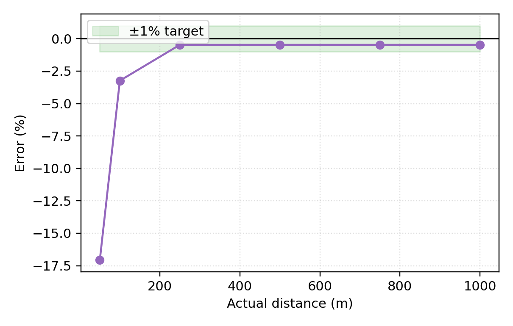

# The da Vinci Codex Project
## Computational archaeology of Leonardo's mechanical inventions

<div align="center">

[](https://www.python.org/downloads/)
[](LICENSE)
[](https://github.com/Shannon-Labs/davinci-codex/actions/workflows/ci.yml)
[](https://shannon-labs.github.io/davinci-codex/)
[](https://colab.research.google.com/github/Shannon-Labs/davinci-codex/blob/main/notebooks/Quickstart.ipynb)

Open-source simulations, CAD, and educational content for Leonardo’s mechanical portfolio — flight, automata, instruments, and civil works.

`Docs` • `Gallery` • `CLI` • `CAD` • `Education`

17 inventions with runnable simulations and CAD-backed assets

</div>

---

## Why this repository exists
- Reconstruct Leonardo’s inventions with modern physics, safety, and materials.
- Provide reproducible simulations, CAD assets, and validation cases for 17 systems.
- Serve educators and museums with interactive demos and historical provenance.
- Encourage contributions that respect non-weaponization and open scholarship.

### Signature builds (current hero demos)
- **Validated**: Aerial Screw (variable-pitch, 1,416N lift), Mechanical Lion (30s cam choreography).
- **Prototype-ready**: Parachute (6.9 m/s descent), Self-Propelled Cart (spring-drive), Mechanical Drum, Mechanical Odometer.
- **Research-stage**: Ornithopter, Programmable Loom, Variable Pitch Mechanism, Revolving Bridge, Armored Walker.

---

## Invention lineup (by readiness)

| Status | Inventions | What to run |
| --- | --- | --- |
| **Validated** | Aerial Screw • Mechanical Lion | `davinci-codex simulate --slug aerial_screw`<br>`davinci-codex simulate --slug mechanical_lion` |
| **Prototype-ready** | Parachute • Self-Propelled Cart • Mechanical Drum • Mechanical Odometer | `davinci-codex evaluate --slug parachute`<br>`davinci-codex pipeline --slug self_propelled_cart` |
| **Research-stage** | Ornithopter • Variable Pitch Mechanism • Programmable Loom • Revolving Bridge • Armored Walker | `davinci-codex simulate --slug ornithopter` (experimental) |
| **Concept reconstructions** | Mechanical Carillon • Organ • Viola Organista • Trumpeter • Programmable Flute • Mechanical Ensemble | `davinci-codex simulate --slug viola_organista` (concept) |

More detail: see `docs/` and the per-invention pages on the [documentation site](https://shannon-labs.github.io/davinci-codex/).

### Current registry (generated from `registry.list_inventions()`)

_This table is regenerated from the Python registry; run `make regen-readme-table` after changing any invention module._

> Status definitions (summary):
> - `validated`: simulation and validation suite in place, with documented metrics and safety review.
> - `prototype_ready`: simulations plus a build/validation plan sufficient for a careful workshop prototype.
> - `simulation_prototype` / `in_progress`: active reconstruction work with core models running but validation still in progress.
> - `concept_reconstruction`: historically grounded reconstruction focused on geometry and motion, with limited quantitative validation.

<!-- BEGIN INVENTION_REGISTRY -->
| Slug | Title | Status | Summary |
| --- | --- | --- | --- |
| aerial_screw | Leonardo's Aerial Screw - Advanced Aerodynamic Analysis | validated | Comprehensive aerodynamic analysis of Leonardo's helical air screw using modern blade element momentum theory. |
| armored_walker | The Armored Walker | simulation_prototype | A walking war machine combining the chassis of the Self-Propelled Cart with the leg mechanism of the Mechanical Lion. |
| mechanical_carillon | Mechanical Carillon | concept_reconstruction | Rotating drum that indexes bell strikers for programmable chimes. |
| mechanical_drum | Mechanical Drum | prototype_ready | Programmable percussion device with cam barrels for rhythm patterns. |
| mechanical_ensemble | Leonardo Mechanical Ensemble | concept_reconstruction | Coordinated simulations for Leonardo''s automated musical inventions. |
| mechanical_lion | Leonardo's Mechanical Lion - Complete Walking and Reveal Mechanism | validated | Reconstruction of Leonardo's cam-based walking mechanism with chest cavity reveal for the 1515 Mechanical Lion automaton. |
| mechanical_odometer | Leonardo's Mechanical Odometer Cart | prototype_ready | Enhanced distance-measuring cart with realistic pebble-drop physics and comprehensive error analysis. |
| mechanical_organ | Automatic Pipe Organ | concept_reconstruction | Self-playing pipe organ driven by pinned barrels and dual bellows. |
| mechanical_trumpeter | Mechanical Trumpeter | concept_reconstruction | Automated trumpeter automaton with programmable fingering and bellows-driven breath. |
| ornithopter | Bio-inspired Ornithopter Flight Lab | in_progress | Advanced flapping-wing flight with unsteady aerodynamics and bio-inspired mechanics. |
| parachute | Pyramid Parachute | prototype_ready | Modern analysis of da Vinci's pyramid-shaped parachute with advanced aerodynamic modeling, stability assessment, and historical accuracy. |
| programmable_flute | Programmable Flute | concept_reconstruction | Cam-driven recorder with automatic fingering and regulated airflow. |
| programmable_loom | Leonardo's Programmable Loom - Textile Pattern Automation | in_progress | Automatic loom concept with cam-based pattern programming for repeatable textile motifs, reconstructed from Codex Atlanticus folios 1090r-1091v. |
| revolving_bridge | Leonardo's Revolving Bridge - Advanced Engineering Implementation | in_progress | Leonardo da Vinci's innovative rotating bridge with water-filled counterweight system, featuring advanced mechanical analysis and educational visualization. |
| self_propelled_cart | Self-Propelled Cart | prototype_ready | Spring-driven cart with multi-stage gear reduction and escapement control for autonomous theatrical motion. |
| variable_pitch_mechanism | Variable Pitch Swashplate Mechanism | in_progress | Swashplate-based variable pitch control system for aerial screw blades |
| viola_organista | Viola Organista | concept_reconstruction | Continuous wheel-bowed keyboard capable of polyphonic string performance. |
<!-- END INVENTION_REGISTRY -->
---

## Quickstart

- Install from source (Python 3.9+):
  ```bash
  pip install git+https://github.com/Shannon-Labs/davinci-codex.git
  ```
- List available inventions:
  ```bash
  davinci-codex list | head
  ```
- Run a hero demo:
  ```bash
  davinci-codex simulate --slug parachute --seed 0 --fidelity educational
  davinci-codex simulate --slug mechanical_lion --seed 1
  ```
- Fast checks:
  ```bash
  make smoke     # quick validation
  make test      # full pytest suite
  make lint      # ruff + mypy
  ```
- Notebook quickstart: open the Colab badge above or `notebooks/Quickstart.ipynb`.

### If you have 2 minutes, try this (validated demo)
```bash
pip install git+https://github.com/Shannon-Labs/davinci-codex.git
davinci-codex list
davinci-codex simulate --slug aerial_screw --seed 3 --fidelity educational
open artifacts/aerial_screw/sim/performance.png  # or view in your file browser
```

---

## Featured visuals

<div align="center">

| Flight Systems | Automata & Robotics | Measurement & Mobility |
| --- | --- | --- |
|  |  |  |
| Parachute descent validation | Mechanical Lion choreography | Odometer accuracy study |

</div>

More galleries live in `artifacts/` and on the [docs site](https://shannon-labs.github.io/davinci-codex/).

---

## What makes this special
- **End-to-end**: CAD → simulation → validation → gallery assets in one place.
- **Historical rigor**: Provenance in `PROVENANCE/`, materials in `materials/`, ethics in `ETHICS.md`.
- **Educational-first**: Seeded simulations, reproducible notebooks, and buildable assets for teaching and exhibits.
- **Non-weaponized**: Every design is filtered through a safety and ethics lens.

---

## Repository layout (what to open first)

- `src/davinci_codex/` — core code, CLI, registry, pipelines, invention modules.
- `docs/` — Jupyter Book sources, images, and API docs (`make book` to build).
- `artifacts/` — generated plots, animations, and reports.
- `cad/`, `sims/`, `validation/` — CAD models, simulation configs, and benchmark cases.
- `tests/` — unit/integration/benchmark suites; `validation/` holds convergence studies.
- `PROVENANCE/`, `materials/` — manuscript references and materials database.

---

## Contribution guide (short version)
- Open issues with folio references and safety considerations.
- Keep changes reproducible: add tests and update docs for new inventions.
- Respect the non-weaponization charter (see `ETHICS.md`).
- Start with `make lint && make test`. See `CONTRIBUTING.md` for full details.

---

## License & citation
- Code: MIT (see `LICENSE`)
- Media: CC0 1.0 Universal (see `LICENSE-CC0`)

Citation:
```bibtex
@software{davinci_codex_2025,
  author = {Bown, Hunter},
  title = {The da Vinci Codex: Computational Archaeology of Renaissance Mechanical Engineering},
  year = {2025},
  publisher = {GitHub},
  url = {https://github.com/Shannon-Labs/davinci-codex}
}
```

Contact: hunter@shannonlabs.dev • https://shannon-labs.github.io/davinci-codex/
