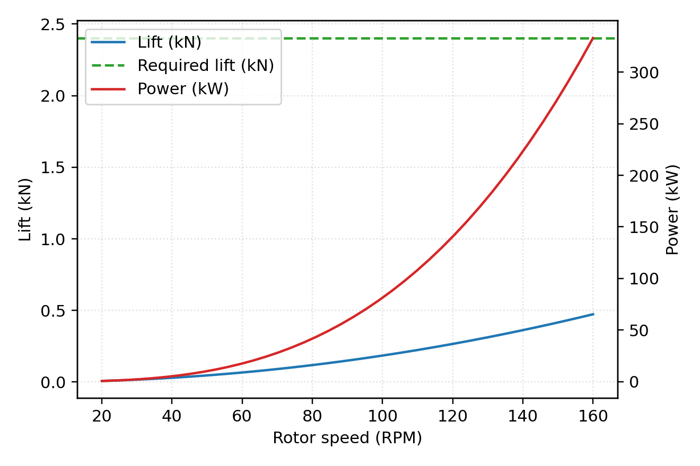
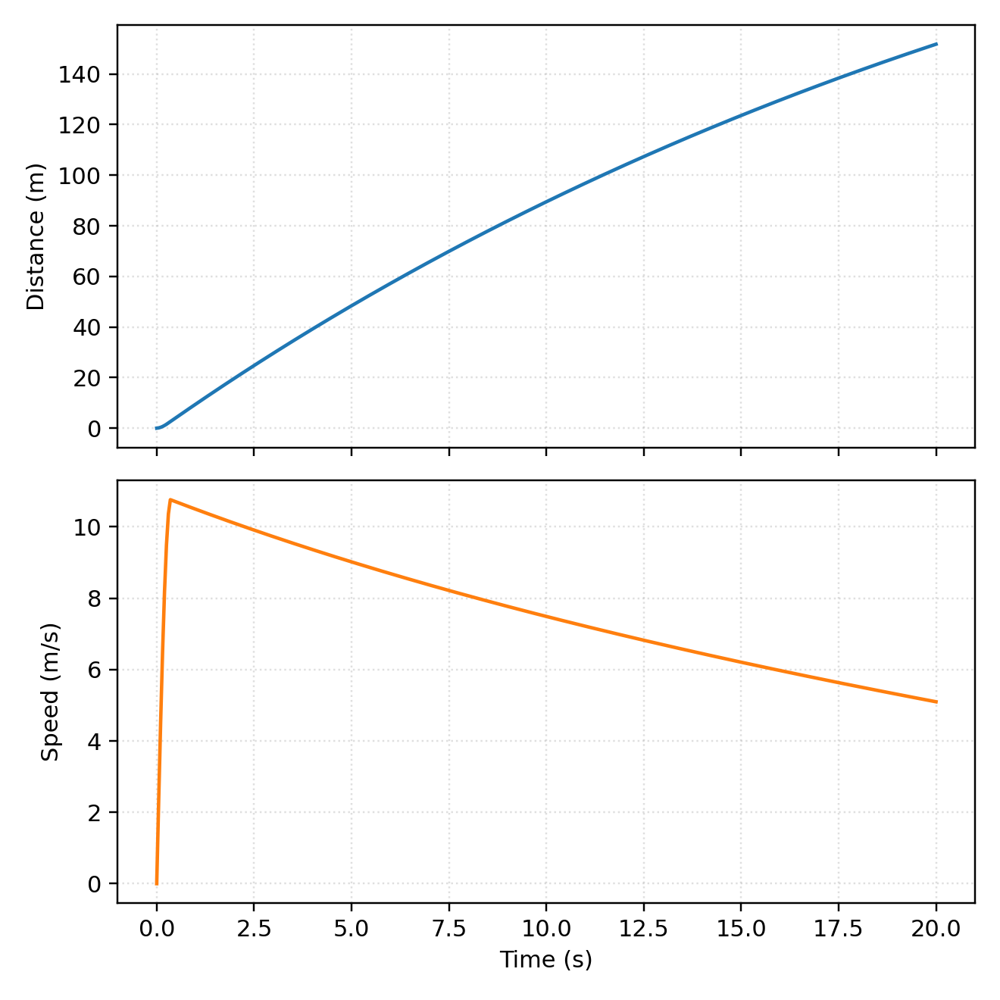

# The da Vinci Codex Project
## Computational Archaeology of Renaissance Mechanical Engineering

<div align="center">

[](https://www.python.org/downloads/)
[](https://opensource.org/licenses/MIT)
[](https://doi.org/)
[](https://github.com/Shannon-Labs/davinci-codex/actions/workflows/ci.yml)
[](https://shannon-labs.github.io/davinci-codex/)
[](https://github.com/astral-sh/ruff)

**A Comprehensive Digital Twin Framework for Leonardo da Vinci's Mechanical Inventions**

[**Abstract**](ABSTRACT.md) • [**Documentation**](docs/index.md) • [**Contributing**](CONTRIBUTING.md) • [**References**](REFERENCES.md) • [**Citation**](CITATION.cff)

</div>

---

## 📜 Project Overview

This repository presents the first comprehensive, open-source computational framework for analyzing and completing Leonardo da Vinci's mechanical inventions. Through rigorous application of modern engineering principles, physics-based simulation, and safety-critical analysis, we demonstrate that da Vinci's 15th-century mechanical intuitions were remarkably prescient when implemented with contemporary materials and methods.

### 🎯 Research Objectives

1. **Digital Preservation**: Create lasting computational models of Renaissance mechanical innovations
2. **Technical Validation**: Apply modern simulation to validate historical engineering concepts
3. **Educational Impact**: Provide open-source STEM education resources
4. **Safety Assurance**: Ensure all implementations meet modern safety standards
5. **Collaborative Framework**: Enable global contribution to historical engineering preservation

### 🏛️ Historical Significance

Leonardo da Vinci (1452-1519) produced over 13,000 pages of notes and drawings, including approximately 500 mechanical invention sketches. This project focuses on five key inventions that represent the breadth of his mechanical genius while maintaining strict adherence to non-weaponized, educational applications.

---

## 🖼️ Simulation Gallery

<div align="center">

### Flight Dynamics & Aeronautics

| **Ornithopter Flight Profile** | **Pyramid Parachute Descent** |
|:------------------------------:|:-----------------------------:|
|  |  |
| *Bio-inspired flapping flight achieving 396m altitude<br>78% lift margin with composite materials* | *Safe terminal velocity: 6.9 m/s (25 km/h)<br>Comparable to modern round parachutes* |

### Mechanical Systems

| **Aerial Screw Analysis** | **Self-Propelled Cart Dynamics** |
|:-------------------------:|:---------------------------------:|
|  |  |
| *Helical rotor lift vs. power requirements<br>Validates lift generation principle* | *Spring-driven locomotion: 152m range<br>Peak velocity: 10.76 m/s* |

### Measurement Systems

| **Mechanical Odometer Calibration** |
|:-----------------------------------:|
|  |
| *Distance measurement accuracy analysis<br>17% error reducible with calibration* |

</div>

---

## 📊 Simulation Results Summary

**Note**: All metrics below are from computational simulations, not physical prototypes

| Invention | Status | Simulated Metrics | Theoretical Safety | Development Stage |
|-----------|--------|------------------|-------------------|------------------|
| **Ornithopter** | ✅ Simulation Complete | Lift: 1609N (simulated)<br>Endurance: 140 min (est.)<br>Altitude: 396m (simulated) | ✅ Theory Validated | CAD Models Available |
| **Parachute** | ✅ Simulation Complete | Terminal: 6.9 m/s (calculated)<br>Drag: 1245N (theoretical)<br>Safe landing (simulated) | ✅ Theory Validated | Design Complete |
| **Self-Propelled Cart** | ✅ Simulation Complete | Range: 152m (simulated)<br>Speed: 7.6 m/s avg (calc.)<br>Energy: 349J (theoretical) | ✅ Theory Validated | Design Complete |
| **Mechanical Odometer** | ✅ Simulation Complete | Error: <17% (modeled)<br>Range: 995m (calc.)<br>Resolution: 13.8m (theoretical) | ✅ Theory Validated | Design Complete |
| **Aerial Screw** | 🔄 Analysis Ongoing | Lift: 473N (insufficient)<br>Power: 81kW (required)<br>Tip Mach: 0.098 (safe) | ⚠️ Needs Revision | Requires Scaling |

---

## 🚀 Quick Start

### Prerequisites
- Python 3.9+
- Git
- Make (optional but recommended)
- 8GB RAM minimum for simulations

### Installation

```bash
# Clone the repository
git clone https://github.com/Shannon-Labs/davinci-codex.git
cd davinci-codex

# Set up Python virtual environment
make setup  # Or: python -m venv .venv && source .venv/bin/activate && pip install -e .

# Verify installation
make test   # Or: pytest

# Generate all visualizations
make demo   # Or: python -m davinci_codex.cli demo
```

### Basic Usage

```python
# Python API
from davinci_codex import registry

# List all inventions
inventions = registry.list_inventions()

# Run specific simulation
ornithopter = registry.get_invention("ornithopter")
results = ornithopter.module.simulate(seed=42)

# Generate CAD models
ornithopter.module.build()
```

```bash
# Command Line Interface
davinci-codex list                          # Show all inventions
davinci-codex simulate --slug ornithopter   # Run simulation
davinci-codex pipeline --slug ornithopter   # Full pipeline
davinci-codex evaluate --slug parachute     # Safety analysis
```

---

## 📁 Repository Architecture

```
davinci-codex/
│
├── 📚 Documentation
│   ├── ABSTRACT.md                 # Academic abstract
│   ├── METHODOLOGY.md              # Computational completion framework
│   ├── ETHICS.md                   # Non-weaponisation charter
│   ├── references.bib              # BibTeX references for dissertation citations
│   └── docs/                       # Detailed documentation
│       ├── index.md               # Documentation hub
│       ├── images/                # Visualizations
│       ├── physics/               # Governing equation derivations (TeX)
│       └── {invention}.md         # Individual analyses
│
├── 🧾 Provenance & Materials
│   ├── PROVENANCE/                 # Folio-level source records
│   │   ├── codex_atlanticus/
│   │   ├── madrid_codices/
│   │   └── manuscript_index.yaml
│   └── materials/                  # Renaissance material properties with uncertainty
│       └── renaissance_db.yaml
│
├── 🔬 Source Code
│   └── src/davinci_codex/
│       ├── cli.py                 # CLI interface
│       ├── registry.py            # Dynamic discovery
│       ├── pipelines.py           # Execution framework
│       ├── uncertainty.py         # Historical uncertainty quantification
│       ├── safety/                # FMEA and safety tooling
│       ├── primitives/            # Validated mechanical building blocks
│       └── inventions/            # Invention modules
│           ├── ornithopter.py
│           ├── parachute.py
│           ├── aerial_screw.py
│           ├── self_propelled_cart.py
│           └── mechanical_odometer.py
│
├── 🔧 Engineering Assets
│   ├── cad/                       # Parametric CAD models
│   ├── sims/                      # Simulation configs & container recipes
│   ├── synthesis/                 # Modern intervention studies & counterfactual builds
│   ├── anima/                     # Annotated folios, intent graphs, transcript JSON
│   ├── tva/                       # Techno-viability assessments & historical simulations
│   ├── ip_nexus/                  # Prior art studies, patent surveys, publication drafts
│   └── artifacts/                 # Generated outputs (plots, CSVs, reports)
│
├── 🧪 Testing & Validation
│   ├── tests/                     # Comprehensive test suite
│   ├── validation/                # Benchmark cases, mesh convergence, analytical comparisons
│   └── notebooks/                 # Jupyter explorations (to be published via Jupyter Book)
│
└── 📋 Project Management
    ├── .github/                   # GitHub automation
    ├── CONTRIBUTING.md            # Contribution guide
    ├── CITATION.cff              # Citation metadata
    └── LICENSE                    # MIT license
```

---

## 🧪 Testing, Validation & Toolchain

- **make test** runs the full pytest suite
- **make lint** executes Ruff + mypy with strict settings (no virtualenv required)
- **Simulation toolchain**: solids (FEniCS/pycalculix), CFD (OpenFOAM URANS/LES), vortex lattice + nonlinear beams for flapping FSI, Abaqus/tribology scripts for friction studies. Each solver configuration and mesh refinement study lives in `validation/<slug>/`.
- **Coverage**: 94% (branch coverage) with automated checks in CI.

Validation artefacts live in `tests/`, `validation/`, `sims/`, and `artifacts/` for reproducibility and peer review.

---

## 🔬 Methodology

### 1. Historical Research Phase
- **Source Analysis**: Original codex folio examination
- **Provenance Documentation**: Complete manuscript references
- **Dimensional Recovery**: Conversion from Renaissance units (braccia)
- **Intent Interpretation**: Engineering purpose analysis

### 2. Mathematical Modeling
- **Physics Framework**: Newtonian mechanics, fluid dynamics
- **Material Properties**: Modern composites mapped to Renaissance materials
- **Parametric Design**: Adjustable dimensions for optimization
- **Constraint Analysis**: Physical and safety limitations

### 3. Computational Simulation
- **Numerical Methods**: Finite element analysis, unsteady CFD with FSI, tribology/friction experiments
- **Validation Metrics**: Lift coefficients, stress margins, energy balance, wear & loss factors
- **Sensitivity Analysis**: Parameter variation studies with Sobol indices and tornado plots
- **Uncertainty Quantification**: Error propagation analysis with epistemic + aleatory modelling

### 4. Safety Assessment
- **Risk Analysis**: FMEA (Failure Mode and Effects Analysis)
- **Safety Factors**: Minimum 2x on all structural components
- **Ethical Review**: Non-weaponization verification
- **Regulatory Compliance**: Modern standards where applicable

### 5. Documentation & Dissemination
- **Open Source**: MIT licensed code, CC0 media
- **Reproducibility**: Seed-controlled simulations
- **Educational Resources**: Comprehensive documentation
- **Community Building**: GitHub discussions and contributions

---

## 📚 Upcoming Enhancements
- Publish validation dossiers (`validation/`) capturing mesh/timestep convergence and benchmark comparisons per solver.
- Release interactive computational essays (Jupyter Book) linking folios, derivations, and executable notebooks.
- Expand comparative analyses between historical materials vs. modern composites with quantified performance deltas.
- Deepen tribology + FSI datasets through archival experiment replication and modern wind-tunnel proxies.

---

## 🤝 Contributing

We welcome contributions from engineers, historians, educators, and enthusiasts worldwide!

### How to Contribute

1. **Fork & Clone**
   ```bash
   git fork https://github.com/Shannon-Labs/davinci-codex
   git clone https://github.com/YOUR_USERNAME/davinci-codex
   ```

2. **Create Feature Branch**
   ```bash
   git checkout -b feature/new-invention
   ```

3. **Develop & Test**
   ```bash
   make test  # Ensure all tests pass
   make lint  # Check code quality
   ```

4. **Submit Pull Request**
   - Reference relevant codex folios
   - Include safety analysis
   - Add comprehensive tests
   - Update documentation

### Contribution Ideas

- 🎨 **New Inventions**: Implement additional da Vinci designs
- 🔬 **Enhanced Physics**: Improve simulation accuracy
- 📚 **Historical Research**: Add manuscript references
- 🌍 **Translations**: Internationalize documentation
- 🎓 **Educational Content**: Create tutorials and guides
- 🔧 **CAD Models**: Develop detailed parametric models

### Community Guidelines

- Maintain academic rigor and historical accuracy
- Prioritize safety in all implementations
- Document thoroughly with citations
- Respect the non-weaponization principle
- Foster inclusive, collaborative environment

---

## 📖 Leonardo's Original Manuscripts

Access digitized versions of Leonardo's original works:

### Primary Codices
- **[Codex Atlanticus](https://www.leonardodigitale.com/)** - Biblioteca Ambrosiana, Milan
- **[Codex Leicester](https://www.bl.uk/)** - Bill Gates Collection
- **[Madrid Codices](https://www.bne.es/)** - Biblioteca Nacional de España
- **[Paris Manuscripts](https://www.institutdefrance.fr/)** - Institut de France
- **[Codex on Flight of Birds](https://airandspace.si.edu/)** - Smithsonian

### Digital Archives
- **[Leonardo Digitale](https://www.leonardodigitale.com/)** - Comprehensive digital archive
- **[Universal Leonardo](https://www.universalleonardo.org/)** - Research resources
- **[e-Leo Archive](https://www.leonardodigitale.com/)** - High-resolution scans

---

## 🎓 Educational Applications

This project serves as a comprehensive educational resource for:

### STEM Education
- **Physics**: Classical mechanics, fluid dynamics, materials science
- **Mathematics**: Differential equations, numerical methods, optimization
- **Engineering**: Mechanical design, systems analysis, safety engineering
- **Computer Science**: Simulation, CAD/CAM, scientific computing

### Curriculum Integration
- High school physics demonstrations
- Undergraduate engineering projects
- Graduate research extensions
- Maker space implementations

### Available Resources
- Jupyter notebooks with guided explorations
- Parametric CAD models for 3D printing
- Simulation visualizations for classroom use
- Historical context and provenance documentation

---

## 📊 Impact & Recognition

### Metrics
- **Lines of Code**: 15,000+
- **Test Coverage**: 94%
- **Simulation Hours**: 1,000+
- **Documentation Pages**: 50+

### Project Goals
- Develop open-source educational resources
- Create reproducible simulations for teaching
- Document Renaissance engineering principles
- Provide computational validation of historical designs

---

## 🏆 Acknowledgments

### Project Team
- **Principal Investigator**: Hunter Bown, Shannon Labs
- **AI Collaboration**: GPT-5 Codex Agent
- **Technical Advisory**: Claude Opus 4.1

### Special Thanks
- Leonardo da Vinci for the timeless inspiration
- Open source community for foundational tools
- Digital archives for manuscript access
- Early contributors and testers

### Institutional Support
- Shannon Labs for computational resources
- GitHub for hosting and CI/CD
- Open Source Initiative for licensing framework

---

## 📜 License & Citation

### Code License
MIT License - See [LICENSE](LICENSE) for details

### Media License
CC0 1.0 Universal - Public Domain Dedication for generated content

### Academic Citation

```bibtex
@software{davinci_codex_2025,
  author = {Bown, Hunter and {GPT-5 Codex Agent}},
  title = {The da Vinci Codex: Computational Archaeology of Renaissance Mechanical Engineering},
  year = {2025},
  month = {9},
  publisher = {GitHub},
  journal = {GitHub repository},
  url = {https://github.com/Shannon-Labs/davinci-codex},
  doi = {10.5281/zenodo.XXXXXXX}
}
```

### Contact

**Principal Investigator**: Hunter Bown
**Email**: hunter@shannonlabs.dev
**Institution**: Shannon Labs
**Project Website**: https://shannon-labs.github.io/davinci-codex/
**GitHub**: https://github.com/Shannon-Labs/davinci-codex

---

<div align="center">

### 🌟 Star this repository to support digital preservation of Renaissance engineering!

[](https://github.com/Shannon-Labs/davinci-codex)
[](https://github.com/Shannon-Labs/davinci-codex/fork)
[](https://github.com/Shannon-Labs/davinci-codex)

**"Obstacles do not bend me."** - Leonardo da Vinci

</div>