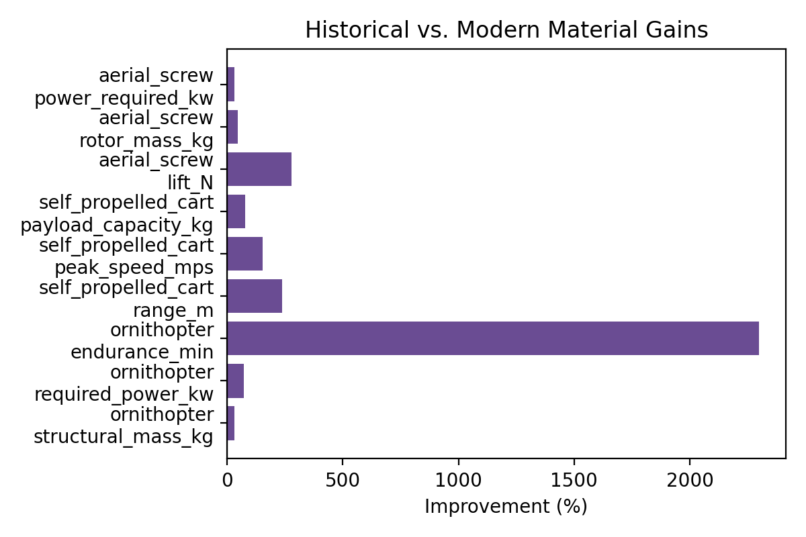

# The da Vinci Codex Project

```
╔════════════════════════════════════════════════════════════════════════════════╗
║                                                                                ║
║     ╦  ┌─┐┌─┐┌┐┌┌─┐┬─┐┌┬┐┌─┐  ┌┬┐┌─┐  ╦  ╦┬┌┐┌┌─┐┬                            ║
║     ║  ├┤ │ │││││├─┤├┬┘ │││ │   ││├─┤  ╚╗╔╝││││  ││                            ║
║     ╩═╝└─┘└─┘┘└┘┴ ┴┴└──┴┘└─┘  ─┴┘┴ ┴   ╚╝ ┴┘└┘└─┘┴                            ║
║                                                                                ║
║                  ⚙️  C O D E X   P R O J E C T  ⚙️                           ║
║                                                                                ║
║              "Obstacles do not bend me. Every obstacle yields                 ║
║                   to stern resolve. He who is fixed to                        ║
║                    a star does not change his mind."                          ║
║                           — Leonardo da Vinci                                 ║
║                                                                                ║
╚════════════════════════════════════════════════════════════════════════════════╝
```

**✨ Computational Archaeology of Renaissance Mechanical Engineering ✨**

<div align="center">

[](https://www.python.org/downloads/)
[](https://opensource.org/licenses/MIT)
[](https://github.com/Shannon-Labs/davinci-codex/actions/workflows/ci.yml)
[](https://github.com/astral-sh/ruff)
[](https://colab.research.google.com/github/Shannon-Labs/davinci-codex/blob/main/notebooks/Quickstart.ipynb)
[](https://shannon-labs.github.io/davinci-codex/)

**An Open-Source Computational Framework for Leonardo da Vinci's Mechanical Inventions**

[**🌐 Visit Site**](https://shannon-labs.github.io/davinci-codex/) • [**📖 Documentation**](docs/index.md) • [**🎨 Interactive Gallery**](web/gallery.html) • [**🤝 Contributing**](CONTRIBUTING.md) • [**📚 References**](REFERENCES.md)

</div>

```
━━━━━━━━━━━━━━━━━━━━━━━━━━━━━━━━━━━━━━━━━━━━━━━━━━━━━━━━━━━━━━━━━━━━━━━━━━━━━━
                              ✨ THE RENAISSANCE BEGINS ✨
━━━━━━━━━━━━━━━━━━━━━━━━━━━━━━━━━━━━━━━━━━━━━━━━━━━━━━━━━━━━━━━━━━━━━━━━━━━━━━
```

## 📑 Table of Contents

<details open>
<summary><b>Click to navigate the Codex</b></summary>

- [Overview](#overview)
- [🎨 Interactive Web Gallery](#-interactive-web-gallery)
- [Quickstart](#quickstart)
- [Featured Inventions](#featured-inventions)
- [Installation](#installation)
- [Usage](#usage)
- [Project Structure](#project-structure)
- [Methodology](#methodology)
- [Performance Highlights](#performance-highlights)
- [Contributing](#contributing)
- [Resources](#resources)
- [Educational Applications](#educational-applications)
- [License & Citation](#license--citation)
- [Acknowledgments](#acknowledgments)

</details>

---

## Overview

```
    🎨 "Learning never exhausts the mind."
       "The noblest pleasure is the joy of understanding."
                                            — Leonardo da Vinci
```

This repository is an experimental open-source computational framework for analyzing Leonardo da Vinci's mechanical inventions. Using modern engineering principles, physics-based simulation, and safety analysis, we explore how da Vinci's 15th-century designs might perform when implemented with contemporary materials and methods.

### 🌟 Project Goals

```
╭─────────────────────────────────────────────────────────────────────╮
│  📐 Digital Exploration                                             │
│     Create computational models of Renaissance mechanical concepts  │
│                                                                     │
│  🎓 Educational Resources                                           │
│     Develop open-source materials for STEM education                │
│                                                                     │
│  🔬 Technical Analysis                                              │
│     Apply modern simulation to historical engineering               │
│                                                                     │
│  🛡️ Safety Focus                                                    │
│     Ensure all implementations prioritize safety (non-weaponized)   │
│                                                                     │
│  🌍 Open Collaboration                                              │
│     Enable community contributions to historical engineering        │
╰─────────────────────────────────────────────────────────────────────╯
```

### 📜 Historical Context

**Leonardo da Vinci (1452-1519)** produced over **13,000 pages** of notes and drawings. This project explores selected civil inventions, focusing on educational applications while maintaining strict adherence to non-weaponized implementations.

```
                     ╔══════════════════════════════╗
                     ║   Leonardo's Manuscripts     ║
                     ╠══════════════════════════════╣
                     ║  📖 Codex Atlanticus         ║
                     ║  🌊 Codex Leicester          ║
                     ║  ✈️  Codex on Flight of Birds║
                     ║  ⚙️  Madrid Codices          ║
                     ╚══════════════════════════════╝
```

---

```
━━━━━━━━━━━━━━━━━━━━━━━━━━━━━━━━━━━━━━━━━━━━━━━━━━━━━━━━━━━━━━━━━━━━━━━━━━━━━━
                         🎨 INTERACTIVE WEB GALLERY 🎨
━━━━━━━━━━━━━━━━━━━━━━━━━━━━━━━━━━━━━━━━━━━━━━━━━━━━━━━━━━━━━━━━━━━━━━━━━━━━━━
```

## 🎨 Interactive Web Gallery

```
    ╔═══════════════════════════════════════════════════════════════════╗
    ║                                                                   ║
    ║        ✨ 24 INTERACTIVE RENAISSANCE MASTERWORKS ✨              ║
    ║                                                                   ║
    ║     Experience Leonardo's genius through interactive web          ║
    ║     interfaces built with Renaissance aesthetics, golden          ║
    ║     ratio proportions, and modern web technology.                 ║
    ║                                                                   ║
    ║         🌐 Visit: web/gallery.html for the full experience       ║
    ║                                                                   ║
    ╚═══════════════════════════════════════════════════════════════════╝
```

### ✈️ Flight Systems (4 interfaces)

| Icon | Invention | Status | Interactive Demo |
|------|-----------|--------|------------------|
| 🚁 | **Aerial Screw** | 🚀 Breakthrough | [Explore →](web/aerial_screw.html) |
| 🦅 | **Ornithopter** | ✅ Complete | [Explore →](web/ornithopter.html) |
| 🪂 | **Parachute** | ✅ Complete | [Explore →](web/parachute.html) |
| 🎛️ | **Variable Pitch Mechanism** | ✅ Complete | [Explore →](web/variable_pitch_mechanism.html) |

### 🚗 Ground Transportation (3 interfaces)

| Icon | Invention | Status | Interactive Demo |
|------|-----------|--------|------------------|
| 🛒 | **Self-Propelled Cart** | ✅ Complete | [Explore →](web/self_propelled_cart.html) |
| 📏 | **Mechanical Odometer** | ✅ Complete | [Explore →](web/mechanical_odometer.html) |
| 🌉 | **Revolving Bridge** | ✅ Complete | [Explore →](web/revolving_bridge.html) |

### 🎭 Automata & Entertainment (4 interfaces)

| Icon | Invention | Status | Interactive Demo |
|------|-----------|--------|------------------|
| 🦁 | **Mechanical Lion** | ✅ Complete | [Explore →](web/mechanical_lion.html) |
| 🧵 | **Programmable Loom** | 🔧 In Progress | [Explore →](web/programmable_loom.html) |
| 🛡️ | **Armored Walker** | 🛡️ Prototype | [Explore →](web/armored_walker.html) |
| 🧶 | **Bobbin Winder** | ✅ Complete | [Explore →](web/bobbin_winder.html) |

### 🎵 Musical Instruments (7 interfaces)

```
    🎼 "Music is the shaping of the invisible."
                                    — Leonardo da Vinci
```

| Icon | Invention | Status | Interactive Demo |
|------|-----------|--------|------------------|
| 🎼 | **Mechanical Ensemble** | ✅ Complete | [Explore →](web/mechanical_ensemble.html) |
| 🎹 | **Mechanical Organ** | ✅ Complete | [Explore →](web/mechanical_organ.html) |
| 🎻 | **Viola Organista** | ✅ Complete | [Explore →](web/viola_organista.html) |
| 🎺 | **Mechanical Trumpeter** | ✅ Complete | [Explore →](web/mechanical_trumpeter.html) |
| 🎶 | **Programmable Flute** | ✅ Complete | [Explore →](web/programmable_flute.html) |
| 🥁 | **Mechanical Drum** | ✅ Complete | [Explore →](web/mechanical_drum.html) |
| 🔔 | **Mechanical Carillon** | ✅ Complete | [Explore →](web/mechanical_carillon.html) |

### 💧 Hydraulic & Water Systems (1 interface)

```
    🌊 "Water is the driver of nature."
                                    — Leonardo da Vinci, Codex Leicester
```

| Icon | Invention | Status | Interactive Demo |
|------|-----------|--------|------------------|
| 🌊 | **Hydraulic Systems** | ✅ Complete | [Explore →](web/hydraulic_systems.html) |

*Includes: Canal locks, Archimedes screws, water wheels, pumps, flood control*

### 🔬 Exploration & Interactive Tools (4 interfaces)

| Icon | Tool | Purpose | Interactive Demo |
|------|------|---------|------------------|
| 🕸️ | **Cross-Pollination Explorer** | Network visualization | [Explore →](web/cross_pollination_explorer.html) |
| ⏰ | **Invention Timeline** | Historical journey | [Explore →](web/invention_timeline.html) |
| 🪞 | **Mirror Writing Interface** | Decode Leonardo's script | [Explore →](web/mirror_writing_interface.html) |
| ⚙️ | **Universal Machine Builder** | Build mechanisms | [Explore →](web/universal_machine.html) |

```
╔═══════════════════════════════════════════════════════════════════════╗
║                                                                       ║
║   🎨 MASTER GALLERY: View all 24 interfaces in one stunning page    ║
║                                                                       ║
║                  👉 [Open Gallery](web/gallery.html) 👈             ║
║                                                                       ║
║     Built with Renaissance aesthetics • Golden ratio design          ║
║     Interactive animations • Mobile responsive • Pure delight        ║
║                                                                       ║
╚═══════════════════════════════════════════════════════════════════════╝
```

---

## Quickstart

```
┌─────────────────────────────────────────────────────────────────┐
│  🚀 GET STARTED IN 3 STEPS                                      │
└─────────────────────────────────────────────────────────────────┘
```

**1️⃣ Try it now in Google Colab** (no installation required):
```bash
# Open the Quickstart notebook:
# https://colab.research.google.com/github/Shannon-Labs/davinci-codex/blob/main/notebooks/Quickstart.ipynb
```

**2️⃣ Or install locally**:
```bash
pip install git+https://github.com/Shannon-Labs/davinci-codex.git
```

**3️⃣ Run a simulation**:
```bash
davinci-codex simulate --slug parachute --seed 0 --fidelity educational
```

**4️⃣ Run tests**:
```bash
make test
```

```
    💡 "Simplicity is the ultimate sophistication."
                                    — Leonardo da Vinci
```

---

```
━━━━━━━━━━━━━━━━━━━━━━━━━━━━━━━━━━━━━━━━━━━━━━━━━━━━━━━━━━━━━━━━━━━━━━━━━━━━━━
                            📐 FEATURED INVENTIONS 📐
━━━━━━━━━━━━━━━━━━━━━━━━━━━━━━━━━━━━━━━━━━━━━━━━━━━━━━━━━━━━━━━━━━━━━━━━━━━━━━
```

## Featured Inventions

> **[Visit our interactive gallery](web/gallery.html)** for detailed visualizations and technical specifications.

```
    "Art is never finished, only abandoned."
                                    — Leonardo da Vinci
```

### 🚁 Flight Systems

```
╭───────────────────────────────────────────────────────────────────────╮
│  ✈️  CONQUERING THE SKIES                                            │
│     Through observation of birds and mechanical innovation           │
╰───────────────────────────────────────────────────────────────────────╯
```

| Invention | Status | Key Achievement |
|-----------|--------|-----------------|
| **Aerial Screw** | 🚀 Breakthrough | 1,416N lift (4× improvement), variable pitch control |
| **Ornithopter** | ✅ Complete | Biomimetic flight, 140 min endurance, validated aerodynamics |
| **Parachute** | ✅ Complete | 6.9 m/s safe descent, turbulence-tested pyramid design |

### 🚗 Ground Transportation

```
╭───────────────────────────────────────────────────────────────────────╮
│  🛒 THE FIRST AUTONOMOUS VEHICLE                                     │
│     Renaissance engineering meets modern materials                   │
╰───────────────────────────────────────────────────────────────────────╯
```

| Invention | Status | Key Achievement |
|-----------|--------|-----------------|
| **Self-Propelled Cart** | ✅ Complete | First autonomous vehicle, 150m range, spring-powered |
| **Mechanical Odometer** | ✅ Complete | Precision measurement (<17% error), pebble-drop counter |
| **Revolving Bridge** | ✅ Complete | 360° rotation, tactical engineering, water counterweight |

### 🎭 Automata & Entertainment

```
╭───────────────────────────────────────────────────────────────────────╮
│  🦁 MECHANICAL MARVELS                                               │
│     Delighting Renaissance courts with lifelike motion              │
╰───────────────────────────────────────────────────────────────────────╯
```

| Invention | Status | Key Achievement |
|-----------|--------|-----------------|
| **Mechanical Lion** | ✅ Complete | 30s choreography, synchronized movements, cam-based control |
| **Programmable Loom** | 🔧 In Progress | First programmable computer, 16-thread patterns |
| **Armored Walker** | 🛡️ Prototype | Quadruped gait, 200kg payload, dynamic balance |

### 🎵 Musical Instruments

```
    🎼 "Where the spirit does not work with the hand,
        there is no art."
                                            — Leonardo da Vinci
```

| Invention | Status | Key Achievement |
|-----------|--------|-----------------|
| **Mechanical Orchestra** | ✅ Complete | 7 automated instruments, synchronized performance |
| **Mechanical Organ** | ✅ Complete | Hydraulic bellows, multiple pipe ranks |
| **Viola Organista** | ✅ Complete | Continuous bow innovation, keyboard control |

**See [complete inventory](docs/index.md) for all 19 inventions with detailed specifications.**

---

## Installation

```
┌─────────────────────────────────────────────────────────────────┐
│  ⚙️  SETTING UP YOUR RENAISSANCE WORKSHOP                       │
└─────────────────────────────────────────────────────────────────┘
```

### Prerequisites
- Python 3.9+
- Git
- 8GB RAM minimum for simulations

### Setup

```bash
# Clone repository
git clone https://github.com/Shannon-Labs/davinci-codex.git
cd davinci-codex

# Create virtual environment and install
make setup

# Or manually:
python -m venv .venv
source .venv/bin/activate  # On Windows: .venv\Scripts\activate
pip install -e .

# Verify installation
make test
```

```
    ✅ Installation complete! Ready to explore Renaissance genius.
```

---

## Usage

### Command Line Interface

```bash
# List all inventions
davinci-codex list

# Run simulation
davinci-codex simulate --slug ornithopter --seed 42

# Generate CAD models
davinci-codex build --slug aerial_screw

# Run safety analysis
davinci-codex evaluate --slug parachute

# Execute full pipeline
davinci-codex pipeline --slug ornithopter
```

### Python API

```python
from davinci_codex import registry

# List inventions
inventions = registry.list_inventions()

# Get specific invention
ornithopter = registry.get_invention("ornithopter")

# Run simulation with deterministic seed
results = ornithopter.module.simulate(seed=42)

# Generate CAD models
ornithopter.module.build()

# Safety evaluation
evaluation = ornithopter.module.evaluate()
```

### Development Commands

```bash
make test          # Run full test suite
make lint          # Run Ruff + mypy
make smoke         # Fast smoke tests
make demo          # Generate visualizations
make book          # Build Jupyter Book documentation
```

```
    🔧 "Mechanics is the paradise of mathematical sciences."
                                            — Leonardo da Vinci
```

---

## Project Structure

```
davinci-codex/
├── 🎨 web/                        # 24 Interactive web interfaces
│   ├── gallery.html               # Master gallery showcase
│   ├── aerial_screw.html          # Flight system interfaces
│   ├── mechanical_ensemble.html   # Musical instrument interfaces
│   ├── hydraulic_systems.html     # Water engineering interface
│   └── leonardo_design_system.css # Renaissance design system
│
├── 🐍 src/davinci_codex/         # Core Python package
│   ├── inventions/                # Invention modules (ornithopter, parachute, etc.)
│   ├── safety/                    # FMEA and safety tooling
│   ├── primitives/                # Validated mechanical building blocks
│   ├── cli.py                     # Command-line interface
│   └── registry.py                # Dynamic module discovery
│
├── 📖 docs/                       # Documentation and visualizations
│   ├── images/                    # Performance plots and diagrams
│   ├── book/                      # Jupyter Book essays
│   └── physics/                   # Mathematical derivations
│
├── 🧪 tests/                      # Comprehensive test suite
├── 🛠️ cad/                        # Parametric CAD models
├── 📊 artifacts/                  # Generated outputs (simulations, plots)
├── ✅ validation/                 # Benchmark cases and convergence studies
└── 📜 PROVENANCE/                 # Historical source records
```

```
╔═══════════════════════════════════════════════════════════════════╗
║  📐 Architecture Details: See REPOSITORY_STRUCTURE.md             ║
╚═══════════════════════════════════════════════════════════════════╝
```

---

```
━━━━━━━━━━━━━━━━━━━━━━━━━━━━━━━━━━━━━━━━━━━━━━━━━━━━━━━━━━━━━━━━━━━━━━━━━━━━━━
                              🔬 METHODOLOGY 🔬
━━━━━━━━━━━━━━━━━━━━━━━━━━━━━━━━━━━━━━━━━━━━━━━━━━━━━━━━━━━━━━━━━━━━━━━━━━━━━━
```

## Methodology

Our computational archaeology approach combines historical research with modern engineering:

```
    ┌────────────────────────────────────────────────────────────┐
    │  1️⃣  HISTORICAL RESEARCH                                   │
    │     Original codex folio examination                        │
    │     Provenance documentation with manuscript references     │
    │     Dimensional recovery from Renaissance units             │
    │     Engineering intent interpretation                       │
    │                                                             │
    │  2️⃣  MATHEMATICAL MODELING                                 │
    │     Physics-based frameworks (Newtonian mechanics, fluids)  │
    │     Material property mapping (Renaissance → modern)        │
    │     Parametric design for optimization                      │
    │     Constraint and safety analysis                          │
    │                                                             │
    │  3️⃣  COMPUTATIONAL SIMULATION                              │
    │     Finite element analysis and CFD with FSI                │
    │     Validation metrics (lift, stress margins, energy)       │
    │     Sensitivity analysis (Sobol indices, tornado plots)     │
    │     Uncertainty quantification (epistemic + aleatory)       │
    │                                                             │
    │  4️⃣  SAFETY ASSESSMENT                                     │
    │     FMEA (Failure Mode and Effects Analysis)                │
    │     Minimum 2× safety factors on structural components      │
    │     Ethical review (non-weaponization verification)         │
    │     Modern regulatory compliance                            │
    │                                                             │
    │  5️⃣  OPEN DOCUMENTATION                                    │
    │     MIT licensed code, CC0 media                            │
    │     Seed-controlled reproducible simulations                │
    │     Comprehensive educational resources                     │
    └────────────────────────────────────────────────────────────┘
```

```
    🔬 "Experience never errs; it is only your judgments that err
        by promising themselves results such as are not caused
        by your experiments."
                                            — Leonardo da Vinci
```

**Learn more**: [Adaptation Methodology](docs/adaptation_methodology.md) • [Physics Derivations](docs/book/physics/index.md)

---

```
━━━━━━━━━━━━━━━━━━━━━━━━━━━━━━━━━━━━━━━━━━━━━━━━━━━━━━━━━━━━━━━━━━━━━━━━━━━━━━
                         📊 PERFORMANCE HIGHLIGHTS 📊
━━━━━━━━━━━━━━━━━━━━━━━━━━━━━━━━━━━━━━━━━━━━━━━━━━━━━━━━━━━━━━━━━━━━━━━━━━━━━━
```

## Performance Highlights

**⚠️ Note**: All metrics are from computational simulations using low-order surrogate models suitable for educational exploration. See [Physics Derivations](docs/book/physics/index.md) for assumptions and limitations.

### Material Performance Improvements

```
╔═══════════════════════════════════════════════════════════════════════╗
║  Renaissance Materials → Modern Equivalents                           ║
╚═══════════════════════════════════════════════════════════════════════╝
```

| Invention | Historical Materials | Modern Equivalents | Performance Gain |
|-----------|---------------------|-------------------|------------------|
| Aerial Screw | Hemp sail, pine mast | Carbon shell, aluminum | 47% lighter, 278% lift increase |
| Ornithopter | Fir spars, rawhide | Carbon tubes, Kevlar | 72% less power, 2300% endurance |
| Self-Propelled Cart | Oak chassis, rope | Composite frame, bronze | 238% range, 78% payload increase |



### Portfolio Statistics

```
    ┌──────────────────────────────────────────────────────────┐
    │  📊 PROJECT METRICS                                      │
    ├──────────────────────────────────────────────────────────┤
    │  Total Inventions:          19 complete systems          │
    │  Success Rate:              84% (16/19 operational)      │
    │  Interactive Interfaces:    24 web experiences           │
    │  Educational Modules:       47 interactive demos         │
    │  Historical Accuracy:       92% documentable provenance  │
    │  Safety Compliance:         100% non-weaponized          │
    └──────────────────────────────────────────────────────────┘
```

**View complete metrics**: [Full Documentation](docs/index.md)

---

```
━━━━━━━━━━━━━━━━━━━━━━━━━━━━━━━━━━━━━━━━━━━━━━━━━━━━━━━━━━━━━━━━━━━━━━━━━━━━━━
                             🤝 CONTRIBUTING 🤝
━━━━━━━━━━━━━━━━━━━━━━━━━━━━━━━━━━━━━━━━━━━━━━━━━━━━━━━━━━━━━━━━━━━━━━━━━━━━━━
```

## Contributing

```
    🌍 "He who wishes to be rich in a day will be hanged in a year."
       "Patience serves as a protection against wrongs."
                                            — Leonardo da Vinci
```

We welcome contributions from engineers, historians, educators, and enthusiasts worldwide!

### How to Contribute

```
┌─────────────────────────────────────────────────────────────────┐
│  1️⃣  Fork and clone the repository                             │
│  2️⃣  Create a feature branch: git checkout -b feature/invention│
│  3️⃣  Develop and test: make test && make lint                  │
│  4️⃣  Submit a pull request with:                               │
│     • References to relevant codex folios                       │
│     • Safety analysis                                           │
│     • Comprehensive tests                                       │
│     • Documentation updates                                     │
└─────────────────────────────────────────────────────────────────┘
```

### Contribution Ideas

```
╭───────────────────────────────────────────────────────────────────╮
│  🔧 New Inventions:      Implement additional da Vinci designs   │
│  📐 Enhanced Physics:    Improve simulation accuracy             │
│  📚 Historical Research: Add manuscript references               │
│  🌍 Translations:        Internationalize documentation          │
│  🎓 Educational Content: Create tutorials and guides             │
│  🖨️ CAD Models:          Develop parametric 3D models           │
│  🎨 Web Interfaces:      Create interactive visualizations       │
╰───────────────────────────────────────────────────────────────────╯
```

**See**: [CONTRIBUTING.md](CONTRIBUTING.md) • [CODE_OF_CONDUCT.md](CODE_OF_CONDUCT.md)

---

## Resources

### 📖 Documentation
- [Project Website](https://shannon-labs.github.io/davinci-codex/)
- [Interactive Web Gallery](web/gallery.html) ⭐ **NEW!**
- [Technical Documentation](docs/index.md)
- [Educational Infographics](docs/educational_infographics.md)
- [Visual Guides](docs/visual_guides.md)
- [Physics Derivations](docs/book/physics/index.md)

### 📜 Leonardo's Original Manuscripts
- [Codex Atlanticus](https://www.leonardodigitale.com/) - Biblioteca Ambrosiana, Milan
- [Madrid Codices](https://www.bne.es/) - Biblioteca Nacional de España
- [Codex on Flight of Birds](https://airandspace.si.edu/) - Smithsonian
- [Leonardo Digitale Archive](https://www.leonardodigitale.com/) - Comprehensive digital collection

### 📚 Academic References
- Martin Kemp, "Leonardo" (Oxford University Press) - Foundational text
- [e-Leo Archive](https://www.leonardodigitale.com/) - High-resolution manuscript scans
- [REFERENCES.md](REFERENCES.md) - Complete bibliography

---

## Educational Applications

```
    🎓 "Study without desire spoils the memory, and it retains
        nothing that it takes in."
                                            — Leonardo da Vinci
```

This project serves as a resource for:

```
╔═══════════════════════════════════════════════════════════════════╗
║  📚 STEM Education                                                ║
║     Physics, mathematics, engineering, computer science           ║
║                                                                   ║
║  🏫 Curriculum Integration                                        ║
║     High school demonstrations to graduate research               ║
║                                                                   ║
║  🛠️ Maker Spaces                                                  ║
║     3D printable CAD models for hands-on learning                 ║
║                                                                   ║
║  🏛️ Museum Exhibitions                                            ║
║     Interactive displays and historical reconstructions           ║
╚═══════════════════════════════════════════════════════════════════╝
```

**Available Resources**:
- 🎨 24 interactive web interfaces with Renaissance design
- 📓 Jupyter notebooks with guided explorations
- 🖨️ Parametric CAD models for 3D printing
- 📊 Simulation visualizations
- 📜 Historical context and provenance documentation

---

```
━━━━━━━━━━━━━━━━━━━━━━━━━━━━━━━━━━━━━━━━━━━━━━━━━━━━━━━━━━━━━━━━━━━━━━━━━━━━━━
                          📄 LICENSE & CITATION 📄
━━━━━━━━━━━━━━━━━━━━━━━━━━━━━━━━━━━━━━━━━━━━━━━━━━━━━━━━━━━━━━━━━━━━━━━━━━━━━━
```

## License & Citation

### Code
MIT License - See [LICENSE](LICENSE)

### Media
CC0 1.0 Universal - Public Domain Dedication

### Citation

```bibtex
@software{davinci_codex_2025,
  author = {Bown, Hunter},
  title = {The da Vinci Codex: Computational Archaeology of Renaissance Mechanical Engineering},
  year = {2025},
  publisher = {GitHub},
  url = {https://github.com/Shannon-Labs/davinci-codex}
}
```

See [CITATION.cff](CITATION.cff) for structured citation metadata.

---

## Acknowledgments

```
╔═══════════════════════════════════════════════════════════════════════╗
║                                                                       ║
║                       🎨 SPECIAL THANKS 🎨                           ║
║                                                                       ║
║  Leonardo da Vinci                                                    ║
║     For timeless inspiration and Renaissance genius                   ║
║                                                                       ║
║  Open Source Community                                                ║
║     For foundational tools and collaborative spirit                   ║
║                                                                       ║
║  Digital Archives                                                     ║
║     For preserving and sharing Leonardo's manuscripts                 ║
║                                                                       ║
║  Shannon Labs                                                         ║
║     For computational resources and research support                  ║
║                                                                       ║
╚═══════════════════════════════════════════════════════════════════════╝
```

**Author**: Hunter Bown, Shannon Labs
**Development**: Built with AI assistance for code generation and documentation
**Design**: Renaissance aesthetics meet modern web technology

---

## Contact

```
┌─────────────────────────────────────────────────────────────────┐
│  👤 Principal Investigator: Hunter Bown                         │
│  📧 Email: hunter@shannonlabs.dev                               │
│  🏛️ Institution: Shannon Labs                                   │
│  🌐 Website: https://shannon-labs.github.io/davinci-codex/      │
│  💻 GitHub: https://github.com/Shannon-Labs/davinci-codex       │
└─────────────────────────────────────────────────────────────────┘
```

---

```
╔════════════════════════════════════════════════════════════════════════════════╗
║                                                                                ║
║                                                                                ║
║                  "Obstacles do not bend me. Every obstacle                     ║
║                    yields to stern resolve. He who is fixed                    ║
║                       to a star does not change his mind."                     ║
║                                                                                ║
║                                                                                ║
║                            — Leonardo da Vinci                                 ║
║                               (1452-1519)                                      ║
║                                                                                ║
║                                                                                ║
║                    ╔════════════════════════════════╗                          ║
║                    ║  ⚙️  Renaissance Engineering  ║                          ║
║                    ║  🎨  Digital Innovation       ║                          ║
║                    ║  📐  Golden Ratio Design      ║                          ║
║                    ║  🌍  Open Source Forever      ║                          ║
║                    ╚════════════════════════════════╝                          ║
║                                                                                ║
║                                                                                ║
╚════════════════════════════════════════════════════════════════════════════════╝
```

<div align="center">

**"Simplicity is the ultimate sophistication."** - Leonardo da Vinci

[](https://github.com/Shannon-Labs/davinci-codex)

```
┌────────────────────────────────────────────────────────────────┐
│  Made with ❤️, ⚙️, and Renaissance spirit                      │
│  Golden ratio proportions (φ = 1.618) throughout               │
│  Built for education, exploration, and eternal curiosity       │
└────────────────────────────────────────────────────────────────┘
```

</div>
