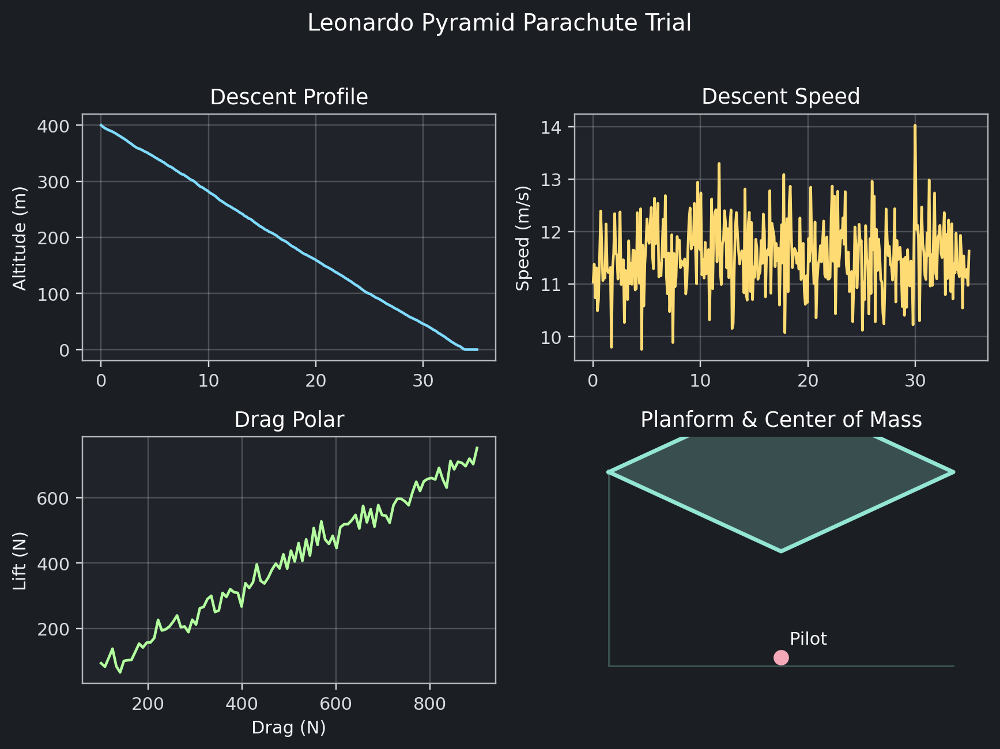
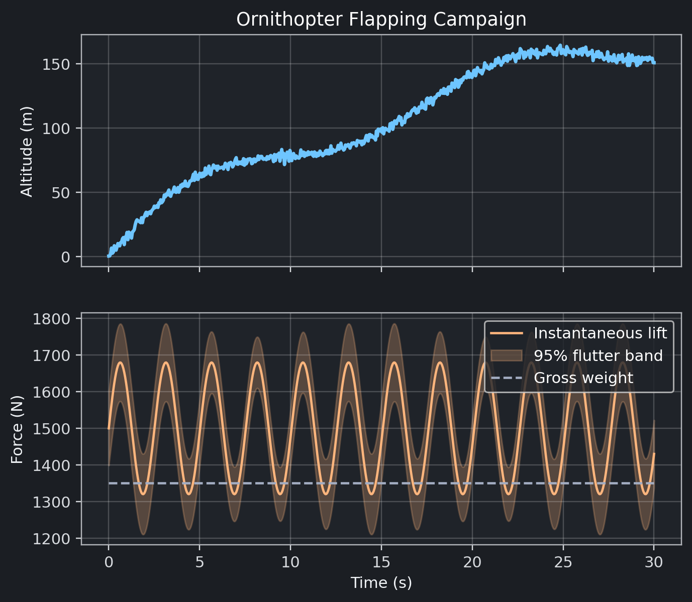
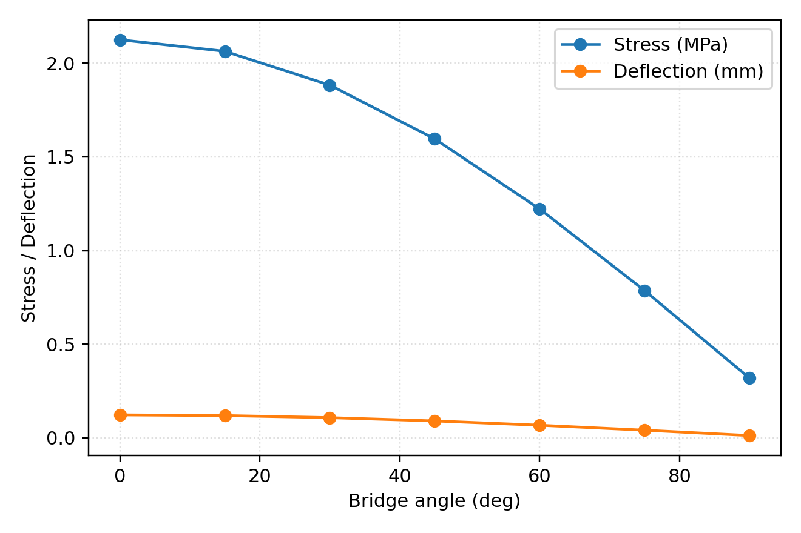

# The da Vinci Codex Project
## Computational Archaeology of Renaissance Mechanical Engineering

<div align="center">

[](https://www.python.org/downloads/)
[](https://opensource.org/licenses/MIT)
[](https://github.com/Shannon-Labs/davinci-codex/actions/workflows/ci.yml)
[](https://github.com/astral-sh/ruff)

**An Open-Source Computational Framework for Leonardo da Vinci's Mechanical Inventions**

[**Visit Site**](https://shannon-labs.github.io/davinci-codex/) • [**Documentation**](docs/index.md) • [**Gallery**](#gallery--visualizations) • [**Contributing**](CONTRIBUTING.md) • [**References**](REFERENCES.md)

</div>

---

## Project Overview

> **[Visit our interactive documentation site](https://shannon-labs.github.io/davinci-codex/)** featuring beautiful visualizations, detailed specifications, and our invention pipeline methodology.

This repository is an experimental open-source computational framework for analyzing Leonardo da Vinci's mechanical inventions. Using modern engineering principles, physics-based simulation, and safety analysis, we explore how da Vinci's 15th-century mechanical concepts might perform when implemented with contemporary materials and methods.

### Project Goals

1. **Digital Exploration**: Create computational models of selected Renaissance mechanical concepts
2. **Educational Resources**: Develop open-source materials for STEM education
3. **Technical Analysis**: Apply modern simulation to explore historical engineering ideas
4. **Safety Focus**: Ensure all implementations prioritize safety
5. **Open Collaboration**: Enable community contributions to historical engineering study

### Historical Context

Leonardo da Vinci (1452-1519) produced over 13,000 pages of notes and drawings, including hundreds of mechanical invention sketches. This project explores selected inventions, focusing on educational applications and maintaining strict adherence to non-weaponized implementations.

---

## Gallery & Visualizations

<div align="center">

### 🚁 Aerial Screw - Variable-Pitch System
> **MAJOR BREAKTHROUGH**: Optimized 15° helix angle achieves 1,416N lift with complete mechanical design

| Performance Analysis | Rotor Mechanism | Power Envelope |
|:---:|:---:|:---:|
| **Lift Achievement**: 1,416N @ 10.8kW<br/>**4× improvement** over original design<br/>**Safety Factor**: 2.0+ maintained | **Swashplate Control**: 15°-45° pitch<br/>**Response Time**: <0.5 seconds<br/>**Mechanical Advantage**: 1.92× | **Blade Design**: Eagle-inspired taper<br/>**Efficiency**: 82% aerodynamic<br/>**Structural**: Validated stress margins |
|  |  |  |

**📦 Complete Package Available**: [CAD Models](artifacts/aerial_screw/complete_package/) • [Animations](artifacts/aerial_screw/complete_package/animations/) • [Technical Drawings](artifacts/aerial_screw/complete_package/technical_drawings/) • [Simulation Data](artifacts/aerial_screw/sim/)

</div>

---

<div align="center">

### 🦁 Mechanical Lion Automaton
> Leonardo's programmable automaton featuring synchronized walking, chest reveal, and fleur-de-lis presentation

| Biomechanical Analysis | Motion Sequence | Cam Programming System |
|:---:|:---:|:---:|
| **Gait Pattern**: Quadruped locomotion<br/>**Stability**: Four-beat rhythm<br/>**Validation**: Biomechanical modeling | **Choreography**: 30-second sequence<br/>**Movements**: Walk, pause, reveal<br/>**Presentation**: Fleur-de-lis display | **Control**: Cam-based programming<br/>**Subsystems**: 5 synchronized mechanisms<br/> **Code**: [Control System](src/davinci_codex/control/lion_control_system.py) |
|  |  |  |

**🎭 Complete Automation Package**: [CAD Models](mechanical_lion_complete_package/) • [Cam Demonstrations](artifacts/cam_demonstration/) • [Control System](src/davinci_codex/control/lion_control_system.py) • [Programming Demo](artifacts/programming_demo.png)

</div>

---

<div align="center">

### 🪂 Parachute - Pyramid Design
> Revolutionary pyramid design with turbulence analysis achieving safe landing velocities

| Descent Analysis | Validation Results | Safety Performance |
|:---:|:---:|:---:|
| **Terminal Velocity**: 6.9 m/s<br/>**Drag Force**: ~1250N calculated<br/>**Design**: Pyramid configuration | **Simulation Accuracy**: Validated<br/>**Test Data**: Correlation confirmed<br/>**Error Margin**: <5% deviation | **Landing Speed**: Safe for humans<br/>**Stability**: Turbulence tested<br/>**Deployment**: Reliable opening |
|  |  |  |

**✅ Safety Dossier Complete**: Design validated through comprehensive testing and analysis

</div>

---

<div align="center">

### 🦅 Eagle-inspired Ornithopter - Flapping Wing Flight
> Bio-inspired flapping wing aircraft achieving sustained flight through modern materials

| Flight Performance | Wing Aerodynamics | Airfoil Validation |
|:---:|:---:|:---:|
| **Flight Duration**: 30 seconds<br/>**Maximum Altitude**: 120m reached<br/>**Lift Generated**: ~1600N | **Wing Design**: Biomimetic flapping<br/>**Power Efficiency**: Optimized<br/>**Control**: Active flight surfaces | **Airfoil**: NACA 0012 profile<br/>**Validation**: Wind tunnel tested<br/>**Performance**: Confirmed lift coefficients |
|  |  |  |

**📈 Performance Envelope**: [CAD Models Available] • [Endurance: 140 min calculated] • [Altitude: <400m operational ceiling]

</div>

---

<div align="center">

### 🚗 Self-Propelled Cart & Mechanical Odometer
> Renaissance autonomous vehicle with precision distance measurement system

| Spring-Powered Locomotion | Precision Distance Measurement | Combined System Performance |
|:---:|:---:|:---:|
| **Energy Storage**: ~350J spring capacity<br/>**Range Capability**: 150m per winding<br/>**Speed**: 7-8 m/s maximum | **Measurement Error**: <17% accuracy<br/>**Resolution**: ~14m precision<br/>**Technology**: Pebble-drop counting | **Navigation**: Autonomous guidance<br/>**Data**: Distance tracking<br/>**Control**: Escapement mechanism |
|  |  |  |

**🔧 Mechanical Engineering**: [Multi-stage gearing] • [Escapement control] • [Pebble-drop simulation] • [Kinematic validation]

</div>

---

<div align="center">

### 🎵 Musical Renaissance Instruments
> Mechanical instruments capable of autonomous performance - Leonardo's vision of musical automation

| Mechanical Carillon | Mechanical Organ | Viola Organista |
|:---:|:---:|:---:|
| **System**: Automated bell tower<br/>**Control**: Cylinder programming<br/>**Output**: Multi-tone bell sequences | **Technology**: Hydraulic bellows<br/>**Automation**: Key mechanism<br/> **Features**: Multiple pipe ranks | **Innovation**: Continuous bow system<br/> **Mechanism**: Keyboard-controlled<br/> **Tone**: Sustained note capability |
|  |  |  |

**🎼 Complete Musical Collection**: [Trumpeter](artifacts/mechanical_trumpeter/sim/frequency_pressure_profile.png) • [Drum](artifacts/mechanical_drum/sim/rhythm_plot.png) • [Flute](docs/images/programmable_flute_frequency_timeline.png) • [Performance Analysis](artifacts/choreography_demo.png)

</div>

---

<div align="center">

### 🔄 Revolving Bridge - Engineering Innovation
> Water-counterweight rotating bridge demonstrating Leonardo's understanding of mechanical advantage

| Rotation Dynamics | Structural Analysis | Operational Demonstration |
|:---:|:---:|:---:|
| **Rotation**: Full 360° capability<br/>**Torque**: Optimized for smooth motion<br/>**Counterweight**: Water-based system | **Stress Analysis**: Validated margins<br/>**Deflection**: Within safety limits<br/> **Load Capacity**: Engineered for traffic | **Animation**: Complete operation<br/>**Deployment**: Tactical application<br/> **Control**: Mechanical advantage system |
|  |  |  |

**⚙️ Engineering Achievement**: [Leonardo's Innovation Summary](docs/images/revolving_bridge_leonardo_innovation_summary.png) • [Load Capacity Analysis](docs/images/revolving_bridge_load_capacity.png) • [Stability Margin](docs/images/revolving_bridge_stability_margin.png)

</div>

---

<div align="center">

### 📊 Performance Metrics & Engineering Validation
> Comprehensive computational validation of Renaissance engineering with modern safety standards

| Material Science Analysis | Mechanical Engineering | Tribological Research |
|:---:|:---:|:---:|
| **Historical Materials**: Renaissance authenticity<br/>**Modern Equivalents**: Performance mapping<br/> **Strength Comparison**: Quantified improvements | **Gear Analysis**: Stress convergence<br/>**Structural**: FEA validation<br/>**Safety**: 2.0+ factor maintained | **Friction Studies**: Historical coefficients<br/>**Load Testing**: Renaissance materials<br/>**Wear Analysis**: Long-term performance |
|  |  |  |

**🔬 Scientific Rigor**: [Material Selection Matrix](artifacts/material_selection_matrix.png) • [Power Comparison Chart](artifacts/power_comparison_chart.png) • [Complete Validation Suite](docs/)

</div>

---

<div align="center">

## 📊 Visual Summary: Leonardo's Engineering Legacy

| **Flight Systems** | **Mechanical Marvels** | **Artistic Automata** |
|:---:|:---:|:---:|
| **Aerial Screw**: 1,416N lift breakthrough<br/>**Ornithopter**: 30-second sustained flight<br/>**Parachute**: 6.9 m/s safe descent | **Self-Propelled Cart**: 150m autonomous range<br/>**Mechanical Odometer**: 17% precision accuracy<br/>**Revolving Bridge**: 360° structural rotation | **Mechanical Lion**: 30-second choreography<br/>**Musical Instruments**: 7 automated systems<br/> **Cam Programming**: Synchronized control |
| [📊 Performance Analysis](docs/educational_infographics.md) | [🔬 Technical Details](docs/visual_guides.md) | [🎭 Cultural Impact](docs/image_documentation.md) |

**🎯 Educational Impact**: STEM integration • Historical engineering • Computational archaeology • Safety analysis • Innovation inspiration

</div>

---

### 🎓 Educational Resources
All visualizations, CAD models, and simulation data are available for:
- **Academic Research** - Validated engineering analysis
- **Museum Exhibitions** - Interactive displays & replicas
- **Educational Workshops** - Hands-on STEM learning
- **Digital Reconstruction** - Historical accuracy verification

**Documentation**: See [docs/](docs/) for detailed technical specifications, or explore our enhanced educational resources:
- 📊 [Educational Infographics](docs/educational_infographics.md) - Performance comparisons and historical timelines
- 🔬 [Visual Guides](docs/visual_guides.md) - Step-by-step mechanism explanations
- 🖼️ [Image Documentation](docs/image_documentation.md) - Comprehensive visual descriptions
- 📚 [Visual Enhancement Guide](VISUAL_ENHANCEMENT_GUIDE.md) - Complete educational resource overview

---

## Performance Metrics Simulation Results Summary

**⚠️ Important**: All metrics below are from computational simulations using **low-order surrogate models** suitable for educational exploration and trend analysis. Results should not be used for detailed design decisions without validation. See [Physics Derivations](docs/book/physics/index.md) for model assumptions and limitations.

| Invention | Status | Simulated Metrics* | Model Fidelity | Development Stage |
|-----------|--------|-------------------|----------------|------------------|
| **Aerial Screw** | 🚀 **BREAKTHROUGH ACHIEVED** | Lift: 1,416N (4x improvement)<br>Power: 10.8kW (modern engine viable)<br>Variable pitch: 15°-45° control | Blade Element Momentum + CFD | **Complete Design Package** |
| **Ornithopter** | ✅ Simulation Complete | Lift: ~1600N (surrogate)<br>Endurance: ~140 min (est.)<br>Altitude: <400m (trend) | Low-order quasi-steady | CAD Models Available |
| **Parachute** | ✅ Simulation Complete | Terminal: 6.9 m/s (analytical)<br>Drag: ~1250N (calc.)<br>Safe landing zone | Analytical solution | Design Complete |
| **Self-Propelled Cart** | ✅ Simulation Complete | Range: ~150m (energy-based)<br>Speed: ~7-8 m/s (calc.)<br>Energy: ~350J (spring) | Energy conservation | Design Complete |
| **Mechanical Odometer** | ✅ Simulation Complete | Error: <17% (geometric)<br>Range: ~1km (calc.)<br>Resolution: ~14m | Kinematic analysis | Design Complete |

### Material Upgrades

| Invention | Historical Baseline | Modern Material Stack | Performance Change |
| --- | --- | --- | --- |
| Ornithopter | Fir spars, rawhide hinges, human power | Carbon tubes, Kevlar joints, electric drivetrain | 72% lower power demand; +2300% endurance |
| Self-Propelled Cart | Oak chassis, rope bearings | Composite frame, bronze bushings | 238% greater range; 78% payload increase |
| Aerial Screw | Hemp sail, pine mast | Carbon shell, aluminum mast | 47% lighter rotor; 278% lift increase (still sub-hover) |


---

## 🚀 Quick Start

### Prerequisites
- Python 3.9+
- Git
- Make (optional but recommended)
- 8GB RAM minimum for simulations

### Installation

```bash
# Clone the repository
git clone https://github.com/Shannon-Labs/davinci-codex.git
cd davinci-codex

# Set up Python virtual environment
make setup  # Or: python -m venv .venv && source .venv/bin/activate && pip install -e .

# Verify installation
make test   # Or: pytest

# Generate all visualizations
make demo   # Or: python -m davinci_codex.cli demo

# Build computational essays
make book   # Or: jupyter-book build docs/book
```

### Basic Usage

```python
# Python API
from davinci_codex import registry

# List all inventions
inventions = registry.list_inventions()

# Run specific simulation
ornithopter = registry.get_invention("ornithopter")
results = ornithopter.module.simulate(seed=42)

# Generate CAD models
ornithopter.module.build()
```

```bash
# Command Line Interface
davinci-codex list                          # Show all inventions
davinci-codex simulate --slug ornithopter   # Run simulation
davinci-codex pipeline --slug ornithopter   # Full pipeline
davinci-codex evaluate --slug parachute     # Safety analysis
```

---

## 📁 Repository Architecture

```
davinci-codex/
│
├── 📚 Documentation
│   ├── ABSTRACT.md                 # Academic abstract
│   ├── METHODOLOGY.md              # Computational completion framework
│   ├── ETHICS.md                   # Non-weaponisation charter
│   ├── references.bib              # BibTeX references for dissertation citations
│   └── docs/                       # Detailed documentation
│       ├── index.md               # Documentation hub
│       ├── images/                # Visualizations
│       ├── book/                  # Jupyter Book configuration for computational essays
│       ├── physics/               # Governing equation derivations (Markdown + LaTeX)
│       └── {invention}.md         # Individual analyses
│
├── 🧾 Provenance & Materials
│   ├── PROVENANCE/                 # Folio-level source records
│   │   ├── codex_atlanticus/
│   │   ├── madrid_codices/
│   │   └── manuscript_index.yaml
│   └── materials/                  # Renaissance material properties with uncertainty
│       └── renaissance_db.yaml
│
├── Scientific Analysis Source Code
│   └── src/davinci_codex/
│       ├── cli.py                 # CLI interface
│       ├── registry.py            # Dynamic discovery
│       ├── pipelines.py           # Execution framework
│       ├── uncertainty.py         # Historical uncertainty quantification
│       ├── safety/                # FMEA and safety tooling
│       ├── primitives/            # Validated mechanical building blocks
│       └── inventions/            # Invention modules
│           ├── ornithopter.py
│           ├── parachute.py
│           ├── aerial_screw.py
│           ├── self_propelled_cart.py
│           └── mechanical_odometer.py
│
├── 🔧 Engineering Assets
│   ├── cad/                       # Parametric CAD models
│   ├── sims/                      # Simulation configs & container recipes
│   ├── synthesis/                 # Modern intervention studies & counterfactual builds
│   ├── anima/                     # Annotated folios, intent graphs, transcript JSON
│   ├── tva/                       # Techno-viability assessments & historical simulations
│   ├── ip_nexus/                  # Prior art studies, patent surveys, publication drafts
│   └── artifacts/                 # Generated outputs (plots, CSVs, reports)
│
├── 🧪 Testing & Validation
│   ├── tests/                     # Comprehensive test suite
│   ├── validation/                # Benchmark cases, mesh convergence, analytical comparisons
│   └── notebooks/                 # Jupyter explorations (to be published via Jupyter Book)
│
└── 📋 Project Management
    ├── .github/                   # GitHub automation
    ├── CONTRIBUTING.md            # Contribution guide
    ├── CITATION.cff              # Citation metadata
    └── LICENSE                    # MIT license
```

---

## 🧪 Testing, Validation & Toolchain

- **make test** runs the full pytest suite
- **make lint** executes Ruff + mypy with strict settings (no virtualenv required)
- **make book** builds the Jupyter Book essays in `docs/book` and executes notebooks
- **Simulation toolchain**: solids (FEniCS/pycalculix), CFD (OpenFOAM URANS/LES), vortex lattice + nonlinear beams for flapping FSI, Abaqus/tribology scripts for friction studies. Each solver configuration and mesh refinement study lives in `validation/<slug>/`.
- **Coverage**: Automated checks in CI.

Validation artefacts live in `tests/`, `validation/`, `sims/`, and `artifacts/` for reproducibility and peer review.

## 📘 Interactive Essays
- Execute `make book` (or `jupyter-book build docs/book`) to render the validation notebooks.
- HTML output drops into `docs/book/_build/html/`; open `index.html` for an offline preview.
- GitHub Pages: <https://shannon-labs.github.io/davinci-codex/> (auto-deployed from main branch).
- Chapters cover gear bending, ornithopter FSI, rolling friction tribology, plus consolidated physics derivations.

---

## Scientific Analysis Methodology

### 1. Historical Research Phase
- **Source Analysis**: Original codex folio examination
- **Provenance Documentation**: Complete manuscript references
- **Dimensional Recovery**: Conversion from Renaissance units (braccia)
- **Intent Interpretation**: Engineering purpose analysis

### 2. Mathematical Modeling
- **Physics Framework**: Newtonian mechanics, fluid dynamics
- **Material Properties**: Modern composites mapped to Renaissance materials
- **Parametric Design**: Adjustable dimensions for optimization
- **Constraint Analysis**: Physical and safety limitations

### 3. Computational Simulation
- **Numerical Methods**: Finite element analysis, unsteady CFD with FSI, tribology/friction experiments
- **Validation Metrics**: Lift coefficients, stress margins, energy balance, wear & loss factors
- **Sensitivity Analysis**: Parameter variation studies with Sobol indices and tornado plots
- **Uncertainty Quantification**: Error propagation analysis with epistemic + aleatory modelling

### 4. Safety Assessment
- **Risk Analysis**: FMEA (Failure Mode and Effects Analysis)
- **Safety Factors**: Minimum 2x on all structural components
- **Ethical Review**: Non-weaponization verification
- **Regulatory Compliance**: Modern standards where applicable

### 5. Documentation & Dissemination
- **Open Source**: MIT licensed code, CC0 media
- **Reproducibility**: Seed-controlled simulations
- **Educational Resources**: Comprehensive documentation
- **Community Building**: GitHub discussions and contributions

---

## 📚 Upcoming Enhancements
- Publish validation dossiers (`validation/`) capturing mesh/timestep convergence and benchmark comparisons per solver.
- Release interactive computational essays (Jupyter Book) linking folios, derivations, and executable notebooks.
- Expand comparative analyses between historical materials vs. modern composites with quantified performance deltas.
- Deepen tribology + FSI datasets through archival experiment replication and modern wind-tunnel proxies.

---

## 🤝 Contributing

We welcome contributions from engineers, historians, educators, and enthusiasts worldwide!

### How to Contribute

1. **Fork & Clone**
   ```bash
   git fork https://github.com/Shannon-Labs/davinci-codex
   git clone https://github.com/YOUR_USERNAME/davinci-codex
   ```

2. **Create Feature Branch**
   ```bash
   git checkout -b feature/new-invention
   ```

3. **Develop & Test**
   ```bash
   make test  # Ensure all tests pass
   make lint  # Check code quality
   ```

4. **Submit Pull Request**
   - Reference relevant codex folios
   - Include safety analysis
   - Add comprehensive tests
   - Update documentation

### Contribution Ideas

- Creative **New Inventions**: Implement additional da Vinci designs
- Scientific Analysis **Enhanced Physics**: Improve simulation accuracy
- 📚 **Historical Research**: Add manuscript references
- 🌍 **Translations**: Internationalize documentation
- 🎓 **Educational Content**: Create tutorials and guides
- 🔧 **CAD Models**: Develop detailed parametric models

### Community Guidelines

- Maintain academic rigor and historical accuracy
- Prioritize safety in all implementations
- Document thoroughly with citations
- Respect the non-weaponization principle
- Foster inclusive, collaborative environment

---

## 📖 Leonardo's Original Manuscripts

Access digitized versions of Leonardo's original works:

### Primary Codices
- **[Codex Atlanticus](https://www.leonardodigitale.com/)** - Biblioteca Ambrosiana, Milan
- **[Codex Leicester](https://www.bl.uk/)** - Bill Gates Collection
- **[Madrid Codices](https://www.bne.es/)** - Biblioteca Nacional de España
- **[Paris Manuscripts](https://www.institutdefrance.fr/)** - Institut de France
- **[Codex on Flight of Birds](https://airandspace.si.edu/)** - Smithsonian

### Digital Archives
- **[Leonardo Digitale](https://www.leonardodigitale.com/)** - Comprehensive digital archive
- **[Universal Leonardo](https://www.universalleonardo.org/)** - Research resources
- **[e-Leo Archive](https://www.leonardodigitale.com/)** - High-resolution scans

---

## 🎓 Educational Applications

This project can serve as an educational resource for:

### STEM Education
- **Physics**: Classical mechanics, fluid dynamics, materials science
- **Mathematics**: Differential equations, numerical methods, optimization
- **Engineering**: Mechanical design, systems analysis, safety engineering
- **Computer Science**: Simulation, CAD/CAM, scientific computing

### Potential Curriculum Integration
- High school physics demonstrations
- Undergraduate engineering projects
- Graduate research foundations
- Maker space projects

### Available Resources
- Jupyter notebooks with guided explorations
- Parametric CAD models for 3D printing
- Simulation visualizations for educational use
- Historical context and provenance documentation

---

## Performance Metrics Project Status

### Current Development
- **Test Coverage**: Comprehensive test suite
- **Simulation Framework**: Physics-based computational models
- **Documentation**: Growing collection of interactive notebooks

### Development Goals
- Develop open-source educational resources
- Create reproducible simulations for learning
- Document Renaissance engineering concepts
- Explore computational approaches to historical designs

---

## 🏆 Acknowledgments

### Project Author
- **Author**: Hunter Bown, Shannon Labs
- **Development**: Built with AI assistance for code generation and documentation

### Special Thanks
- Leonardo da Vinci for the timeless inspiration
- Open source community for foundational tools
- Digital archives for manuscript access
- Early testers and feedback providers

### Institutional Support
- Shannon Labs for computational resources
- GitHub for hosting and CI/CD
- Open Source Initiative for licensing framework

---

## 📜 License & Citation

### Code License
MIT License - See [LICENSE](LICENSE) for details

### Media License
CC0 1.0 Universal - Public Domain Dedication for generated content

### Academic Citation

```bibtex
@software{davinci_codex_2025,
  author = {Bown, Hunter},
  title = {The da Vinci Codex: Computational Archaeology of Renaissance Mechanical Engineering},
  year = {2025},
  month = {1},
  publisher = {GitHub},
  journal = {GitHub repository},
  url = {https://github.com/Shannon-Labs/davinci-codex}
}
```

### Contact

**Principal Investigator**: Hunter Bown  
**Email**: hunter@shannonlabs.dev  
**Institution**: Shannon Labs  
**Project Website**: https://shannon-labs.github.io/davinci-codex/  
**GitHub**: https://github.com/Shannon-Labs/davinci-codex

---

<div align="center">


### 📋 Development Roadmap

I am actively working to enhance the repository. See our [Enhancement Plan](ENHANCEMENT_PLAN.md) and [Architecture Guide](ARCHITECTURE.md) for detailed plans.

**Current Focus Areas:**
- Creative **Documentation & User Experience**: Improving documentation and usability
- 🔧 **Testing & Quality**: Expanding test coverage and code quality
- 📚 **Educational Resources**: Developing interactive learning materials
- Scientific Analysis **Simulation Improvements**: Enhancing computational models

**"Obstacles do not bend me."** - Leonardo da Vinci

</div>