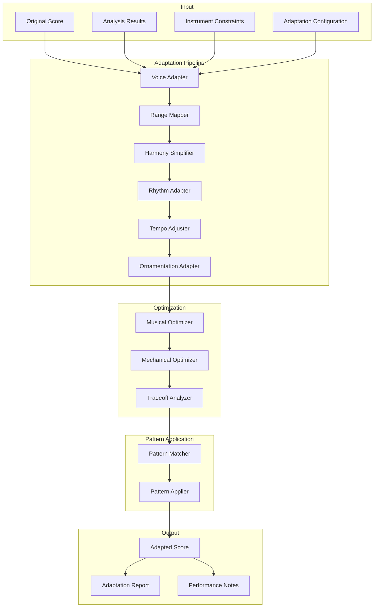

# Adaptation Engine for Renaissance Music Adaptation

## Overview

The Adaptation Engine is the core component responsible for modifying Renaissance music to be compatible with Leonardo's mechanical instruments. It combines analysis results, constraint enforcement, and pattern application to create musically coherent adaptations that preserve the essence of the original music while working within mechanical limitations.

## Architecture



## Core Data Structures

### Adaptation Configuration

```python
from dataclasses import dataclass
from typing import List, Dict, Tuple, Optional, Any, Union
from enum import Enum
import numpy as np

class AdaptationStrategy(Enum):
    """Overall adaptation strategies"""
    PRESERVE_MELODY = "preserve_melody"  # Prioritize melodic integrity
    PRESERVE_HARMONY = "preserve_harmony"  # Prioritize harmonic integrity
    PRESERVE_RHYTHM = "preserve_rhythm"  # Prioritize rhythmic integrity
    BALANCED = "balanced"  # Balance all elements
    MECHANICAL_PRIORITY = "mechanical_priority"  # Prioritize mechanical playability

class VoiceReductionMethod(Enum):
    """Methods for reducing voice count"""
    HIGHEST_VOICE = "highest_voice"  # Keep highest voice
    LOWEST_VOICE = "lowest_voice"  # Keep lowest voice
    IMPORTANCE_BASED = "importance_based"  # Keep most important voices
    ROLE_BASED = "role_based"  # Keep voices matching instrument roles
    ALTERNATING = "alternating"  # Alternate between voices

class TranspositionMethod(Enum):
    """Methods for transposition"""
    CLOSEST_FIT = "closest_fit"  # Minimal transposition
    PREFERRED_RANGE = "preferred_range"  # Transpose to preferred range
    MODE_PRESERVING = "mode_preserving"  # Preserve modal character
    INSTRUMENT_OPTIMAL = "instrument_optimal"  # Optimize for instrument

@dataclass
class AdaptationConfig:
    """Configuration for music adaptation"""
    
    # Overall strategy
    strategy: AdaptationStrategy = AdaptationStrategy.BALANCED
    
    # Voice reduction
    voice_reduction_method: VoiceReductionMethod = VoiceReductionMethod.IMPORTANCE_BASED
    max_voice_reduction: int = 2  # Maximum voices to remove
    
    # Transposition
    transposition_method: TranspositionMethod = TranspositionMethod.CLOSEST_FIT
    transposition_allowed: bool = True
    max_transposition: int = 12  # Maximum transposition in semitones
    
    # Rhythm adaptation
    rhythm_adaptation_allowed: bool = True
    simplify_complex_rhythms: bool = True
    preserve_dance_rhythms: bool = True
    
    # Harmony adaptation
    harmony_simplification_allowed: bool = True
    preserve_cadences: bool = True
    preserve_modal_character: bool = True
    
    # Tempo adaptation
    tempo_adjustment_allowed: bool = True
    tempo_range: Tuple[float, float] = (0.8, 1.2)  # Tempo adjustment range
    
    # Ornamentation
    ornamentation_level: str = "moderate"  # "minimal", "moderate", "full"
    simplify_ornaments: bool = True
    
    # Pattern application
    apply_renaissance_patterns: bool = True
    pattern_application_strength: float = 0.7  # 0-1, how strongly to apply patterns
    
    # Mechanical optimization
    mechanical_priority: float = 0.5  # 0-1, balance between musical and mechanical
    noise_tolerance: float = 0.3  # 0-1, tolerance for mechanical noise
```

### Adaptation Results

```python
@dataclass
class AdaptationAction:
    """Represents a single adaptation action"""
    action_type: str  # "transpose", "voice_reduce", "rhythm_simplify", etc.
    target_notes: List[int]  # Indices of affected notes
    parameters: Dict[str, Any]  # Action-specific parameters
    musical_cost: float  # 0-1, musical impact of this action
    mechanical_benefit: float  # 0-1, mechanical improvement from this action
    reason: str  # Why this action was taken

@dataclass
class AdaptationReport:
    """Report of adaptation actions and their impact"""
    actions: List[AdaptationAction]
    total_musical_cost: float
    total_mechanical_benefit: float
    voice_reduction_count: int
    transposition_amount: int
    tempo_adjustment: float
    rhythm_simplifications: int
    harmony_simplifications: int
    ornamentation_changes: int
    pattern_applications: int
    preservation_score: float  # 0-1, how well original was preserved
    playability_score: float  # 0-1, how playable the result is
```

## Adaptation Components

### Voice Adapter

```python
class VoiceAdapter:
    """Adapts voice count and distribution"""
    
    def __init__(self):
        self.importance_calculator = VoiceImportanceCalculator()
        self.role_matcher = InstrumentRoleMatcher()
    
    def adapt_voices(self, score: MusicalScore,
                    analysis: RenaissanceAnalysisResult,
                    constraints: Dict[str, InstrumentConstraints],
                    config: AdaptationConfig) -> Tuple[MusicalScore, List[AdaptationAction]]:
        """Adapt voice count to match instrument constraints"""
        adapted_score = score.copy()
        actions = []
        
        # Determine target voice count for each instrument
        target_voices = self._determine_target_voices(constraints)
        
        # Reduce voices if necessary
        for instrument_slug, instrument_constraints in constraints.items():
            current_voices = self._count_voices_for_instrument(adapted_score, instrument_constraints)
            target_voice_count = target_voices[instrument_slug]
            
            if current_voices > target_voice_count:
                reduction = current_voices - target_voice_count
                adapted_score, reduction_actions = self._reduce_voices(
                    adapted_score, instrument_slug, reduction, 
                    analysis, instrument_constraints, config
                )
                actions.extend(reduction_actions)
        
        return adapted_score, actions
    
    def _determine_target_voices(self, constraints: Dict[str, InstrumentConstraints]) -> Dict[str, int]:
        """Determine target voice count for each instrument"""
        target_voices = {}
        
        for instrument_slug, instrument_constraints in constraints.items():
            target_voices[instrument_slug] = min(
                instrument_constraints.max_simultaneous_notes,
                3  # Practical limit for Renaissance music
            )
        
        return target_voices
    
    def _reduce_voices(self, score: MusicalScore, instrument_slug: str,
                      reduction_count: int, analysis: RenaissanceAnalysisResult,
                      constraints: InstrumentConstraints,
                      config: AdaptationConfig) -> Tuple[MusicalScore, List[AdaptationAction]]:
        """Reduce voice count for an instrument"""
        adapted_score = score.copy()
        actions = []
        
        # Get notes for this instrument
        instrument_notes = [n for n in adapted_score.notes 
                          if n.voice in constraints.voice_range]
        
        if not instrument_notes:
            return adapted_score, actions
        
        # Group notes by voice
        voice_groups = self._group_notes_by_voice(instrument_notes)
        
        # Select voices to keep based on method
        if config.voice_reduction_method == VoiceReductionMethod.IMPORTANCE_BASED:
            voices_to_keep = self._select_voices_by_importance(
                voice_groups, analysis, constraints, reduction_count
            )
        elif config.voice_reduction_method == VoiceReductionMethod.ROLE_BASED:
            voices_to_keep = self._select_voices_by_role(
                voice_groups, analysis, constraints, reduction_count
            )
        elif config.voice_reduction_method == VoiceReductionMethod.ALTERNATING:
            voices_to_keep = self._select_voices_by_alternating(
                voice_groups, reduction_count
            )
        else:
            voices_to_keep = self._select_voices_by_default(
                voice_groups, reduction_count
            )
        
        # Remove notes from voices to be eliminated
        voices_to_remove = set(voice_groups.keys()) - set(voices_to_keep)
        notes_to_remove = []
        
        for voice in voices_to_remove:
            notes_to_remove.extend(voice_groups[voice])
        
        # Create adaptation action
        if notes_to_remove:
            note_indices = [adapted_score.notes.index(n) for n in notes_to_remove]
            
            action = AdaptationAction(
                action_type="voice_reduce",
                target_notes=note_indices,
                parameters={
                    "instrument": instrument_slug,
                    "voices_removed": list(voices_to_remove),
                    "voices_kept": voices_to_keep
                },
                musical_cost=self._calculate_voice_reduction_cost(
                    notes_to_remove, voice_groups, analysis
                ),
                mechanical_benefit=self._calculate_voice_reduction_benefit(
                    reduction_count, constraints
                ),
                reason=f"Reduced {len(voices_to_remove)} voices to match instrument constraints"
            )
            actions.append(action)
            
            # Remove notes from score
            adapted_score.notes = [n for n in adapted_score.notes if n not in notes_to_remove]
        
        return adapted_score, actions
    
    def _select_voices_by_importance(self, voice_groups: Dict[int, List[MusicalNote]],
                                   analysis: RenaissanceAnalysisResult,
                                   constraints: InstrumentConstraints,
                                   reduction_count: int) -> List[int]:
        """Select voices to keep based on importance"""
        voice_importance = {}
        
        for voice, notes in voice_groups.items():
            # Calculate importance based on multiple factors
            melodic_importance = self._calculate_melodic_importance(notes, analysis)
            harmonic_importance = self._calculate_harmonic_importance(notes, analysis)
            role_importance = self._calculate_role_importance(voice, constraints)
            
            voice_importance[voice] = melodic_importance + harmonic_importance + role_importance
        
        # Sort by importance and keep top voices
        sorted_voices = sorted(voice_importance.items(), key=lambda x: x[1], reverse=True)
        voices_to_keep = [voice for voice, _ in sorted_voices[:len(voice_groups) - reduction_count]]
        
        return voices_to_keep
```

### Range Mapper

```python
class RangeMapper:
    """Maps pitch ranges to instrument capabilities"""
    
    def __init__(self):
        self.mode_preserver = ModalCharacterPreserver()
        self.transposition_optimizer = TranspositionOptimizer()
    
    def adapt_ranges(self, score: MusicalScore,
                    analysis: RenaissanceAnalysisResult,
                    constraints: Dict[str, InstrumentConstraints],
                    config: AdaptationConfig) -> Tuple[MusicalScore, List[AdaptationAction]]:
        """Adapt pitch ranges to match instrument capabilities"""
        adapted_score = score.copy()
        actions = []
        
        # Process each instrument separately
        for instrument_slug, instrument_constraints in constraints.items():
            # Get notes for this instrument
            instrument_notes = [n for n in adapted_score.notes 
                              if n.voice in instrument_constraints.voice_range]
            
            if not instrument_notes:
                continue
            
            # Check if notes are within range
            out_of_range_notes = self._find_out_of_range_notes(
                instrument_notes, instrument_constraints
            )
            
            if out_of_range_notes:
                # Determine best transposition
                transposition = self._determine_transposition(
                    out_of_range_notes, instrument_constraints, analysis, config
                )
                
                # Apply transposition
                if transposition != 0:
                    adapted_score, transposition_action = self._apply_transposition(
                        adapted_score, instrument_slug, transposition, config
                    )
                    actions.append(transposition_action)
                
                # Handle any remaining out-of-range notes
                remaining_out_of_range = self._find_out_of_range_notes(
                    [n for n in adapted_score.notes 
                     if n.voice in instrument_constraints.voice_range],
                    instrument_constraints
                )
                
                if remaining_out_of_range:
                    adapted_score, range_actions = self._handle_remaining_range_issues(
                        adapted_score, instrument_slug, remaining_out_of_range,
                        instrument_constraints, config
                    )
                    actions.extend(range_actions)
        
        return adapted_score, actions
    
    def _determine_transposition(self, out_of_range_notes: List[MusicalNote],
                               constraints: InstrumentConstraints,
                               analysis: RenaissanceAnalysisResult,
                               config: AdaptationConfig) -> int:
        """Determine optimal transposition for out-of-range notes"""
        if not config.transposition_allowed:
            return 0
        
        # Get all pitches for this instrument
        pitches = [n.pitch for n in out_of_range_notes]
        min_pitch = min(pitches)
        max_pitch = max(pitches)
        
        # Calculate required transposition based on method
        if config.transposition_method == TranspositionMethod.CLOSEST_FIT:
            return self._find_closest_fit_transposition(
                min_pitch, max_pitch, constraints
            )
        elif config.transposition_method == TranspositionMethod.PREFERRED_RANGE:
            return self._find_preferred_range_transposition(
                min_pitch, max_pitch, constraints
            )
        elif config.transposition_method == TranspositionMethod.MODE_PRESERVING:
            return self._find_mode_preserving_transposition(
                min_pitch, max_pitch, constraints, analysis
            )
        elif config.transposition_method == TranspositionMethod.INSTRUMENT_OPTIMAL:
            return self._find_instrument_optimal_transposition(
                min_pitch, max_pitch, constraints
            )
        
        return 0
    
    def _find_closest_fit_transposition(self, min_pitch: int, max_pitch: int,
                                      constraints: InstrumentConstraints) -> int:
        """Find transposition that requires minimal movement"""
        # Check if current range fits
        if (constraints.pitch_range[0] <= min_pitch and 
            max_pitch <= constraints.pitch_range[1]):
            return 0
        
        # Calculate transposition needed
        if min_pitch < constraints.pitch_range[0]:
            return constraints.pitch_range[0] - min_pitch
        elif max_pitch > constraints.pitch_range[1]:
            return constraints.pitch_range[1] - max_pitch
        
        return 0
    
    def _find_mode_preserving_transposition(self, min_pitch: int, max_pitch: int,
                                          constraints: InstrumentConstraints,
                                          analysis: RenaissanceAnalysisResult) -> int:
        """Find transposition that preserves modal character"""
        # Get possible transpositions
        possible_transpositions = range(-config.max_transposition, config.max_transposition + 1)
        
        # Score each transposition
        best_transposition = 0
        best_score = float('-inf')
        
        for transposition in possible_transpositions:
            # Check if transposition fits within constraints
            transposed_min = min_pitch + transposition
            transposed_max = max_pitch + transposition
            
            if (constraints.pitch_range[0] <= transposed_min and 
                transposed_max <= constraints.pitch_range[1]):
                
                # Calculate modal preservation score
                modal_score = self.mode_preserver.calculate_preservation_score(
                    transposition, analysis
                )
                
                # Prefer transpositions closer to original
                distance_penalty = abs(transposition) * 0.1
                
                total_score = modal_score - distance_penalty
                
                if total_score > best_score:
                    best_score = total_score
                    best_transposition = transposition
        
        return best_transposition
```

### Harmony Simplifier

```python
class HarmonySimplifier:
    """Simplifies harmonic content to match instrument capabilities"""
    
    def __init__(self):
        self.cadence_preserver = CadencePreserver()
        self.modal_preserver = ModalCharacterPreserver()
    
    def adapt_harmony(self, score: MusicalScore,
                     analysis: RenaissanceAnalysisResult,
                     constraints: Dict[str, InstrumentConstraints],
                     config: AdaptationConfig) -> Tuple[MusicalScore, List[AdaptationAction]]:
        """Adapt harmonic content to match instrument capabilities"""
        adapted_score = score.copy()
        actions = []
        
        # Check if harmony simplification is needed
        max_voices = max(constraints.max_simultaneous_notes for constraints in constraints.values())
        current_max_voices = self._calculate_current_max_voices(adapted_score)
        
        if current_max_voices <= max_voices:
            return adapted_score, actions
        
        # Simplify harmony
        if config.harmony_simplification_allowed:
            adapted_score, simplification_actions = self._simplify_harmony(
                adapted_score, analysis, constraints, config
            )
            actions.extend(simplification_actions)
        
        return adapted_score, actions
    
    def _simplify_harmony(self, score: MusicalScore,
                         analysis: RenaissanceAnalysisResult,
                         constraints: Dict[str, InstrumentConstraints],
                         config: AdaptationConfig) -> Tuple[MusicalScore, List[AdaptationAction]]:
        """Simplify harmonic content"""
        adapted_score = score.copy()
        actions = []
        
        # Identify harmonic reduction points
        reduction_points = self._identify_harmonic_reduction_points(adapted_score, constraints)
        
        for point in reduction_points:
            # Determine which voices to keep
            voices_to_keep = self._select_harmonic_voices(
                adapted_score, point, constraints, analysis
            )
            
            # Remove other voices
            voices_to_remove = set(point["voices"]) - set(voices_to_keep)
            
            if voices_to_remove:
                notes_to_remove = []
                for note in adapted_score.notes:
                    if (abs(note.start_time - point["time"]) < 0.01 and
                        note.voice in voices_to_remove):
                        notes_to_remove.append(note)
                
                if notes_to_remove:
                    note_indices = [adapted_score.notes.index(n) for n in notes_to_remove]
                    
                    action = AdaptationAction(
                        action_type="harmony_simplify",
                        target_notes=note_indices,
                        parameters={
                            "time": point["time"],
                            "voices_removed": list(voices_to_remove),
                            "voices_kept": voices_to_keep
                        },
                        musical_cost=self._calculate_harmony_simplification_cost(
                            notes_to_remove, point, analysis
                        ),
                        mechanical_benefit=self._calculate_harmony_simplification_benefit(
                            len(voices_to_remove), constraints
                        ),
                        reason=f"Simplified harmony at {point['time']} to match instrument constraints"
                    )
                    actions.append(action)
                    
                    # Remove notes from score
                    adapted_score.notes = [n for n in adapted_score.notes if n not in notes_to_remove]
        
        return adapted_score, actions
    
    def _identify_harmonic_reduction_points(self, score: MusicalScore,
                                          constraints: Dict[str, InstrumentConstraints]) -> List[Dict]:
        """Identify points where harmonic reduction is needed"""
        reduction_points = []
        
        # Find simultaneous notes
        time_windows = self._find_simultaneous_notes(score.notes)
        
        max_voices = max(constraints.max_simultaneous_notes for constraints in constraints.values())
        
        for window_start, window_end, note_indices in time_windows:
            voices = set(score.notes[i].voice for i in note_indices)
            
            if len(voices) > max_voices:
                reduction_points.append({
                    "time": window_start,
                    "voices": list(voices),
                    "note_indices": note_indices
                })
        
        return reduction_points
```

### Rhythm Adapter

```python
class RhythmAdapter:
    """Adapts rhythmic content to match instrument capabilities"""
    
    def __init__(self):
        self.dance_pattern_preserver = DancePatternPreserver()
        self.rhythm_simplifier = RhythmSimplifier()
    
    def adapt_rhythm(self, score: MusicalScore,
                    analysis: RenaissanceAnalysisResult,
                    constraints: Dict[str, InstrumentConstraints],
                    config: AdaptationConfig) -> Tuple[MusicalScore, List[AdaptationAction]]:
        """Adapt rhythmic content to match instrument capabilities"""
        adapted_score = score.copy()
        actions = []
        
        # Check if rhythm adaptation is needed
        if not config.rhythm_adaptation_allowed:
            return adapted_score, actions
        
        # Identify rhythmic issues
        rhythmic_issues = self._identify_rhythmic_issues(adapted_score, constraints)
        
        for issue in rhythmic_issues:
            if issue["type"] == "complex_rhythm" and config.simplify_complex_rhythms:
                adapted_score, simplification_action = self._simplify_rhythm(
                    adapted_score, issue, config
                )
                actions.append(simplification_action)
            elif issue["type"] == "transition_time":
                adapted_score, transition_action = self._adjust_transition_time(
                    adapted_score, issue, config
                )
                actions.append(transition_action)
            elif issue["type"] == "note_duration":
                adapted_score, duration_action = self._adjust_note_duration(
                    adapted_score, issue, config
                )
                actions.append(duration_action)
        
        return adapted_score, actions
    
    def _identify_rhythmic_issues(self, score: MusicalScore,
                                constraints: Dict[str, InstrumentConstraints]) -> List[Dict]:
        """Identify rhythmic issues that need adaptation"""
        issues = []
        
        # Check each instrument
        for instrument_slug, instrument_constraints in constraints.items():
            # Get notes for this instrument
            instrument_notes = [n for n in score.notes 
                              if n.voice in instrument_constraints.voice_range]
            
            if not instrument_notes:
                continue
            
            # Group notes by voice
            voice_notes = self._group_notes_by_voice(instrument_notes)
            
            for voice, notes in voice_notes.items():
                # Check for complex rhythms
                complex_rhythms = self._identify_complex_rhythms(notes, instrument_constraints)
                issues.extend(complex_rhythms)
                
                # Check for transition time issues
                transition_issues = self._identify_transition_issues(notes, instrument_constraints)
                issues.extend(transition_issues)
                
                # Check for note duration issues
                duration_issues = self._identify_duration_issues(notes, instrument_constraints)
                issues.extend(duration_issues)
        
        return issues
    
    def _simplify_rhythm(self, score: MusicalScore,
                        issue: Dict, config: AdaptationConfig) -> Tuple[MusicalScore, AdaptationAction]:
        """Simplify complex rhythm"""
        adapted_score = score.copy()
        
        # Get notes to simplify
        note_indices = issue["note_indices"]
        notes = [score.notes[i] for i in note_indices]
        
        # Simplify rhythm
        simplified_notes = self.rhythm_simplifier.simplify_rhythm(notes)
        
        # Create adaptation action
        action = AdaptationAction(
            action_type="rhythm_simplify",
            target_notes=note_indices,
            parameters={
                "original_rhythm": [n.duration for n in notes],
                "simplified_rhythm": [n.duration for n in simplified_notes]
            },
            musical_cost=self._calculate_rhythm_simplification_cost(notes, simplified_notes),
            mechanical_benefit=self._calculate_rhythm_simplification_benefit(notes, simplified_notes),
            reason=f"Simplified complex rhythm to improve mechanical playability"
        )
        
        # Replace notes in score
        for i, note_idx in enumerate(note_indices):
            adapted_score.notes[note_idx] = simplified_notes[i]
        
        return adapted_score, action
```

### Tempo Adjuster

```python
class TempoAdjuster:
    """Adjusts tempo to match instrument capabilities"""
    
    def adapt_tempo(self, score: MusicalScore,
                   analysis: RenaissanceAnalysisResult,
                   constraints: Dict[str, InstrumentConstraints],
                   config: AdaptationConfig) -> Tuple[MusicalScore, List[AdaptationAction]]:
        """Adapt tempo to match instrument capabilities"""
        adapted_score = score.copy()
        actions = []
        
        if not config.tempo_adjustment_allowed:
            return adapted_score, actions
        
        # Determine optimal tempo range
        tempo_range = self._determine_tempo_range(constraints)
        
        # Check if current tempo is within range
        current_tempo = score.tempo
        optimal_tempo = self._find_optimal_tempo(current_tempo, tempo_range, analysis, config)
        
        if optimal_tempo != current_tempo:
            # Calculate tempo adjustment factor
            tempo_factor = optimal_tempo / current_tempo
            
            # Apply tempo adjustment
            adapted_score = self._apply_tempo_adjustment(adapted_score, tempo_factor)
            
            # Create adaptation action
            action = AdaptationAction(
                action_type="tempo_adjust",
                target_notes=[],  # Affects all notes
                parameters={
                    "original_tempo": current_tempo,
                    "new_tempo": optimal_tempo,
                    "tempo_factor": tempo_factor
                },
                musical_cost=self._calculate_tempo_adjustment_cost(tempo_factor, analysis),
                mechanical_benefit=self._calculate_tempo_adjustment_benefit(
                    current_tempo, optimal_tempo, constraints
                ),
                reason=f"Adjusted tempo from {current_tempo} to {optimal_tempo} to match instrument capabilities"
            )
            actions.append(action)
        
        return adapted_score, actions
    
    def _determine_tempo_range(self, constraints: Dict[str, InstrumentConstraints]) -> Tuple[float, float]:
        """Determine optimal tempo range for all instruments"""
        min_tempos = []
        max_tempos = []
        
        for instrument_constraints in constraints.values():
            min_tempos.append(instrument_constraints.tempo_range[0])
            max_tempos.append(instrument_constraints.tempo_range[1])
        
        # Find intersection of all tempo ranges
        overall_min = max(min_tempos)
        overall_max = min(max_tempos)
        
        # If no intersection, find compromise range
        if overall_min > overall_max:
            overall_min = max(min_tempos)
            overall_max = min(max_tempos)
            # Add some margin
            overall_min *= 0.9
            overall_max *= 1.1
        
        return (overall_min, overall_max)
    
    def _find_optimal_tempo(self, current_tempo: float,
                          tempo_range: Tuple[float, float],
                          analysis: RenaissanceAnalysisResult,
                          config: AdaptationConfig) -> float:
        """Find optimal tempo within constraints"""
        min_tempo, max_tempo = tempo_range
        
        # If current tempo is within range, keep it
        if min_tempo <= current_tempo <= max_tempo:
            return current_tempo
        
        # Adjust to nearest bound
        if current_tempo < min_tempo:
            return min_tempo
        else:
            return max_tempo
```

## Adaptation Engine Main Interface

```python
class AdaptationEngine:
    """Main interface for music adaptation"""
    
    def __init__(self):
        self.voice_adapter = VoiceAdapter()
        self.range_mapper = RangeMapper()
        self.harmony_simplifier = HarmonySimplifier()
        self.rhythm_adapter = RhythmAdapter()
        self.tempo_adjuster = TempoAdjuster()
        self.ornamentation_adapter = OrnamentationAdapter()
        
        self.musical_optimizer = MusicalOptimizer()
        self.mechanical_optimizer = MechanicalOptimizer()
        self.tradeoff_analyzer = TradeoffAnalyzer()
        
        self.pattern_matcher = PatternMatcher()
        self.pattern_applier = PatternApplier()
    
    def adapt_music(self, score: MusicalScore,
                   analysis: RenaissanceAnalysisResult,
                   constraints: Dict[str, InstrumentConstraints],
                   config: AdaptationConfig) -> Tuple[MusicalScore, AdaptationReport]:
        """Adapt music to match instrument constraints"""
        adapted_score = score.copy()
        all_actions = []
        
        # Apply adaptation pipeline
        adapted_score, voice_actions = self.voice_adapter.adapt_voices(
            adapted_score, analysis, constraints, config
        )
        all_actions.extend(voice_actions)
        
        adapted_score, range_actions = self.range_mapper.adapt_ranges(
            adapted_score, analysis, constraints, config
        )
        all_actions.extend(range_actions)
        
        adapted_score, harmony_actions = self.harmony_simplifier.adapt_harmony(
            adapted_score, analysis, constraints, config
        )
        all_actions.extend(harmony_actions)
        
        adapted_score, rhythm_actions = self.rhythm_adapter.adapt_rhythm(
            adapted_score, analysis, constraints, config
        )
        all_actions.extend(rhythm_actions)
        
        adapted_score, tempo_actions = self.tempo_adjuster.adapt_tempo(
            adapted_score, analysis, constraints, config
        )
        all_actions.extend(tempo_actions)
        
        adapted_score, ornamentation_actions = self.ornamentation_adapter.adapt_ornamentation(
            adapted_score, analysis, constraints, config
        )
        all_actions.extend(ornamentation_actions)
        
        # Optimize adaptations
        adapted_score, optimized_actions = self._optimize_adaptations(
            adapted_score, all_actions, analysis, constraints, config
        )
        all_actions = optimized_actions
        
        # Apply Renaissance patterns
        if config.apply_renaissance_patterns:
            adapted_score, pattern_actions = self._apply_patterns(
                adapted_score, analysis, constraints, config
            )
            all_actions.extend(pattern_actions)
        
        # Create adaptation report
        report = self._create_adaptation_report(all_actions, score, adapted_score, analysis)
        
        return adapted_score, report
    
    def _optimize_adaptations(self, score: MusicalScore,
                            actions: List[AdaptationAction],
                            analysis: RenaissanceAnalysisResult,
                            constraints: Dict[str, InstrumentConstraints],
                            config: AdaptationConfig) -> Tuple[MusicalScore, List[AdaptationAction]]:
        """Optimize adaptation actions for best musical/mechanical balance"""
        # Sort actions by mechanical benefit vs. musical cost
        sorted_actions = sorted(
            actions,
            key=lambda a: (a.mechanical_benefit - a.musical_cost * (1 - config.mechanical_priority)),
            reverse=True
        )
        
        # Apply actions greedily, checking for conflicts
        optimized_actions = []
        applied_notes = set()
        
        for action in sorted_actions:
            # Check if this action conflicts with already applied actions
            conflict = False
            for note_idx in action.target_notes:
                if note_idx in applied_notes:
                    conflict = True
                    break
            
            if not conflict:
                optimized_actions.append(action)
                applied_notes.update(action.target_notes)
        
        return score, optimized_actions
    
    def _create_adaptation_report(self, actions: List[AdaptationAction],
                                original_score: MusicalScore,
                                adapted_score: MusicalScore,
                                analysis: RenaissanceAnalysisResult) -> AdaptationReport:
        """Create report of adaptation actions and their impact"""
        # Calculate statistics
        total_musical_cost = sum(a.musical_cost for a in actions)
        total_mechanical_benefit = sum(a.mechanical_benefit for a in actions)
        
        voice_reduction_count = len([a for a in actions if a.action_type == "voice_reduce"])
        transposition_amount = 0
        tempo_adjustment = 0
        rhythm_simplifications = len([a for a in actions if a.action_type == "rhythm_simplify"])
        harmony_simplifications = len([a for a in actions if a.action_type == "harmony_simplify"])
        ornamentation_changes = len([a for a in actions if a.action_type == "ornamentation_adapt"])
        pattern_applications = len([a for a in actions if a.action_type == "pattern_apply"])
        
        # Find transposition and tempo adjustments
        for action in actions:
            if action.action_type == "transpose":
                transposition_amount = action.parameters.get("transposition", 0)
            elif action.action_type == "tempo_adjust":
                tempo_adjustment = action.parameters.get("new_tempo", 0) - action.parameters.get("original_tempo", 0)
        
        # Calculate preservation and playability scores
        preservation_score = self._calculate_preservation_score(original_score, adapted_score, analysis)
        playability_score = self._calculate_playability_score(adapted_score, analysis)
        
        return AdaptationReport(
            actions=actions,
            total_musical_cost=total_musical_cost,
            total_mechanical_benefit=total_mechanical_benefit,
            voice_reduction_count=voice_reduction_count,
            transposition_amount=transposition_amount,
            tempo_adjustment=tempo_adjustment,
            rhythm_simplifications=rhythm_simplifications,
            harmony_simplifications=harmony_simplifications,
            ornamentation_changes=ornamentation_changes,
            pattern_applications=pattern_applications,
            preservation_score=preservation_score,
            playability_score=playability_score
        )
```

The Adaptation Engine provides a comprehensive system for modifying Renaissance music to work with Leonardo's mechanical instruments while preserving musical integrity and historical character.