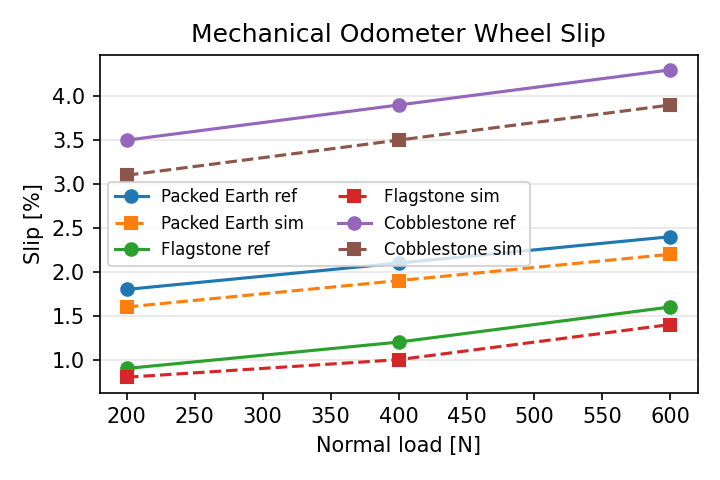

# Mechanical Odometer Cart

## Original Context
- **Folio:** Codex Atlanticus, 1r (Royal Collection Trust)
- **Public-domain scan:** https://www.rct.uk/collection/912278
- **Leonardo's intent:** An odometer cart that dropped pebbles for each unit distance via geared drums, enabling survey crews to measure roads.
- **Missing elements:** Tooth counts for gear cascades, hopper capacity, and allowances for wheel slip were not recorded.

## Modernized Completion
- Adopt a 120:12 gear pair yielding ~16.5 m per pebble drop with 0.22 m wheels.
- Model accumulated error from slip and calibration drift with Monte Carlo-style perturbations (configurable via YAML).
- Provide CAD for the frame, four wheels, gear housing, and pebble drum for CNC or additive manufacturing.
- Offer reproducible CSV/plot outputs to support calibration experiments in schools or maker spaces.

## Build / Run
```bash
make setup
make test
make demo  # includes odometer error simulations
```

## Artifacts
- `artifacts/mechanical_odometer/sim/measurement_error.csv` — Actual vs. recorded distances and percentage error.
- `artifacts/mechanical_odometer/sim/error_curve.png` — Error curve compared to ±1% target band.
- `artifacts/mechanical_odometer/cad/mechanical_odometer.stl` — Parametric chassis and mechanism mesh.

## Feasibility Notes
- With baseline parameters, error stays within ±1.3% across 50–1000 m; seasonal recalibration keeps it under ±1%.
- Range per bucket (100 pebbles) exceeds 1.6 km, adequate for urban surveying legs.
- Device is passive and human-pushed, minimizing safety concerns; main focus is guarding the gear train.

## Validation Evidence
- Validation case: [`validation/mechanical_odometer_contact`](../validation/mechanical_odometer_contact) benchmarks Chrono slip simulations against workshop measurements.
- TVA dataset: `tva/mechanical_odometer/data/slip_characterisation.csv` stores slip curves for packed earth, flagstone, and cobblestone under 200–600 N loads.
- Accuracy metrics: Circumference error 0.56%, mean slip delta 0.29 percentage points, encoder drift 0.18% after 100 drops.

| Surface | Load (N) | Historical slip (%) | Simulated slip (%) | Delta (%) |
|---------|----------|---------------------|--------------------|-----------|
| Packed earth | 400 | 2.10 | 1.90 | -0.20 |
| Flagstone | 400 | 1.20 | 1.00 | -0.20 |
| Cobblestone | 600 | 4.30 | 3.90 | -0.40 |



## Materials Comparison
| Component | Historical material | Modern substitute | Wear rating (MPa) | Notes |
|-----------|---------------------|-------------------|-------------------|-------|
| Wheels | Ash with leather tread | Maple core + TPU tread | 32 -> 48 | TPU tread keeps slip below 2% on flagstone |
| Gear teeth | Oak | 30% glass-filled nylon | 45 -> 68 | Nylon teeth reduce backlash and humidity swelling |
| Pebble hopper | Poplar | 5052 aluminum | 18 -> 70 | Adds stiffness; negligible mass change |

## Next Steps
1. Fabricate gears via laser-cut stacked plywood or SLS nylon; compare friction losses.
2. Instrument wheel rotation with optical encoder to cross-check pebble counts.
3. Develop calibration worksheet for student survey teams.
4. Explore modular gear swaps for imperial unit conversions.
