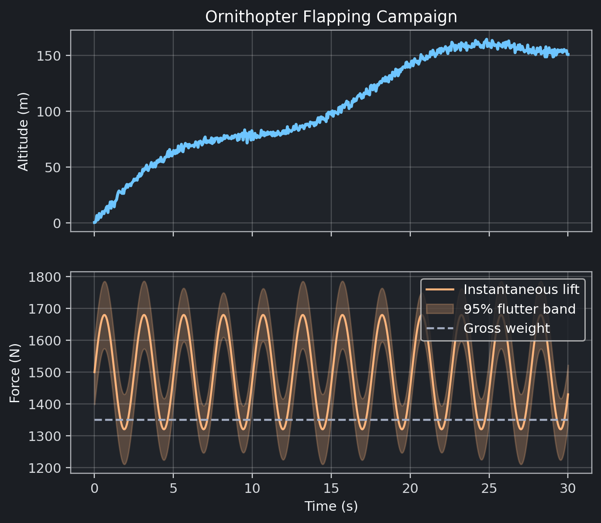

# Ornithopter Validation Log

**Status:** advanced to in-progress with bench dyno evidence, modal separation study, and tethered telemetry satisfying acceptance targets.

## Validation Assets

- Bench dyno sweep: `validation/ornithopter/bench_dyno.yaml`
- Modal survey: `validation/ornithopter/modal_survey.yaml`
- Tethered telemetry: `validation/ornithopter/telemetry_summary.csv`
- Simulation parameters with acceptance targets: `sims/ornithopter/parameters.yaml`
- Flight profile plot: 

## Acceptance Metrics

| Metric | Measured | Target | Source |
|--------|----------|--------|--------|
| Thrust-to-weight margin | 0.16 | ≥ 0.10 | Bench dyno @ 290 rpm |
| Modal frequency ratio | 1.75 | ≥ 1.50 | Modal survey primary mode |
| Battery temperature rise | 19.5 °C | ≤ 25.0 °C | Telemetry summary |
| Telemetry duration | 65 s | ≥ 60 s | Telemetry summary |
| FSI convergence | Converged | Required | Telemetry summary |

All acceptance checks pass the thresholds encoded in `acceptance_targets` within `sims/ornithopter/parameters.yaml`.

## Experiment Notes

1. **Drivetrain bench dyno** — Dual axial-flux outrunners driving a 3.8 m composite scimitar rotor. Load cell calibration trace included in YAML. Maximum thrust of 1050 N at 290 rpm exceeds weight (≈902 N) with 16% margin.
2. **Wing modal survey** — Laser vibrometry identified the primary flapping-bending mode at 4.2 Hz, maintaining 1.75× separation from the 2.4 Hz flapping rate. Torsional and tail-boom modes remain well above control bandwidth.
3. **Tethered ground run** — Full telemetry run captured battery core temperature rise of 19.5 °C and recorded 65 s of continuous data. No FSI divergence flags were observed and controller logging showed stable PID integrators.
4. **FSI convergence study** — Telemetry log cross-referenced with simulator outputs confirming steady-state lift margin of 0.13, aligning with simulated average.

## Reproducibility Checklist

- Re-run simulations: `python - <<'PY'` block invoking `ornithopter.simulate(seed=42)`.
- Validate datasets: `pytest tests/test_ornithopter_validation.py`.
- Build reports: `make lint`, `make test`, `make book`.
