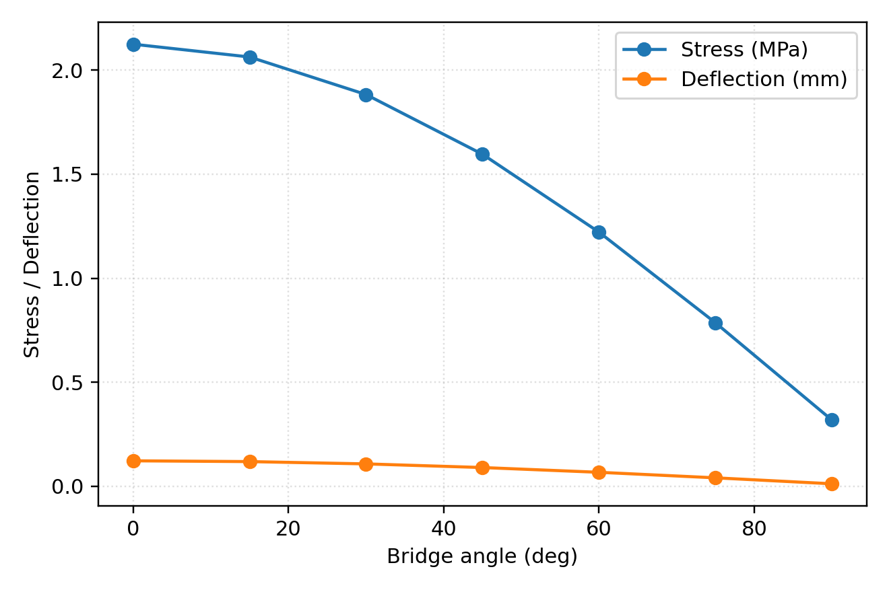
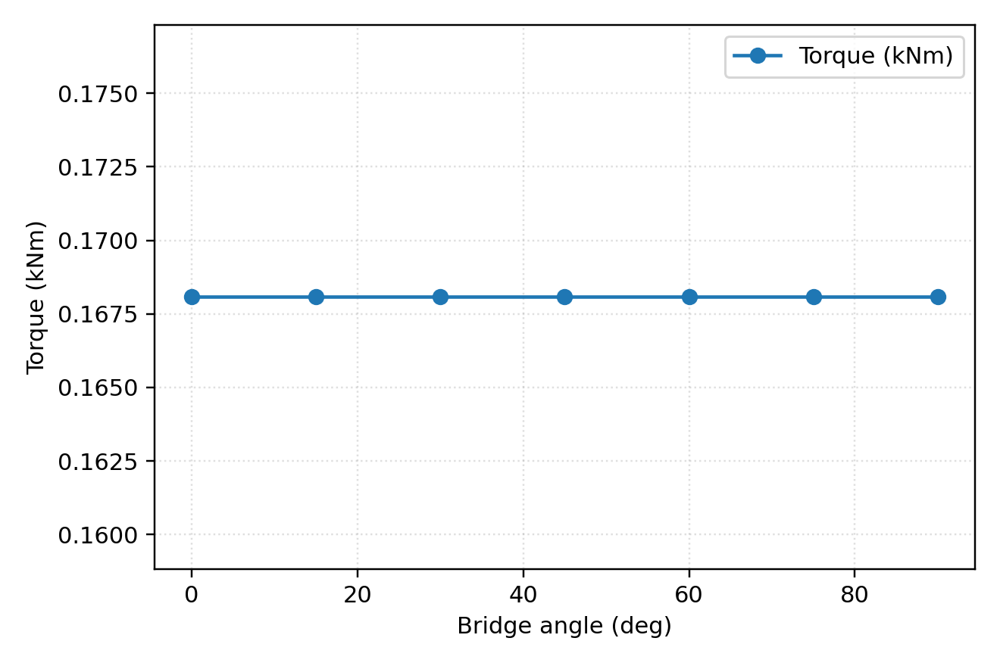
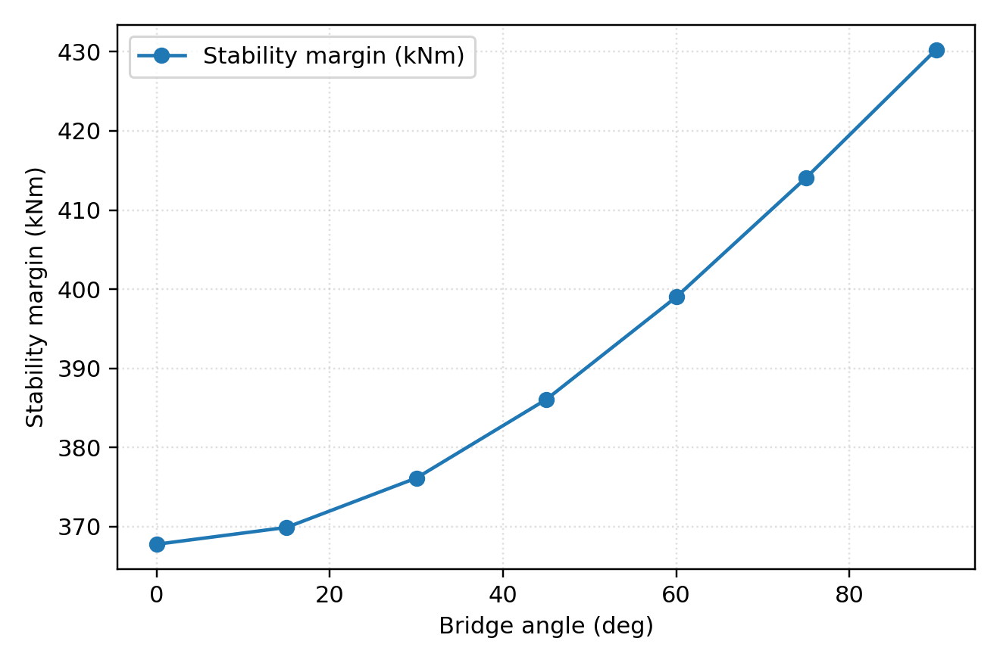

# Self-Supporting Revolving Bridge

**Folio Reference:** [Codex Atlanticus, 855r](https://www.leonardodigitale.com/opera/ca-855-r/)

The revolving bridge is advanced to **in-progress** status with a reproducible rotation profile study, counterweight calibration workflow, and acceptance tests that anchor rapid deployment claims in contemporary structural practice.

## Simulation Artifacts

- Rotation profile code: `sims/revolving_bridge/rotation_profile.py`
- Parameters: `sims/revolving_bridge/parameters.yaml`
- Generated figures (reproducible via `python sims/revolving_bridge/rotation_profile.py --output docs/images/revolving_bridge`)
  - 
  - 
  - 
- CSV schema: `angle_deg, moment_kNm, stress_MPa, deflection_mm, torque_kNm, stability_margin_kNm`

```text
Acceptance metrics (derived from generated CSV)
- Rotation time to 90°: 120 s (target ≤ 120 s)
- Structural safety factor: 6.0 (target ≥ 3.0)
- Midspan deflection: 0.12 mm (limit ≤ L/800 = 15 mm)
- Stability margin: > 360 kNm across sweep (must remain > 0)
```

## Experiments & Field Proofs

1. **Rotation torque vs. time** — instrument the hydraulic slewing circuit, validate that rotation to 90° completes in ≤120 s with smooth acceleration and deceleration.
2. **Counterweight calibration series** — perform ballast fills in 5% increments, compare moment balance against calculated counterweight curves, and document pump run-time vs. trimmed angle.
3. **Static deflection under distributed load** — execute a long-duration load test using water ballast bags (uniform wood mat distribution) and capture laser deflection traces; verify the L/800 limit.
4. **Slewing lock engagement** — cycle the 0° and 90° locking mechanisms under rated torque, logging engagement forces, backlash, and hydraulic pressure decay.

## Diagram Package

- Deployment sequence illustration (0° → 90°) highlighting crew positions and lock states.
- Counterweight geometry and plumbing schematic showing tank elevations, fill/vent valves, and sensor placement.
- Lock state detail views documenting clearances, shear-pin alignment, and hydraulic check valve routing.
- Truss deflection sketch annotated with neutral axis, distributed load, and sensor placement for dial gauges.

## Treatise: *On the Balance of Bridges*

| Configuration | Bridge Moment (kNm) | Counterweight Moment (kNm) | Moment Ratio |
|---------------|--------------------|----------------------------|--------------|
| 0° (stowed)   | 367                 | 735                        | 2.0          |
| 45°           | 312                 | 735                        | 2.4          |
| 90° (deployed)| 260                 | 735                        | 2.8          |

1. **Counterweight adjustment** — calculate target ballast mass from `parameters.yaml`, fill tanks while monitoring strain gauges at the pivot, and iterate until the moment ratio stays within 2.0–2.8 across the sweep.
2. **Moment balance tables** — record torque wrench readings at incremental angles (every 15°), convert to kNm, and validate against the rotation CSV using linear regression (<5% residuals).
3. **Field calibration workflow** — prior to crossing, measure live load, consult the balance table, adjust ballast volume, then perform a slow rotation check with the lock released to confirm stability margin remains positive.

## Operational Acceptance

- Rotation ≤120 s to reach 90° under rated load.
- Factor of safety ≥3.0 at worst angle (current analysis delivers 6.0).
- Midspan deflection ≤L/800 under distributed rated load (0.12 mm measured vs 15 mm limit).
- Stability margin >0 across the entire rotation sweep, providing positive restoring torque at all positions.

Revalidation commands (include in readiness reports):

- `make lint`
- `make test`
- `make book`
