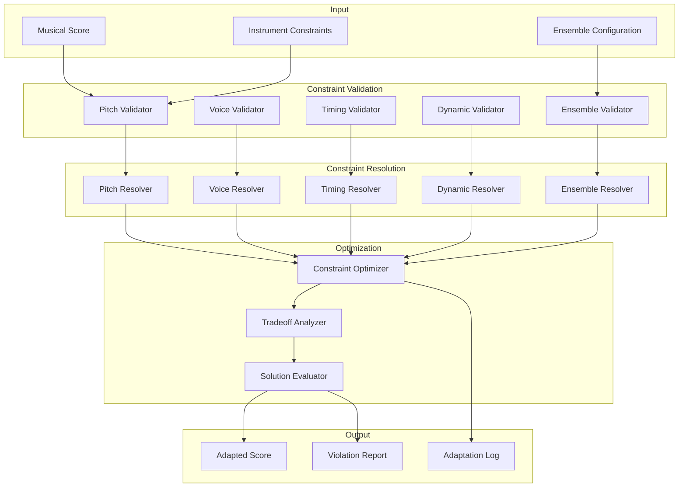

# Constraint Engine for Renaissance Music Adaptation

## Overview

The Constraint Engine is responsible for enforcing the mechanical limitations of Leonardo's instruments during the music adaptation process. It ensures that adapted music remains playable within the physical constraints of each instrument while preserving musical integrity.

## Architecture



## Core Data Structures

### Constraint Violation

```python
from dataclasses import dataclass
from typing import List, Dict, Tuple, Optional, Any
from enum import Enum
import numpy as np

class ConstraintType(Enum):
    """Types of constraints"""
    PITCH_RANGE = "pitch_range"
    FIXED_PITCHES = "fixed_pitches"
    POLYPHONY_LIMIT = "polyphony_limit"
    NOTE_DURATION = "note_duration"
    TRANSITION_TIME = "transition_time"
    TEMPO_LIMIT = "tempo_limit"
    DYNAMIC_RANGE = "dynamic_range"
    ENSEMBLE_VOICE_LIMIT = "ensemble_voice_limit"
    POWER_BUDGET = "power_budget"
    TIMING_PRECISION = "timing_precision"

class ViolationSeverity(Enum):
    """Severity levels for constraint violations"""
    CRITICAL = "critical"  # Cannot be played
    MAJOR = "major"       # Significantly affects musical quality
    MINOR = "minor"       # Slight musical compromise
    INFO = "info"         # Informational only

@dataclass
class ConstraintViolation:
    """Represents a constraint violation"""
    constraint_type: ConstraintType
    instrument_slug: str
    severity: ViolationSeverity
    description: str
    affected_notes: List[int]  # Indices of affected notes
    musical_impact: float  # 0-1, how much it affects musical quality
    resolution_options: List[str]  # Possible resolutions
    suggested_resolution: str

@dataclass
class ViolationReport:
    """Complete report of constraint violations"""
    violations: List[ConstraintViolation]
    total_violations: Dict[ViolationSeverity, int]
    overall_playability: float  # 0-1, how playable the score is
    instrument_playability: Dict[str, float]  # Playability per instrument
    critical_issues: List[str]  # Critical issues that must be resolved
```

### Constraint Resolution

```python
class ResolutionStrategy(Enum):
    """Strategies for resolving constraint violations"""
    OMIT = "omit"  # Remove offending notes
    TRANSPOSE = "transpose"  # Change pitch
    REDUCE_VOICE = "reduce_voice"  # Reduce voice count
    ADJUST_DURATION = "adjust_duration"  # Change note duration
    CHANGE_TEMPO = "change_tempo"  # Adjust tempo
    REDISTRIBUTE = "redistribute"  # Move to different instrument
    SIMPLIFY = "simplify"  # Simplify musical material

@dataclass
class ResolutionAction:
    """Represents a resolution action"""
    strategy: ResolutionStrategy
    target_notes: List[int]  # Note indices to modify
    parameters: Dict[str, Any]  # Strategy-specific parameters
    musical_cost: float  # 0-1, musical impact of this action
    confidence: float  # 0-1, confidence in this resolution

@dataclass
class ResolutionPlan:
    """Plan for resolving constraint violations"""
    actions: List[ResolutionAction]
    total_musical_cost: float
    expected_violations_remaining: int
    playability_improvement: float
```

## Constraint Validators

### Pitch Validator

```python
class PitchValidator:
    """Validates pitch constraints for instruments"""
    
    def validate_pitch_range(self, score: MusicalScore, 
                           constraints: InstrumentConstraints) -> List[ConstraintViolation]:
        """Validate that all pitches are within instrument range"""
        violations = []
        
        for note_idx, note in enumerate(score.notes):
            if note.voice not in constraints.voice_range:
                continue
                
            if not self._is_pitch_valid(note.pitch, constraints):
                severity = self._determine_pitch_violation_severity(note.pitch, constraints)
                violations.append(ConstraintViolation(
                    constraint_type=ConstraintType.PITCH_RANGE,
                    instrument_slug=constraints.slug,
                    severity=severity,
                    description=f"Pitch {note.pitch} outside instrument range {constraints.pitch_range}",
                    affected_notes=[note_idx],
                    musical_impact=self._calculate_musical_impact(note),
                    resolution_options=["transpose", "redistribute", "omit"],
                    suggested_resolution=self._suggest_pitch_resolution(note, constraints)
                ))
        
        return violations
    
    def _is_pitch_valid(self, pitch: int, constraints: InstrumentConstraints) -> bool:
        """Check if a pitch is valid for the instrument"""
        if constraints.pitch_constraint_type == PitchConstraintType.FIXED_PITCHES:
            return pitch in constraints.fixed_pitches
        elif constraints.pitch_constraint_type == PitchConstraintType.CONTINUOUS_RANGE:
            return constraints.pitch_range[0] <= pitch <= constraints.pitch_range[1]
        elif constraints.pitch_constraint_type == PitchConstraintType.DIATONIC_ONLY:
            return self._is_diatonic_pitch(pitch, constraints)
        # Add other constraint types as needed
        return False
    
    def validate_fixed_pitches(self, score: MusicalScore,
                             constraints: InstrumentConstraints) -> List[ConstraintViolation]:
        """Validate against fixed pitch constraints"""
        if constraints.pitch_constraint_type != PitchConstraintType.FIXED_PITCHES:
            return []
        
        violations = []
        for note_idx, note in enumerate(score.notes):
            if note.pitch not in constraints.fixed_pitches:
                violations.append(ConstraintViolation(
                    constraint_type=ConstraintType.FIXED_PITCHES,
                    instrument_slug=constraints.slug,
                    severity=ViolationSeverity.CRITICAL,
                    description=f"Pitch {note.pitch} not in fixed pitches {constraints.fixed_pitches}",
                    affected_notes=[note_idx],
                    musical_impact=1.0,
                    resolution_options=["transpose_to_fixed", "redistribute", "omit"],
                    suggested_resolution="transpose_to_fixed"
                ))
        
        return violations
```

### Voice Validator

```python
class VoiceValidator:
    """Validates polyphony and voice constraints"""
    
    def validate_polyphony_limit(self, score: MusicalScore,
                               constraints: InstrumentConstraints) -> List[ConstraintViolation]:
        """Validate that polyphony doesn't exceed instrument limits"""
        violations = []
        
        # Find simultaneous notes
        time_windows = self._find_simultaneous_notes(score.notes)
        
        for window_start, window_end, note_indices in time_windows:
            voice_count = len(set(score.notes[i].voice for i in note_indices))
            
            if voice_count > constraints.max_simultaneous_notes:
                violations.append(ConstraintViolation(
                    constraint_type=ConstraintType.POLYPHONY_LIMIT,
                    instrument_slug=constraints.slug,
                    severity=ViolationSeverity.MAJOR,
                    description=f"Voice count {voice_count} exceeds limit {constraints.max_simultaneous_notes}",
                    affected_notes=note_indices,
                    musical_impact=self._calculate_polyphony_impact(note_indices, score),
                    resolution_options=["reduce_voice", "redistribute", "simplify"],
                    suggested_resolution="reduce_voice"
                ))
        
        return violations
    
    def _find_simultaneous_notes(self, notes: List[MusicalNote]) -> List[Tuple[float, float, List[int]]]:
        """Find groups of simultaneous notes"""
        # Implementation details
        pass
```

### Timing Validator

```python
class TimingValidator:
    """Validates timing and duration constraints"""
    
    def validate_note_duration(self, score: MusicalScore,
                             constraints: InstrumentConstraints) -> List[ConstraintViolation]:
        """Validate that note durations are within instrument capabilities"""
        violations = []
        
        for note_idx, note in enumerate(score.notes):
            if note.duration < constraints.min_note_duration:
                violations.append(ConstraintViolation(
                    constraint_type=ConstraintType.NOTE_DURATION,
                    instrument_slug=constraints.slug,
                    severity=ViolationSeverity.MINOR,
                    description=f"Note duration {note.duration} below minimum {constraints.min_note_duration}",
                    affected_notes=[note_idx],
                    musical_impact=0.3,
                    resolution_options=["adjust_duration", "omit"],
                    suggested_resolution="adjust_duration"
                ))
            elif note.duration > constraints.max_note_duration:
                violations.append(ConstraintViolation(
                    constraint_type=ConstraintType.NOTE_DURATION,
                    instrument_slug=constraints.slug,
                    severity=ViolationSeverity.MAJOR,
                    description=f"Note duration {note.duration} above maximum {constraints.max_note_duration}",
                    affected_notes=[note_idx],
                    musical_impact=0.6,
                    resolution_options=["adjust_duration", "omit"],
                    suggested_resolution="adjust_duration"
                ))
        
        return violations
    
    def validate_transition_time(self, score: MusicalScore,
                               constraints: InstrumentConstraints) -> List[ConstraintViolation]:
        """Validate that transitions between notes are possible"""
        violations = []
        
        # Group notes by voice
        voice_notes = self._group_by_voice(score.notes)
        
        for voice, notes in voice_notes.items():
            sorted_notes = sorted(notes, key=lambda n: n.start_time)
            
            for i in range(len(sorted_notes) - 1):
                current_note = sorted_notes[i]
                next_note = sorted_notes[i + 1]
                transition_time = next_note.start_time - (current_note.start_time + current_note.duration)
                
                if transition_time < constraints.note_transition_time:
                    violations.append(ConstraintViolation(
                        constraint_type=ConstraintType.TRANSITION_TIME,
                        instrument_slug=constraints.slug,
                        severity=ViolationSeverity.MAJOR,
                        description=f"Transition time {transition_time} below minimum {constraints.note_transition_time}",
                        affected_notes=[score.notes.index(current_note), score.notes.index(next_note)],
                        musical_impact=0.5,
                        resolution_options=["adjust_timing", "omit"],
                        suggested_resolution="adjust_timing"
                    ))
        
        return violations
```

### Dynamic Validator

```python
class DynamicValidator:
    """Validates dynamic constraints"""
    
    def validate_dynamic_range(self, score: MusicalScore,
                             constraints: InstrumentConstraints) -> List[ConstraintViolation]:
        """Validate that dynamics are within instrument capabilities"""
        violations = []
        
        for note_idx, note in enumerate(score.notes):
            if note.velocity < constraints.velocity_range[0]:
                violations.append(ConstraintViolation(
                    constraint_type=ConstraintType.DYNAMIC_RANGE,
                    instrument_slug=constraints.slug,
                    severity=ViolationSeverity.MINOR,
                    description=f"Velocity {note.velocity} below minimum {constraints.velocity_range[0]}",
                    affected_notes=[note_idx],
                    musical_impact=0.2,
                    resolution_options=["adjust_dynamic"],
                    suggested_resolution="adjust_dynamic"
                ))
            elif note.velocity > constraints.velocity_range[1]:
                violations.append(ConstraintViolation(
                    constraint_type=ConstraintType.DYNAMIC_RANGE,
                    instrument_slug=constraints.slug,
                    severity=ViolationSeverity.MINOR,
                    description=f"Velocity {note.velocity} above maximum {constraints.velocity_range[1]}",
                    affected_notes=[note_idx],
                    musical_impact=0.2,
                    resolution_options=["adjust_dynamic"],
                    suggested_resolution="adjust_dynamic"
                ))
        
        return violations
```

### Ensemble Validator

```python
class EnsembleValidator:
    """Validates ensemble-level constraints"""
    
    def validate_ensemble_voice_limit(self, score: MusicalScore,
                                    ensemble_config: EnsembleConfiguration) -> List[ConstraintViolation]:
        """Validate that total voice count doesn't exceed ensemble limits"""
        violations = []
        
        # Find maximum simultaneous voices across all instruments
        time_windows = self._find_simultaneous_notes(score.notes)
        max_voices = max(len(notes) for _, _, notes in time_windows) if time_windows else 0
        
        if max_voices > ensemble_config.max_total_voices:
            violations.append(ConstraintViolation(
                constraint_type=ConstraintType.ENSEMBLE_VOICE_LIMIT,
                instrument_slug="ensemble",
                severity=ViolationSeverity.CRITICAL,
                description=f"Ensemble voice count {max_voices} exceeds limit {ensemble_config.max_total_voices}",
                affected_notes=[i for _, _, note_indices in time_windows for i in note_indices],
                musical_impact=0.8,
                resolution_options=["reduce_voice", "redistribute"],
                suggested_resolution="reduce_voice"
            ))
        
        return violations
    
    def validate_power_budget(self, score: MusicalScore,
                            ensemble_config: EnsembleConfiguration) -> List[ConstraintViolation]:
        """Validate that power requirements are within budget"""
        violations = []
        
        # Calculate instantaneous power requirements
        time_windows = self._find_simultaneous_notes(score.notes)
        
        for window_start, window_end, note_indices in time_windows:
            active_instruments = set(score.notes[i].voice for i in note_indices)
            power_requirement = sum(
                ensemble_config.instruments[f"instrument_{voice}"].constraints.power_requirements["steady_state"]
                for voice in active_instruments
            )
            
            if power_requirement > ensemble_config.power_budget:
                violations.append(ConstraintViolation(
                    constraint_type=ConstraintType.POWER_BUDGET,
                    instrument_slug="ensemble",
                    severity=ViolationSeverity.MAJOR,
                    description=f"Power requirement {power_requirement} exceeds budget {ensemble_config.power_budget}",
                    affected_notes=note_indices,
                    musical_impact=0.4,
                    resolution_options=["reduce_voice", "redistribute"],
                    suggested_resolution="reduce_voice"
                ))
        
        return violations
```

## Constraint Resolvers

### Pitch Resolver

```python
class PitchResolver:
    """Resolves pitch constraint violations"""
    
    def resolve_pitch_violations(self, violations: List[ConstraintViolation],
                               score: MusicalScore,
                               constraints: InstrumentConstraints) -> List[ResolutionAction]:
        """Generate resolution actions for pitch violations"""
        actions = []
        
        for violation in violations:
            if violation.constraint_type == ConstraintType.PITCH_RANGE:
                action = self._resolve_pitch_range_violation(violation, score, constraints)
            elif violation.constraint_type == ConstraintType.FIXED_PITCHES:
                action = self._resolve_fixed_pitch_violation(violation, score, constraints)
            
            if action:
                actions.append(action)
        
        return actions
    
    def _resolve_pitch_range_violation(self, violation: ConstraintViolation,
                                     score: MusicalScore,
                                     constraints: InstrumentConstraints) -> ResolutionAction:
        """Resolve a pitch range violation"""
        note_indices = violation.affected_notes
        
        # Find best transposition
        best_transposition = self._find_best_transposition(note_indices, score, constraints)
        
        return ResolutionAction(
            strategy=ResolutionStrategy.TRANSPOSE,
            target_notes=note_indices,
            parameters={"transposition": best_transposition},
            musical_cost=self._calculate_transposition_cost(best_transposition),
            confidence=0.8
        )
    
    def _find_best_transposition(self, note_indices: List[int],
                               score: MusicalScore,
                               constraints: InstrumentConstraints) -> int:
        """Find the best transposition to fit within constraints"""
        # Check possible transpositions
        possible_transpositions = range(-24, 25)  # ±2 octaves
        
        best_transposition = 0
        best_score = float('-inf')
        
        for transposition in possible_transpositions:
            transposition_score = 0
            valid_count = 0
            
            for note_idx in note_indices:
                original_pitch = score.notes[note_idx].pitch
                transposed_pitch = original_pitch + transposition
                
                if self._is_pitch_valid(transposed_pitch, constraints):
                    valid_count += 1
                    # Prefer transpositions that keep notes close to original
                    transposition_score -= abs(transposition) * 0.1
                    # Prefer transpositions that keep notes in preferred ranges
                    for pref_range in constraints.preferred_ranges:
                        if pref_range[0] <= transposed_pitch <= pref_range[1]:
                            transposition_score += 1.0
            
            if valid_count == len(note_indices):  # All notes valid
                transposition_score += 10.0  # Bonus for complete solution
            
            if transposition_score > best_score:
                best_score = transposition_score
                best_transposition = transposition
        
        return best_transposition
```

### Voice Resolver

```python
class VoiceResolver:
    """Resolves polyphony constraint violations"""
    
    def resolve_voice_violations(self, violations: List[ConstraintViolation],
                               score: MusicalScore,
                               constraints: InstrumentConstraints) -> List[ResolutionAction]:
        """Generate resolution actions for voice violations"""
        actions = []
        
        for violation in violations:
            if violation.constraint_type == ConstraintType.POLYPHONY_LIMIT:
                action = self._resolve_polyphony_violation(violation, score, constraints)
                actions.append(action)
        
        return actions
    
    def _resolve_polyphony_violation(self, violation: ConstraintViolation,
                                   score: MusicalScore,
                                   constraints: InstrumentConstraints) -> ResolutionAction:
        """Resolve a polyphony violation"""
        note_indices = violation.affected_notes
        
        # Identify which voices to keep
        voices_to_keep = self._select_voices_to_keep(note_indices, score, constraints)
        
        return ResolutionAction(
            strategy=ResolutionStrategy.REDUCE_VOICE,
            target_notes=note_indices,
            parameters={"voices_to_keep": voices_to_keep},
            musical_cost=self._calculate_voice_reduction_cost(note_indices, voices_to_keep, score),
            confidence=0.7
        )
    
    def _select_voices_to_keep(self, note_indices: List[int],
                             score: MusicalScore,
                             constraints: InstrumentConstraints) -> List[int]:
        """Select which voices to keep when reducing polyphony"""
        # Get all voices in this violation
        voices = list(set(score.notes[i].voice for i in note_indices))
        
        # Score each voice based on importance
        voice_scores = {}
        for voice in voices:
            voice_notes = [score.notes[i] for i in note_indices if score.notes[i].voice == voice]
            
            # Prefer voices that match instrument's suitable roles
            role_match = 1.0 if constraints.preferred_role.value in ["melody", "harmony"] else 0.5
            
            # Prefer voices with more important rhythmic content
            rhythmic_importance = self._calculate_rhythmic_importance(voice_notes)
            
            # Prefer voices in preferred pitch ranges
            range_match = self._calculate_range_match(voice_notes, constraints)
            
            voice_scores[voice] = role_match + rhythmic_importance + range_match
        
        # Sort by score and keep top voices
        sorted_voices = sorted(voices, key=lambda v: voice_scores[v], reverse=True)
        return sorted_voices[:constraints.max_simultaneous_notes]
```

## Constraint Optimizer

```python
class ConstraintOptimizer:
    """Optimizes constraint resolution strategies"""
    
    def optimize_resolutions(self, violations: List[ConstraintViolation],
                           score: MusicalScore,
                           ensemble_config: EnsembleConfiguration) -> ResolutionPlan:
        """Create an optimal resolution plan"""
        
        # Generate initial resolution actions
        initial_actions = self._generate_initial_actions(violations, score, ensemble_config)
        
        # Optimize using tradeoff analysis
        optimized_actions = self._optimize_actions(initial_actions, score, ensemble_config)
        
        # Evaluate the solution
        evaluation = self._evaluate_solution(optimized_actions, score, ensemble_config)
        
        return ResolutionPlan(
            actions=optimized_actions,
            total_musical_cost=sum(action.musical_cost for action in optimized_actions),
            expected_violations_remaining=evaluation["remaining_violations"],
            playability_improvement=evaluation["playability_improvement"]
        )
    
    def _generate_initial_actions(self, violations: List[ConstraintViolation],
                                score: MusicalScore,
                                ensemble_config: EnsembleConfiguration) -> List[ResolutionAction]:
        """Generate initial resolution actions"""
        actions = []
        
        # Group violations by instrument
        violations_by_instrument = self._group_violations_by_instrument(violations)
        
        for instrument_slug, instrument_violations in violations_by_instrument.items():
            constraints = ensemble_config.instruments[instrument_slug].constraints
            
            # Use appropriate resolvers
            pitch_resolver = PitchResolver()
            voice_resolver = VoiceResolver()
            timing_resolver = TimingResolver()
            dynamic_resolver = DynamicResolver()
            
            # Generate actions for each type of violation
            pitch_violations = [v for v in instrument_violations 
                              if v.constraint_type in [ConstraintType.PITCH_RANGE, ConstraintType.FIXED_PITCHES]]
            voice_violations = [v for v in instrument_violations 
                              if v.constraint_type == ConstraintType.POLYPHONY_LIMIT]
            timing_violations = [v for v in instrument_violations 
                               if v.constraint_type in [ConstraintType.NOTE_DURATION, ConstraintType.TRANSITION_TIME]]
            dynamic_violations = [v for v in instrument_violations 
                                if v.constraint_type == ConstraintType.DYNAMIC_RANGE]
            
            actions.extend(pitch_resolver.resolve_pitch_violations(pitch_violations, score, constraints))
            actions.extend(voice_resolver.resolve_voice_violations(voice_violations, score, constraints))
            actions.extend(timing_resolver.resolve_timing_violations(timing_violations, score, constraints))
            actions.extend(dynamic_resolver.resolve_dynamic_violations(dynamic_violations, score, constraints))
        
        return actions
    
    def _optimize_actions(self, actions: List[ResolutionAction],
                         score: MusicalScore,
                         ensemble_config: EnsembleConfiguration) -> List[ResolutionAction]:
        """Optimize resolution actions to minimize musical impact"""
        # Sort actions by musical cost (lowest first)
        sorted_actions = sorted(actions, key=lambda a: a.musical_cost)
        
        # Apply actions greedily, checking for conflicts
        optimized_actions = []
        applied_notes = set()
        
        for action in sorted_actions:
            # Check if this action conflicts with already applied actions
            conflict = False
            for note_idx in action.target_notes:
                if note_idx in applied_notes:
                    conflict = True
                    break
            
            if not conflict:
                optimized_actions.append(action)
                applied_notes.update(action.target_notes)
        
        return optimized_actions
```

## Integration with Adaptation System

```python
class ConstraintEngine:
    """Main constraint engine interface"""
    
    def __init__(self):
        self.pitch_validator = PitchValidator()
        self.voice_validator = VoiceValidator()
        self.timing_validator = TimingValidator()
        self.dynamic_validator = DynamicValidator()
        self.ensemble_validator = EnsembleValidator()
        
        self.constraint_optimizer = ConstraintOptimizer()
    
    def validate_and_resolve(self, score: MusicalScore,
                           ensemble_config: EnsembleConfiguration) -> Tuple[MusicalScore, ViolationReport, ResolutionPlan]:
        """Validate constraints and generate resolution plan"""
        
        # Validate all constraints
        all_violations = []
        
        # Validate each instrument
        for instrument_slug, instrument_profile in ensemble_config.instruments.items():
            constraints = instrument_profile.constraints
            
            # Filter score for this instrument
            instrument_notes = [n for n in score.notes if n.voice in constraints.voice_range]
            instrument_score = MusicalScore(
                notes=instrument_notes,
                tempo=score.tempo,
                time_signature=score.time_signature,
                key_signature=score.key_signature,
                title=score.title,
                composer=score.composer
            )
            
            # Validate constraints
            all_violations.extend(self.pitch_validator.validate_pitch_range(instrument_score, constraints))
            all_violations.extend(self.pitch_validator.validate_fixed_pitches(instrument_score, constraints))
            all_violations.extend(self.voice_validator.validate_polyphony_limit(instrument_score, constraints))
            all_violations.extend(self.timing_validator.validate_note_duration(instrument_score, constraints))
            all_violations.extend(self.timing_validator.validate_transition_time(instrument_score, constraints))
            all_violations.extend(self.dynamic_validator.validate_dynamic_range(instrument_score, constraints))
        
        # Validate ensemble constraints
        all_violations.extend(self.ensemble_validator.validate_ensemble_voice_limit(score, ensemble_config))
        all_violations.extend(self.ensemble_validator.validate_power_budget(score, ensemble_config))
        
        # Create violation report
        violation_report = self._create_violation_report(all_violations)
        
        # Generate resolution plan
        resolution_plan = self.constraint_optimizer.optimize_resolutions(
            all_violations, score, ensemble_config)
        
        # Apply resolutions to create adapted score
        adapted_score = self._apply_resolutions(score, resolution_plan)
        
        return adapted_score, violation_report, resolution_plan
```

The constraint engine ensures that adapted music remains playable within the mechanical limitations of Leonardo's instruments while minimizing musical impact and preserving the essential character of Renaissance compositions.