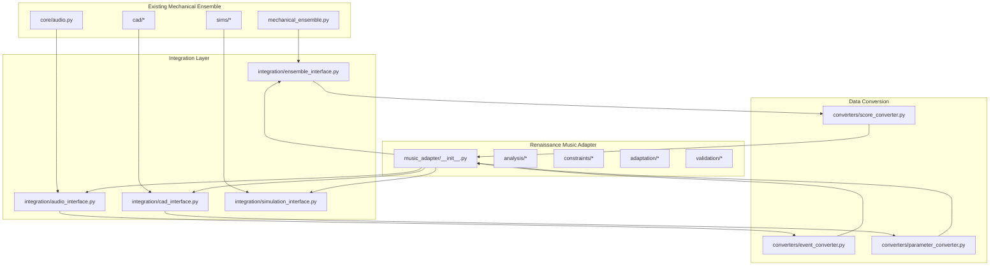

# Integration Points with Existing Mechanical Ensemble Code

## Overview

This document defines the integration points between the Renaissance Music Adapter system and the existing Mechanical Ensemble code. It ensures seamless operation of the adaptation system with the current infrastructure while maintaining compatibility with existing APIs and data structures.

## Integration Architecture



## Core Integration Points

### 1. Mechanical Ensemble Integration

#### Extension of mechanical_ensemble.py

```python
# Additions to src/davinci_codex/mechanical_ensemble.py

from .music_adapter import MusicAdapter, AdaptationConfig, MusicalScore
from pathlib import Path
from typing import Optional, Dict, Any

class MechanicalEnsemble:
    # ... existing code ...
    
    def __init__(self):
        # ... existing initialization ...
        self.music_adapter = MusicAdapter()
    
    def load_renaissance_music(self, music_path: Path, 
                             adaptation_config: Optional[AdaptationConfig] = None) -> Dict[str, Any]:
        """Load and adapt Renaissance music for mechanical performance"""
        # Load music file (MIDI or ABC)
        if music_path.suffix.lower() == '.mid':
            score = self.music_adapter.load_midi(music_path)
        elif music_path.suffix.lower() == '.abc':
            score = self.music_adapter.load_abc(music_path)
        else:
            raise ValueError(f"Unsupported music format: {music_path.suffix}")
        
        # Analyze music
        analysis = self.music_adapter.analyze_music(score)
        
        # Adapt music for mechanical instruments
        if adaptation_config is None:
            adaptation_config = AdaptationConfig()
        
        adapted_score, adaptation_report = self.music_adapter.adapt_music(
            score, analysis, self.instruments, adaptation_config
        )
        
        # Validate adaptation
        validation_report = self.music_adapter.validate_adaptation(
            adapted_score, score, analysis, self.instruments
        )
        
        # Convert to ensemble format
        ensemble_events = self.music_adapter.convert_to_ensemble_events(adapted_score)
        
        return {
            "original_score": score,
            "adapted_score": adapted_score,
            "analysis": analysis,
            "adaptation_report": adaptation_report,
            "validation_report": validation_report,
            "ensemble_events": ensemble_events
        }
    
    def simulate_renaissance_performance(self, music_data: Dict[str, Any],
                                       output_path: Optional[Path] = None) -> Dict[str, Any]:
        """Simulate performance of adapted Renaissance music"""
        adapted_score = music_data["adapted_score"]
        validation_report = music_data["validation_report"]
        
        # Use existing simulation with adapted events
        ensemble_events = music_data["ensemble_events"]
        
        # Run simulation
        simulation_result = self.simulate(ensemble_events)
        
        # Add Renaissance-specific simulation data
        if validation_report.simulation_result:
            simulation_result["renaissance_simulation"] = validation_report.simulation_result
        
        # Generate audio if requested
        if output_path:
            audio_path = output_path.with_suffix('.wav')
            self.render_renaissance_audio(adapted_score, audio_path)
            simulation_result["audio_path"] = str(audio_path)
        
        return simulation_result
    
    def render_renaissance_audio(self, adapted_score: MusicalScore, 
                               output_path: Path) -> Path:
        """Render audio for adapted Renaissance music"""
        # Convert adapted score to format expected by audio.py
        audio_score = self.music_adapter.convert_to_audio_score(adapted_score)
        
        # Use existing audio rendering
        from .core.audio import render_score_to_wav
        return render_score_to_wav(
            audio_score, 
            adapted_score.tempo, 
            adapted_score.time_signature[0], 
            output_path
        )
```

#### Ensemble Interface Module

```python
# src/davinci_codex/music_adapter/integration/ensemble_interface.py

from typing import Dict, List, Any, Optional
from pathlib import Path

from ..core.models import MusicalScore
from ..adaptation.adaptation_engine import AdaptationEngine
from ..validation.validation_system import ValidationSystem
from ..core.midi_parser import MIDIParser
from ..core.abc_parser import ABCParser

class EnsembleInterface:
    """Interface between Music Adapter and Mechanical Ensemble"""
    
    def __init__(self, ensemble_instance):
        self.ensemble = ensemble_instance
        self.adaptation_engine = AdaptationEngine()
        self.validation_system = ValidationSystem()
        self.midi_parser = MIDIParser()
        self.abc_parser = ABCParser()
    
    def load_and_adapt_music(self, music_path: Path, 
                            adaptation_config: Optional[Dict[str, Any]] = None) -> Dict[str, Any]:
        """Load and adapt music for mechanical ensemble"""
        # Parse music file
        if music_path.suffix.lower() == '.mid':
            score = self.midi_parser.parse(music_path)
        elif music_path.suffix.lower() == '.abc':
            score = self.abc_parser.parse(music_path)
        else:
            raise ValueError(f"Unsupported music format: {music_path.suffix}")
        
        # Get instrument constraints from ensemble
        constraints = self._extract_instrument_constraints()
        
        # Analyze music
        analysis = self._analyze_music(score)
        
        # Adapt music
        adapted_score, adaptation_report = self.adaptation_engine.adapt_music(
            score, analysis, constraints, adaptation_config
        )
        
        # Validate adaptation
        validation_report = self.validation_system.validate_adapted_music(
            adapted_score, score, analysis, constraints
        )
        
        # Convert to ensemble events
        ensemble_events = self._convert_to_ensemble_events(adapted_score)
        
        return {
            "original_score": score,
            "adapted_score": adapted_score,
            "analysis": analysis,
            "adaptation_report": adaptation_report,
            "validation_report": validation_report,
            "ensemble_events": ensemble_events
        }
    
    def _extract_instrument_constraints(self) -> Dict[str, Any]:
        """Extract instrument constraints from ensemble"""
        constraints = {}
        
        for instrument_slug, instrument in self.ensemble.instruments.items():
            # Extract relevant parameters from instrument
            params = instrument.params
            
            constraints[instrument_slug] = {
                "slug": instrument_slug,
                "pitch_range": self._extract_pitch_range(params),
                "max_simultaneous_notes": self._extract_max_voices(params),
                "min_note_duration": self._extract_min_duration(params),
                "max_note_duration": self._extract_max_duration(params),
                "note_transition_time": self._extract_transition_time(params),
                "tempo_range": self._extract_tempo_range(params),
                "voice_range": self._extract_voice_range(params),
                "noise_characteristics": self._extract_noise_characteristics(params),
                "power_requirements": self._extract_power_requirements(params)
            }
        
        return constraints
    
    def _convert_to_ensemble_events(self, adapted_score: MusicalScore) -> List[Dict[str, Any]]:
        """Convert adapted score to ensemble event format"""
        events = []
        
        for note in adapted_score.notes:
            # Find instrument for this voice
            instrument_slug = self._find_instrument_for_voice(note.voice)
            
            if instrument_slug:
                event = {
                    "instrument": instrument_slug,
                    "type": "note",
                    "pitch": note.pitch,
                    "velocity": note.velocity,
                    "start_time": note.start_time,
                    "duration": note.duration,
                    "voice": note.voice
                }
                events.append(event)
        
        return events
    
    def _find_instrument_for_voice(self, voice: int) -> Optional[str]:
        """Find instrument that can play this voice"""
        for instrument_slug, instrument in self.ensemble.instruments.items():
            # Check if this voice is in the instrument's range
            voice_range = self._get_instrument_voice_range(instrument)
            if voice_range[0] <= voice <= voice_range[1]:
                return instrument_slug
        
        return None
```

### 2. Audio System Integration

#### Extension of core/audio.py

```python
# Additions to src/davinci_codex/core/audio.py

from ..music_adapter.core.models import MusicalScore
from typing import Dict, List, Any

def render_adapted_score_to_wav(adapted_score: MusicalScore, 
                              instrument_profiles: Dict[str, Any],
                              output_path: Path,
                              sample_rate: int = DEFAULT_SAMPLE_RATE) -> Path:
    """Render an adapted Renaissance score to WAV file"""
    
    # Convert adapted score to format expected by render_score_to_wav
    score_dict = convert_adapted_score_to_dict(adapted_score, instrument_profiles)
    
    # Use existing rendering function
    return render_score_to_wav(
        score_dict,
        adapted_score.tempo,
        adapted_score.time_signature[0],
        output_path,
        sample_rate
    )

def convert_adapted_score_to_dict(adapted_score: MusicalScore,
                                instrument_profiles: Dict[str, Any]) -> Dict[str, List[Dict[str, Any]]]:
    """Convert adapted score to score dictionary format"""
    score_dict = {}
    
    # Group notes by instrument
    instrument_notes = {}
    for note in adapted_score.notes:
        # Find instrument for this voice
        instrument_slug = find_instrument_for_voice(note.voice, instrument_profiles)
        
        if instrument_slug not in instrument_notes:
            instrument_notes[instrument_slug] = []
        
        instrument_notes[instrument_slug].append({
            "time_s": note.start_time,
            "frequency_hz": 440.0 * (2 ** ((note.pitch - 69) / 12)),  # Convert MIDI to Hz
            "intensity": note.velocity / 127.0,
            "duration": note.duration,
            "kind": "pitched"
        })
    
    # Convert to score dictionary format
    for instrument_slug, notes in instrument_notes.items():
        score_dict[instrument_slug] = notes
    
    return score_dict

def find_instrument_for_voice(voice: int, instrument_profiles: Dict[str, Any]) -> str:
    """Find instrument that can play this voice"""
    for instrument_slug, profile in instrument_profiles.items():
        voice_range = profile.get("voice_range", (0, 3))
        if voice_range[0] <= voice <= voice_range[1]:
            return instrument_slug
    
    return "default"  # Fallback
```

#### Audio Interface Module

```python
# src/davinci_codex/music_adapter/integration/audio_interface.py

from typing import Dict, Any, Optional
from pathlib import Path

from ..core.models import MusicalScore
from ..validation.validation_system import ValidationSystem

class AudioInterface:
    """Interface between Music Adapter and Audio System"""
    
    def __init__(self):
        self.validation_system = ValidationSystem()
    
    def render_adapted_music(self, adapted_score: MusicalScore,
                           instrument_constraints: Dict[str, Any],
                           validation_report: Optional[Dict[str, Any]] = None,
                           output_path: Optional[Path] = None) -> Dict[str, Any]:
        """Render adapted music to audio"""
        
        # Create instrument profiles from constraints
        instrument_profiles = self._create_instrument_profiles(instrument_constraints)
        
        # Add mechanical noise characteristics if available from validation
        if validation_report and validation_report.simulation_result:
            instrument_profiles = self._add_simulation_data(
                instrument_profiles, validation_report.simulation_result
            )
        
        # Render audio
        if output_path:
            from ..core.audio import render_adapted_score_to_wav
            audio_path = render_adapted_score_to_wav(
                adapted_score, instrument_profiles, output_path
            )
            
            return {
                "audio_path": str(audio_path),
                "instrument_profiles": instrument_profiles,
                "rendering_successful": True
            }
        
        return {
            "instrument_profiles": instrument_profiles,
            "rendering_successful": False,
            "message": "No output path provided"
        }
    
    def _create_instrument_profiles(self, constraints: Dict[str, Any]) -> Dict[str, Any]:
        """Create instrument profiles from constraints"""
        profiles = {}
        
        for instrument_slug, constraint in constraints.items():
            profiles[instrument_slug] = {
                "slug": instrument_slug,
                "voice_range": constraint.get("voice_range", (0, 3)),
                "pitch_range": constraint.get("pitch_range", (36, 84)),
                "noise_characteristics": constraint.get("noise_characteristics", {}),
                "timbre": self._determine_timbre(instrument_slug),
                "attack_time": constraint.get("attack_time", 0.1),
                "decay_time": constraint.get("decay_time", 0.5)
            }
        
        return profiles
    
    def _add_simulation_data(self, profiles: Dict[str, Any],
                           simulation_result: Dict[str, Any]) -> Dict[str, Any]:
        """Add simulation data to instrument profiles"""
        if "instrument_states" in simulation_result:
            for instrument_slug, states in simulation_result["instrument_states"].items():
                if instrument_slug in profiles:
                    # Calculate average noise level from simulation
                    noise_levels = [state.get("noise_level", 0) for state in states]
                    avg_noise = sum(noise_levels) / len(noise_levels) if noise_levels else 0
                    
                    profiles[instrument_slug]["simulated_noise_level"] = avg_noise
        
        return profiles
```

### 3. CAD System Integration

#### CAD Interface Module

```python
# src/davinci_codex/music_adapter/integration/cad_interface.py

from typing import Dict, Any, List, Optional
from pathlib import Path

from ..core.models import MusicalScore
from ..validation.validation_system import ValidationSystem

class CADInterface:
    """Interface between Music Adapter and CAD System"""
    
    def __init__(self):
        self.validation_system = ValidationSystem()
    
    def generate_mechanical_visualization(self, adapted_score: MusicalScore,
                                       instrument_constraints: Dict[str, Any],
                                       validation_report: Optional[Dict[str, Any]] = None,
                                       output_path: Optional[Path] = None) -> Dict[str, Any]:
        """Generate CAD visualization of mechanical performance"""
        
        # Extract mechanical events from score
        mechanical_events = self._extract_mechanical_events(adapted_score)
        
        # Add simulation data if available
        if validation_report and validation_report.simulation_result:
            mechanical_events = self._enhance_with_simulation_data(
                mechanical_events, validation_report.simulation_result
            )
        
        # Generate CAD data
        cad_data = self._generate_cad_data(mechanical_events, instrument_constraints)
        
        # Export CAD files if requested
        if output_path:
            cad_file_path = output_path.with_suffix('.stl')
            self._export_cad_file(cad_data, cad_file_path)
            
            return {
                "cad_file_path": str(cad_file_path),
                "cad_data": cad_data,
                "mechanical_events": mechanical_events,
                "export_successful": True
            }
        
        return {
            "cad_data": cad_data,
            "mechanical_events": mechanical_events,
            "export_successful": False,
            "message": "No output path provided"
        }
    
    def _extract_mechanical_events(self, adapted_score: MusicalScore) -> List[Dict[str, Any]]:
        """Extract mechanical events from adapted score"""
        events = []
        
        for note in adapted_score.notes:
            event = {
                "instrument": f"instrument_{note.voice}",
                "type": "note_on",
                "pitch": note.pitch,
                "velocity": note.velocity,
                "start_time": note.start_time,
                "duration": note.duration,
                "voice": note.voice
            }
            events.append(event)
            
            # Add note off event
            off_event = {
                "instrument": f"instrument_{note.voice}",
                "type": "note_off",
                "pitch": note.pitch,
                "start_time": note.start_time + note.duration,
                "voice": note.voice
            }
            events.append(off_event)
        
        # Sort by time
        events.sort(key=lambda e: e["start_time"])
        
        return events
    
    def _generate_cad_data(self, mechanical_events: List[Dict[str, Any]],
                          instrument_constraints: Dict[str, Any]) -> Dict[str, Any]:
        """Generate CAD data from mechanical events"""
        cad_data = {
            "instruments": {},
            "timeline": []
        }
        
        # Group events by instrument
        instrument_events = {}
        for event in mechanical_events:
            instrument = event["instrument"]
            if instrument not in instrument_events:
                instrument_events[instrument] = []
            instrument_events[instrument].append(event)
        
        # Generate CAD data for each instrument
        for instrument, events in instrument_events.items():
            cad_data["instruments"][instrument] = {
                "constraints": instrument_constraints.get(instrument, {}),
                "events": events,
                "movements": self._calculate_movements(events)
            }
        
        # Generate timeline data
        cad_data["timeline"] = self._generate_timeline(mechanical_events)
        
        return cad_data
    
    def _export_cad_file(self, cad_data: Dict[str, Any], output_path: Path) -> Path:
        """Export CAD file"""
        # This would integrate with existing CAD modules
        # For now, just create a placeholder
        output_path.parent.mkdir(parents=True, exist_ok=True)
        
        with open(output_path, 'w') as f:
            f.write("# CAD file for Renaissance music performance\n")
            f.write("# Generated by Music Adapter\n")
            f.write(f"# Instruments: {list(cad_data['instruments'].keys())}\n")
            f.write(f"# Timeline points: {len(cad_data['timeline'])}\n")
        
        return output_path
```

### 4. Simulation System Integration

#### Simulation Interface Module

```python
# src/davinci_codex/music_adapter/integration/simulation_interface.py

from typing import Dict, Any, Optional
from pathlib import Path

from ..core.models import MusicalScore
from ..validation.validation_system import ValidationSystem

class SimulationInterface:
    """Interface between Music Adapter and Simulation System"""
    
    def __init__(self):
        self.validation_system = ValidationSystem()
    
    def run_comprehensive_simulation(self, adapted_score: MusicalScore,
                                   instrument_constraints: Dict[str, Any],
                                   output_path: Optional[Path] = None) -> Dict[str, Any]:
        """Run comprehensive simulation of adapted music"""
        
        # Run validation with full simulation
        from ..validation.validation_system import ValidationConfig, ValidationLevel, SimulationType
        config = ValidationConfig(
            validation_level=ValidationLevel.COMPREHENSIVE,
            simulation_type=SimulationType.FULL,
            generate_simulation_data=True
        )
        
        validation_report = self.validation_system.validate_adapted_music(
            adapted_score, None, None, instrument_constraints, config
        )
        
        # Process simulation results
        simulation_results = self._process_simulation_results(
            validation_report.simulation_result
        )
        
        # Export simulation data if requested
        if output_path:
            simulation_file_path = output_path.with_suffix('.json')
            self._export_simulation_data(simulation_results, simulation_file_path)
            
            return {
                "simulation_file_path": str(simulation_file_path),
                "simulation_results": simulation_results,
                "validation_report": validation_report,
                "export_successful": True
            }
        
        return {
            "simulation_results": simulation_results,
            "validation_report": validation_report,
            "export_successful": False,
            "message": "No output path provided"
        }
    
    def _process_simulation_results(self, simulation_result: Dict[str, Any]) -> Dict[str, Any]:
        """Process simulation results for analysis"""
        processed_results = {
            "timing_analysis": self._analyze_timing(simulation_result),
            "power_analysis": self._analyze_power(simulation_result),
            "noise_analysis": self._analyze_noise(simulation_result),
            "performance_metrics": simulation_result.get("performance_metrics", {}),
            "failure_points": simulation_result.get("failure_points", [])
        }
        
        return processed_results
    
    def _analyze_timing(self, simulation_result: Dict[str, Any]) -> Dict[str, Any]:
        """Analyze timing from simulation results"""
        timing_analysis = {
            "average_latency": 0.0,
            "max_latency": 0.0,
            "timing_variance": 0.0,
            "latency_distribution": []
        }
        
        if "instrument_states" in simulation_result:
            latencies = []
            
            for instrument_slug, states in simulation_result["instrument_states"].items():
                for i, state in enumerate(states):
                    if i > 0 and state.get("transitioning"):
                        # Calculate transition time
                        transition_time = state.get("transition_start_time", 0) - states[i-1].get("transition_start_time", 0)
                        latencies.append(transition_time)
            
            if latencies:
                timing_analysis["average_latency"] = sum(latencies) / len(latencies)
                timing_analysis["max_latency"] = max(latencies)
                timing_analysis["timing_variance"] = sum((l - timing_analysis["average_latency"])**2 for l in latencies) / len(latencies)
                timing_analysis["latency_distribution"] = latencies
        
        return timing_analysis
    
    def _export_simulation_data(self, simulation_results: Dict[str, Any], 
                              output_path: Path) -> Path:
        """Export simulation data to file"""
        import json
        
        output_path.parent.mkdir(parents=True, exist_ok=True)
        
        with open(output_path, 'w') as f:
            json.dump(simulation_results, f, indent=2)
        
        return output_path
```

## Data Converters

### Score Converter

```python
# src/davinci_codex/music_adapter/converters/score_converter.py

from typing import Dict, List, Any

from ..core.models import MusicalScore
from ..validation.validation_system import ValidationSystem

class ScoreConverter:
    """Converts between different score formats"""
    
    def to_ensemble_format(self, adapted_score: MusicalScore) -> List[Dict[str, Any]]:
        """Convert adapted score to ensemble event format"""
        events = []
        
        for note in adapted_score.notes:
            event = {
                "instrument": f"instrument_{note.voice}",
                "type": "note",
                "pitch": note.pitch,
                "velocity": note.velocity,
                "start_time": note.start_time,
                "duration": note.duration,
                "voice": note.voice
            }
            events.append(event)
        
        return events
    
    def from_ensemble_format(self, ensemble_events: List[Dict[str, Any]]) -> MusicalScore:
        """Convert ensemble events to musical score"""
        notes = []
        
        for event in ensemble_events:
            if event["type"] == "note":
                note = MusicalNote(
                    pitch=event["pitch"],
                    velocity=event["velocity"],
                    start_time=event["start_time"],
                    duration=event["duration"],
                    voice=event["voice"]
                )
                notes.append(note)
        
        # Estimate tempo and time signature from events
        tempo = self._estimate_tempo(notes)
        time_signature = self._estimate_time_signature(notes)
        
        return MusicalScore(
            notes=notes,
            tempo=tempo,
            time_signature=time_signature,
            key_signature=0,  # Default to C
            title="Converted from Ensemble Format",
            composer="Unknown"
        )
```

## CLI Integration

### Extension of CLI

```python
# Additions to src/davinci_codex/cli.py

import typer
from pathlib import Path
from typing import Optional

from .music_adapter import MusicAdapter, AdaptationConfig

app = typer.Typer()

@app.command()
def adapt_renaissance_music(
    music_path: Path = typer.Argument(..., help="Path to music file (MIDI or ABC)"),
    output_path: Optional[Path] = typer.Option(None, help="Output path for adapted music"),
    config_path: Optional[Path] = typer.Option(None, help="Path to adaptation configuration file"),
    simulation: bool = typer.Option(False, help="Run comprehensive simulation"),
    audio: bool = typer.Option(False, help="Generate audio output"),
    cad: bool = typer.Option(False, help="Generate CAD visualization")
):
    """Adapt Renaissance music for mechanical ensemble performance"""
    
    # Initialize music adapter
    adapter = MusicAdapter()
    
    # Load configuration
    if config_path and config_path.exists():
        config = AdaptationConfig.from_file(config_path)
    else:
        config = AdaptationConfig()
    
    # Load and adapt music
    music_data = adapter.load_and_adapt_music(music_path, config)
    
    # Set up output directory
    if output_path:
        output_dir = output_path
    else:
        output_dir = music_path.parent / f"{music_path.stem}_adapted"
    
    output_dir.mkdir(exist_ok=True)
    
    # Save adapted score
    adapted_score_path = output_dir / f"{music_path.stem}_adapted.mid"
    adapter.save_adapted_score(music_data["adapted_score"], adapted_score_path)
    
    # Save reports
    adaptation_report_path = output_dir / f"{music_path.stem}_adaptation_report.json"
    adapter.save_adaptation_report(music_data["adaptation_report"], adaptation_report_path)
    
    validation_report_path = output_dir / f"{music_path.stem}_validation_report.json"
    adapter.save_validation_report(music_data["validation_report"], validation_report_path)
    
    # Run simulation if requested
    if simulation:
        simulation_results = adapter.run_simulation(music_data, output_dir)
    
    # Generate audio if requested
    if audio:
        audio_path = output_dir / f"{music_path.stem}_adapted.wav"
        adapter.generate_audio(music_data, audio_path)
    
    # Generate CAD if requested
    if cad:
        cad_path = output_dir / f"{music_path.stem}_mechanical.stl"
        adapter.generate_cad(music_data, cad_path)
    
    typer.echo(f"Renaissance music adaptation complete!")
    typer.echo(f"Output directory: {output_dir}")
```

## Integration Testing

### Integration Tests

```python
# tests/test_music_adapter_integration.py

import pytest
from pathlib import Path
from src.davinci_codex.music_adapter import MusicAdapter, AdaptationConfig
from src.davinci_codex.mechanical_ensemble import MechanicalEnsemble

class TestMusicAdapterIntegration:
    """Integration tests for Music Adapter"""
    
    def test_ensemble_integration(self, tmp_path):
        """Test integration with Mechanical Ensemble"""
        # Initialize ensemble and adapter
        ensemble = MechanicalEnsemble()
        adapter = MusicAdapter()
        
        # Load test music
        music_path = Path("tests/data/test_renaissance.mid")
        
        # Adapt music
        music_data = ensemble.load_renaissance_music(music_path)
        
        # Verify adaptation
        assert "adapted_score" in music_data
        assert "validation_report" in music_data
        assert music_data["validation_report"].is_playable
    
    def test_audio_integration(self, tmp_path):
        """Test integration with Audio System"""
        # Initialize adapter
        adapter = MusicAdapter()
        
        # Load test music
        music_path = Path("tests/data/test_renaissance.mid")
        music_data = adapter.load_and_adapt_music(music_path)
        
        # Generate audio
        audio_path = tmp_path / "test_audio.wav"
        result = adapter.generate_audio(music_data, audio_path)
        
        # Verify audio generation
        assert audio_path.exists()
        assert result["rendering_successful"]
    
    def test_cad_integration(self, tmp_path):
        """Test integration with CAD System"""
        # Initialize adapter
        adapter = MusicAdapter()
        
        # Load test music
        music_path = Path("tests/data/test_renaissance.mid")
        music_data = adapter.load_and_adapt_music(music_path)
        
        # Generate CAD
        cad_path = tmp_path / "test_cad.stl"
        result = adapter.generate_cad(music_data, cad_path)
        
        # Verify CAD generation
        assert cad_path.exists()
        assert result["export_successful"]
```

This integration specification ensures seamless operation between the Renaissance Music Adapter and the existing Mechanical Ensemble code, with clear interfaces and data conversion mechanisms.