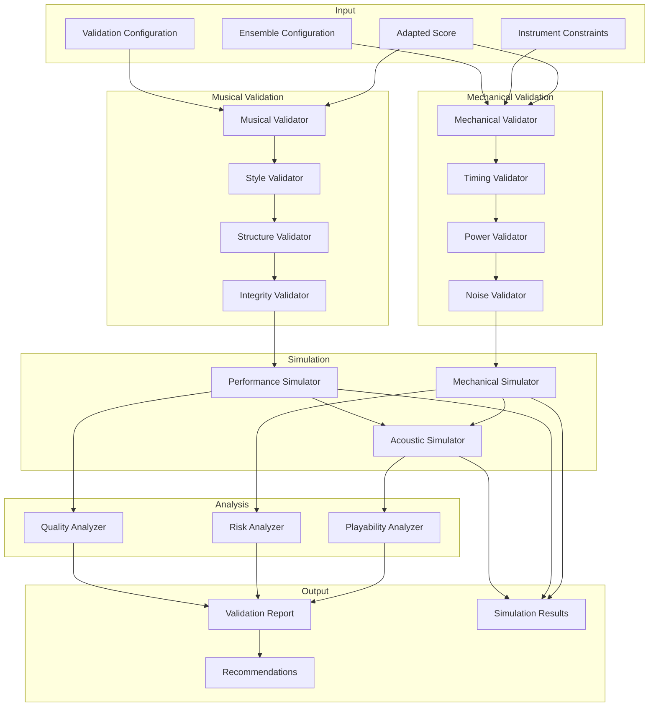

# Validation System for Renaissance Music Adaptation

## Overview

The Validation System ensures that adapted Renaissance music is mechanically feasible and musically coherent. It performs comprehensive checks on adapted scores, simulates mechanical performance, and provides feedback on playability and musical integrity.

## Architecture



## Core Data Structures

### Validation Configuration

```python
from dataclasses import dataclass
from typing import List, Dict, Tuple, Optional, Any, Union
from enum import Enum
import numpy as np

class ValidationLevel(Enum):
    """Levels of validation strictness"""
    BASIC = "basic"  # Essential mechanical feasibility
    STANDARD = "standard"  # Standard mechanical and musical validation
    COMPREHENSIVE = "comprehensive"  # Thorough validation with simulation
    STRICT = "strict"  # Strict validation with conservative tolerances

class SimulationType(Enum):
    """Types of simulation to perform"""
    TIMING_ONLY = "timing_only"  # Only timing simulation
    MECHANICAL_ONLY = "mechanical_only"  # Only mechanical simulation
    ACOUSTIC_ONLY = "acoustic_only"  # Only acoustic simulation
    FULL = "full"  # Complete simulation

@dataclass
class ValidationConfig:
    """Configuration for validation process"""
    
    # Validation level
    validation_level: ValidationLevel = ValidationLevel.STANDARD
    
    # Simulation settings
    simulation_type: SimulationType = SimulationType.MECHANICAL_ONLY
    simulation_duration: Optional[float] = None  # None for full piece
    simulation_sample_rate: float = 1000.0  # Hz
    
    # Tolerances
    timing_tolerance: float = 0.01  # seconds
    pitch_tolerance: float = 0.5  # semitones
    power_tolerance: float = 0.1  # 10% of budget
    
    # Risk assessment
    risk_threshold: float = 0.7  # 0-1, threshold for risk warnings
    failure_probability_threshold: float = 0.1  # 0-1, threshold for failure warnings
    
    # Quality assessment
    musical_integrity_threshold: float = 0.7  # 0-1, threshold for musical integrity
    historical_authenticity_threshold: float = 0.6  # 0-1, threshold for authenticity
    
    # Reporting
    generate_recommendations: bool = True
    generate_simulation_data: bool = True
    generate_performance_notes: bool = True
```

### Validation Results

```python
@dataclass
class ValidationIssue:
    """Represents a validation issue"""
    issue_type: str  # "mechanical", "musical", "timing", "power", etc.
    severity: str  # "critical", "major", "minor", "info"
    instrument_slug: Optional[str]  # Affected instrument, None for ensemble
    description: str
    affected_notes: List[int]  # Indices of affected notes
    time_points: List[float]  # Time points where issue occurs
    impact_score: float  # 0-1, impact on performance
    resolution_suggestions: List[str]  # Suggested resolutions
    simulation_evidence: Optional[Dict[str, Any]]  # Evidence from simulation

@dataclass
class MechanicalValidationResult:
    """Results of mechanical validation"""
    is_mechanically_feasible: bool
    timing_issues: List[ValidationIssue]
    power_issues: List[ValidationIssue]
    noise_issues: List[ValidationIssue]
    transition_issues: List[ValidationIssue]
    overall_mechanical_score: float  # 0-1
    critical_failure_points: List[float]  # Time points of critical failures

@dataclass
class MusicalValidationResult:
    """Results of musical validation"""
    maintains_musical_integrity: bool
    style_issues: List[ValidationIssue]
    structure_issues: List[ValidationIssue]
    authenticity_issues: List[ValidationIssue]
    overall_musical_score: float  # 0-1
    preservation_score: float  # 0-1, how well original is preserved

@dataclass
class SimulationResult:
    """Results of simulation"""
    simulation_type: SimulationType
    success: bool
    execution_time: float  # seconds
    time_points: List[float]  # Simulated time points
    instrument_states: Dict[str, List[Dict[str, Any]]]  # Instrument states over time
    performance_metrics: Dict[str, float]  # Performance metrics
    acoustic_output: Optional[Dict[str, Any]]  # Acoustic simulation results
    failure_points: List[float]  # Time points of failures

@dataclass
class ValidationReport:
    """Complete validation report"""
    validation_config: ValidationConfig
    mechanical_result: MechanicalValidationResult
    musical_result: MusicalValidationResult
    simulation_result: Optional[SimulationResult]
    overall_score: float  # 0-1
    is_playable: bool
    is_musically_coherent: bool
    risk_assessment: Dict[str, float]  # Risk factors
    quality_assessment: Dict[str, float]  # Quality factors
    recommendations: List[str]  # Recommendations for improvement
    performance_notes: List[str]  # Notes for performers/operators
```

## Mechanical Validation

### Mechanical Validator

```python
class MechanicalValidator:
    """Validates mechanical feasibility of adapted music"""
    
    def __init__(self):
        self.timing_validator = TimingValidator()
        self.power_validator = PowerValidator()
        self.noise_validator = NoiseValidator()
        self.transition_validator = TransitionValidator()
    
    def validate(self, score: MusicalScore,
                constraints: Dict[str, InstrumentConstraints],
                config: ValidationConfig) -> MechanicalValidationResult:
        """Validate mechanical feasibility"""
        
        # Validate timing constraints
        timing_issues = self.timing_validator.validate(score, constraints, config)
        
        # Validate power constraints
        power_issues = self.power_validator.validate(score, constraints, config)
        
        # Validate noise constraints
        noise_issues = self.noise_validator.validate(score, constraints, config)
        
        # Validate transition constraints
        transition_issues = self.transition_validator.validate(score, constraints, config)
        
        # Calculate overall mechanical score
        overall_score = self._calculate_mechanical_score(
            timing_issues, power_issues, noise_issues, transition_issues
        )
        
        # Identify critical failure points
        critical_failure_points = self._identify_critical_failures(
            timing_issues, power_issues, noise_issues, transition_issues
        )
        
        # Determine mechanical feasibility
        is_feasible = (
            len([i for i in timing_issues if i.severity == "critical"]) == 0 and
            len([i for i in power_issues if i.severity == "critical"]) == 0 and
            len([i for i in transition_issues if i.severity == "critical"]) == 0 and
            overall_score >= 0.5
        )
        
        return MechanicalValidationResult(
            is_mechanically_feasible=is_feasible,
            timing_issues=timing_issues,
            power_issues=power_issues,
            noise_issues=noise_issues,
            transition_issues=transition_issues,
            overall_mechanical_score=overall_score,
            critical_failure_points=critical_failure_points
        )
    
    def _calculate_mechanical_score(self, timing_issues: List[ValidationIssue],
                                  power_issues: List[ValidationIssue],
                                  noise_issues: List[ValidationIssue],
                                  transition_issues: List[ValidationIssue]) -> float:
        """Calculate overall mechanical score"""
        # Weight different types of issues
        timing_weight = 0.3
        power_weight = 0.2
        noise_weight = 0.2
        transition_weight = 0.3
        
        # Calculate penalty for each type
        timing_penalty = sum(i.impact_score for i in timing_issues) / max(len(timing_issues), 1)
        power_penalty = sum(i.impact_score for i in power_issues) / max(len(power_issues), 1)
        noise_penalty = sum(i.impact_score for i in noise_issues) / max(len(noise_issues), 1)
        transition_penalty = sum(i.impact_score for i in transition_issues) / max(len(transition_issues), 1)
        
        # Calculate weighted score
        weighted_penalty = (
            timing_penalty * timing_weight +
            power_penalty * power_weight +
            noise_penalty * noise_weight +
            transition_penalty * transition_weight
        )
        
        return max(0.0, 1.0 - weighted_penalty)
```

### Timing Validator

```python
class TimingValidator:
    """Validates timing constraints"""
    
    def validate(self, score: MusicalScore,
                constraints: Dict[str, InstrumentConstraints],
                config: ValidationConfig) -> List[ValidationIssue]:
        """Validate timing constraints"""
        issues = []
        
        # Check each instrument
        for instrument_slug, instrument_constraints in constraints.items():
            # Get notes for this instrument
            instrument_notes = [n for n in score.notes 
                              if n.voice in instrument_constraints.voice_range]
            
            if not instrument_notes:
                continue
            
            # Group notes by voice
            voice_notes = self._group_notes_by_voice(instrument_notes)
            
            for voice, notes in voice_notes.items():
                # Check note duration constraints
                duration_issues = self._check_note_durations(
                    notes, instrument_constraints, config
                )
                issues.extend(duration_issues)
                
                # Check transition time constraints
                transition_issues = self._check_transition_times(
                    notes, instrument_constraints, config
                )
                issues.extend(transition_issues)
                
                # Check timing precision
                precision_issues = self._check_timing_precision(
                    notes, instrument_constraints, config
                )
                issues.extend(precision_issues)
        
        return issues
    
    def _check_note_durations(self, notes: List[MusicalNote],
                            constraints: InstrumentConstraints,
                            config: ValidationConfig) -> List[ValidationIssue]:
        """Check note duration constraints"""
        issues = []
        
        for note in notes:
            if note.duration < constraints.min_note_duration:
                severity = "critical" if note.duration < constraints.min_note_duration * 0.5 else "major"
                
                issues.append(ValidationIssue(
                    issue_type="timing",
                    severity=severity,
                    instrument_slug=constraints.slug,
                    description=f"Note duration {note.duration} below minimum {constraints.min_note_duration}",
                    affected_notes=[],  # Will be filled by caller
                    time_points=[note.start_time],
                    impact_score=0.8,
                    resolution_suggestions=[
                        "Extend note duration",
                        "Replace with longer note value",
                        "Omit note if duration cannot be extended"
                    ],
                    simulation_evidence=None
                ))
            elif note.duration > constraints.max_note_duration:
                severity = "major" if note.duration > constraints.max_note_duration * 1.5 else "minor"
                
                issues.append(ValidationIssue(
                    issue_type="timing",
                    severity=severity,
                    instrument_slug=constraints.slug,
                    description=f"Note duration {note.duration} above maximum {constraints.max_note_duration}",
                    affected_notes=[],
                    time_points=[note.start_time],
                    impact_score=0.5,
                    resolution_suggestions=[
                        "Shorten note duration",
                        "Replace with shorter note value",
                        "Add rest if note cannot be shortened"
                    ],
                    simulation_evidence=None
                ))
        
        return issues
```

### Power Validator

```python
class PowerValidator:
    """Validates power constraints"""
    
    def validate(self, score: MusicalScore,
                constraints: Dict[str, InstrumentConstraints],
                config: ValidationConfig) -> List[ValidationIssue]:
        """Validate power constraints"""
        issues = []
        
        # Calculate power requirements over time
        time_windows = self._find_simultaneous_notes(score.notes)
        
        for window_start, window_end, note_indices in time_windows:
            # Calculate instantaneous power requirement
            active_instruments = set(score.notes[i].voice for i in note_indices)
            power_requirement = 0.0
            
            for voice in active_instruments:
                # Find instrument for this voice
                for instrument_slug, instrument_constraints in constraints.items():
                    if voice in instrument_constraints.voice_range:
                        power_requirement += instrument_constraints.power_requirements["steady_state"]
                        break
            
            # Check against power budget
            ensemble_config = self._get_ensemble_config(constraints)
            if power_requirement > ensemble_config.power_budget * (1.0 + config.power_tolerance):
                severity = "critical" if power_requirement > ensemble_config.power_budget * 1.2 else "major"
                
                issues.append(ValidationIssue(
                    issue_type="power",
                    severity=severity,
                    instrument_slug="ensemble",
                    description=f"Power requirement {power_requirement} exceeds budget {ensemble_config.power_budget}",
                    affected_notes=note_indices,
                    time_points=[window_start],
                    impact_score=0.9,
                    resolution_suggestions=[
                        "Reduce number of simultaneously active instruments",
                        "Redistribute notes to different time points",
                        "Use instruments with lower power requirements"
                    ],
                    simulation_evidence={
                        "power_requirement": power_requirement,
                        "power_budget": ensemble_config.power_budget,
                        "active_instruments": list(active_instruments)
                    }
                ))
        
        return issues
```

## Musical Validation

### Musical Validator

```python
class MusicalValidator:
    """Validates musical integrity and coherence"""
    
    def __init__(self):
        self.style_validator = StyleValidator()
        self.structure_validator = StructureValidator()
        self.integrity_validator = IntegrityValidator()
        self.authenticity_validator = AuthenticityValidator()
    
    def validate(self, score: MusicalScore,
                original_analysis: RenaissanceAnalysisResult,
                adapted_analysis: RenaissanceAnalysisResult,
                config: ValidationConfig) -> MusicalValidationResult:
        """Validate musical integrity"""
        
        # Validate style preservation
        style_issues = self.style_validator.validate(
            score, original_analysis, adapted_analysis, config
        )
        
        # Validate structure preservation
        structure_issues = self.structure_validator.validate(
            score, original_analysis, adapted_analysis, config
        )
        
        # Validate musical integrity
        integrity_issues = self.integrity_validator.validate(
            score, original_analysis, adapted_analysis, config
        )
        
        # Validate historical authenticity
        authenticity_issues = self.authenticity_validator.validate(
            score, original_analysis, adapted_analysis, config
        )
        
        # Calculate overall musical score
        overall_score = self._calculate_musical_score(
            style_issues, structure_issues, integrity_issues, authenticity_issues
        )
        
        # Calculate preservation score
        preservation_score = self._calculate_preservation_score(
            original_analysis, adapted_analysis
        )
        
        # Determine musical coherence
        is_coherent = (
            len([i for i in style_issues if i.severity == "critical"]) == 0 and
            len([i for i in structure_issues if i.severity == "critical"]) == 0 and
            len([i for i in integrity_issues if i.severity == "critical"]) == 0 and
            overall_score >= config.musical_integrity_threshold
        )
        
        return MusicalValidationResult(
            maintains_musical_integrity=is_coherent,
            style_issues=style_issues,
            structure_issues=structure_issues,
            authenticity_issues=authenticity_issues,
            overall_musical_score=overall_score,
            preservation_score=preservation_score
        )
```

### Style Validator

```python
class StyleValidator:
    """Validates Renaissance style preservation"""
    
    def validate(self, score: MusicalScore,
                original_analysis: RenaissanceAnalysisResult,
                adapted_analysis: RenaissanceAnalysisResult,
                config: ValidationConfig) -> List[ValidationIssue]:
        """Validate Renaissance style preservation"""
        issues = []
        
        # Check modal character preservation
        modal_issues = self._check_modal_preservation(
            original_analysis, adapted_analysis, config
        )
        issues.extend(modal_issues)
        
        # Check ornamentation appropriateness
        ornamentation_issues = self._check_ornamentation(
            score, original_analysis, adapted_analysis, config
        )
        issues.extend(ornamentation_issues)
        
        # Check voice leading quality
        voice_leading_issues = self._check_voice_leading(
            score, original_analysis, adapted_analysis, config
        )
        issues.extend(voice_leading_issues)
        
        return issues
    
    def _check_modal_preservation(self, original_analysis: RenaissanceAnalysisResult,
                                adapted_analysis: RenaissanceAnalysisResult,
                                config: ValidationConfig) -> List[ValidationIssue]:
        """Check modal character preservation"""
        issues = []
        
        # Compare primary modes
        if original_analysis.primary_mode != adapted_analysis.primary_mode:
            issues.append(ValidationIssue(
                issue_type="style",
                severity="major",
                instrument_slug=None,
                description=f"Mode changed from {original_analysis.primary_mode} to {adapted_analysis.primary_mode}",
                affected_notes=[],
                time_points=[],
                impact_score=0.7,
                resolution_suggestions=[
                    "Adjust pitch content to preserve original mode",
                    "Modify cadences to reinforce original mode",
                    "Revoice harmonies to maintain modal character"
                ],
                simulation_evidence={
                    "original_mode": original_analysis.primary_mode.value,
                    "adapted_mode": adapted_analysis.primary_mode.value
                }
            ))
        
        return issues
```

## Simulation

### Mechanical Simulator

```python
class MechanicalSimulator:
    """Simulates mechanical performance of adapted music"""
    
    def __init__(self):
        self.timing_simulator = TimingSimulator()
        self.power_simulator = PowerSimulator()
        self.noise_simulator = NoiseSimulator()
    
    def simulate(self, score: MusicalScore,
                constraints: Dict[str, InstrumentConstraints],
                config: ValidationConfig) -> SimulationResult:
        """Simulate mechanical performance"""
        import time
        start_time = time.time()
        
        # Determine simulation duration
        duration = config.simulation_duration or self._calculate_score_duration(score)
        
        # Generate time points
        time_points = np.arange(0, duration, 1.0 / config.simulation_sample_rate)
        
        # Simulate instrument states over time
        instrument_states = {}
        for instrument_slug, instrument_constraints in constraints.items():
            # Get notes for this instrument
            instrument_notes = [n for n in score.notes 
                              if n.voice in instrument_constraints.voice_range]
            
            # Simulate instrument state
            states = self._simulate_instrument_state(
                instrument_notes, instrument_constraints, time_points, config
            )
            instrument_states[instrument_slug] = states
        
        # Calculate performance metrics
        performance_metrics = self._calculate_performance_metrics(
            instrument_states, constraints
        )
        
        # Identify failure points
        failure_points = self._identify_failure_points(
            instrument_states, constraints, config
        )
        
        execution_time = time.time() - start_time
        
        return SimulationResult(
            simulation_type=SimulationType.MECHANICAL_ONLY,
            success=len(failure_points) == 0,
            execution_time=execution_time,
            time_points=time_points.tolist(),
            instrument_states=instrument_states,
            performance_metrics=performance_metrics,
            acoustic_output=None,
            failure_points=failure_points
        )
    
    def _simulate_instrument_state(self, notes: List[MusicalNote],
                                 constraints: InstrumentConstraints,
                                 time_points: np.ndarray,
                                 config: ValidationConfig) -> List[Dict[str, Any]]:
        """Simulate instrument state over time"""
        states = []
        
        # Initialize state
        current_state = {
            "active": False,
            "pitch": None,
            "velocity": 0,
            "power_consumption": constraints.power_requirements["idle"],
            "transitioning": False,
            "noise_level": 0.0
        }
        
        # Sort notes by start time
        sorted_notes = sorted(notes, key=lambda n: n.start_time)
        note_index = 0
        
        for t in time_points:
            # Check if we need to start a new note
            while note_index < len(sorted_notes) and sorted_notes[note_index].start_time <= t:
                note = sorted_notes[note_index]
                
                # Start note transition
                current_state["transitioning"] = True
                current_state["target_pitch"] = note.pitch
                current_state["target_velocity"] = note.velocity
                current_state["transition_start_time"] = t
                
                note_index += 1
            
            # Check if we need to end a note
            for note in sorted_notes:
                if (note.start_time + note.duration <= t and 
                    current_state.get("pitch") == note.pitch):
                    current_state["transitioning"] = True
                    current_state["target_pitch"] = None
                    current_state["target_velocity"] = 0
                    current_state["transition_start_time"] = t
            
            # Update state based on transitions
            if current_state["transitioning"]:
                transition_progress = (t - current_state["transition_start_time"]) / constraints.note_transition_time
                
                if transition_progress >= 1.0:
                    # Complete transition
                    current_state["transitioning"] = False
                    current_state["pitch"] = current_state.get("target_pitch")
                    current_state["velocity"] = current_state.get("target_velocity", 0)
                    current_state["active"] = current_state["pitch"] is not None
                else:
                    # In transition
                    if current_state.get("target_pitch") is not None:
                        # Starting note
                        current_state["velocity"] = int(current_state.get("target_velocity", 0) * transition_progress)
                    else:
                        # Ending note
                        current_state["velocity"] = int(current_state.get("velocity", 0) * (1.0 - transition_progress))
            
            # Update power consumption
            if current_state["active"]:
                current_state["power_consumption"] = constraints.power_requirements["steady_state"]
            elif current_state["transitioning"]:
                current_state["power_consumption"] = constraints.power_requirements["peak"]
            else:
                current_state["power_consumption"] = constraints.power_requirements["idle"]
            
            # Update noise level
            if current_state["active"]:
                current_state["noise_level"] = constraints.noise_characteristics["pitch_variation"]
            elif current_state["transitioning"]:
                current_state["noise_level"] = constraints.noise_characteristics["timing_jitter"]
            else:
                current_state["noise_level"] = 0.0
            
            # Store state copy
            states.append(current_state.copy())
        
        return states
```

## Validation System Main Interface

```python
class ValidationSystem:
    """Main interface for validation system"""
    
    def __init__(self):
        self.mechanical_validator = MechanicalValidator()
        self.musical_validator = MusicalValidator()
        
        self.mechanical_simulator = MechanicalSimulator()
        self.performance_simulator = PerformanceSimulator()
        self.acoustic_simulator = AcousticSimulator()
        
        self.playability_analyzer = PlayabilityAnalyzer()
        self.risk_analyzer = RiskAnalyzer()
        self.quality_analyzer = QualityAnalyzer()
    
    def validate_adapted_music(self, adapted_score: MusicalScore,
                             original_score: MusicalScore,
                             original_analysis: RenaissanceAnalysisResult,
                             constraints: Dict[str, InstrumentConstraints],
                             config: ValidationConfig) -> ValidationReport:
        """Validate adapted music comprehensively"""
        
        # Perform mechanical validation
        mechanical_result = self.mechanical_validator.validate(
            adapted_score, constraints, config
        )
        
        # Analyze adapted music for comparison
        adapted_analysis = self._analyze_adapted_music(adapted_score)
        
        # Perform musical validation
        musical_result = self.musical_validator.validate(
            adapted_score, original_analysis, adapted_analysis, config
        )
        
        # Perform simulation if requested
        simulation_result = None
        if config.validation_level in [ValidationLevel.COMPREHENSIVE, ValidationLevel.STRICT]:
            if config.simulation_type in [SimulationType.MECHANICAL_ONLY, SimulationType.FULL]:
                simulation_result = self.mechanical_simulator.simulate(
                    adapted_score, constraints, config
                )
        
        # Analyze playability
        playability_metrics = self.playability_analyzer.analyze(
            adapted_score, mechanical_result, simulation_result
        )
        
        # Analyze risks
        risk_metrics = self.risk_analyzer.analyze(
            adapted_score, mechanical_result, musical_result, simulation_result
        )
        
        # Analyze quality
        quality_metrics = self.quality_analyzer.analyze(
            adapted_score, original_score, original_analysis, adapted_analysis
        )
        
        # Generate recommendations
        recommendations = self._generate_recommendations(
            mechanical_result, musical_result, simulation_result,
            playability_metrics, risk_metrics, quality_metrics
        )
        
        # Generate performance notes
        performance_notes = self._generate_performance_notes(
            adapted_score, mechanical_result, simulation_result
        )
        
        # Calculate overall score
        overall_score = self._calculate_overall_score(
            mechanical_result, musical_result, playability_metrics,
            risk_metrics, quality_metrics
        )
        
        # Determine playability and coherence
        is_playable = (
            mechanical_result.is_mechanically_feasible and
            playability_metrics["overall_playability"] >= 0.7
        )
        
        is_musically_coherent = (
            musical_result.maintains_musical_integrity and
            quality_metrics["musical_integrity"] >= config.musical_integrity_threshold
        )
        
        return ValidationReport(
            validation_config=config,
            mechanical_result=mechanical_result,
            musical_result=musical_result,
            simulation_result=simulation_result,
            overall_score=overall_score,
            is_playable=is_playable,
            is_musically_coherent=is_musically_coherent,
            risk_assessment=risk_metrics,
            quality_assessment=quality_metrics,
            recommendations=recommendations,
            performance_notes=performance_notes
        )
    
    def _generate_recommendations(self, mechanical_result: MechanicalValidationResult,
                                musical_result: MusicalValidationResult,
                                simulation_result: Optional[SimulationResult],
                                playability_metrics: Dict[str, float],
                                risk_metrics: Dict[str, float],
                                quality_metrics: Dict[str, float]) -> List[str]:
        """Generate recommendations for improvement"""
        recommendations = []
        
        # Mechanical recommendations
        if not mechanical_result.is_mechanically_feasible:
            critical_issues = (
                mechanical_result.timing_issues +
                mechanical_result.power_issues +
                mechanical_result.transition_issues
            )
            critical_issues = [i for i in critical_issues if i.severity == "critical"]
            
            for issue in critical_issues[:3]:  # Top 3 critical issues
                recommendations.append(f"Address critical mechanical issue: {issue.description}")
        
        # Musical recommendations
        if not musical_result.maintains_musical_integrity:
            major_issues = (
                musical_result.style_issues +
                musical_result.structure_issues +
                musical_result.authenticity_issues
            )
            major_issues = [i for i in major_issues if i.severity in ["critical", "major"]]
            
            for issue in major_issues[:2]:  # Top 2 major issues
                recommendations.append(f"Address musical integrity issue: {issue.description}")
        
        # Playability recommendations
        if playability_metrics["overall_playability"] < 0.7:
            recommendations.append("Improve overall playability by simplifying complex passages")
        
        # Risk recommendations
        high_risk_factors = [factor for factor, score in risk_metrics.items() if score > 0.7]
        if high_risk_factors:
            recommendations.append(f"Mitigate high-risk factors: {', '.join(high_risk_factors)}")
        
        # Quality recommendations
        if quality_metrics["musical_integrity"] < 0.7:
            recommendations.append("Improve musical integrity by better preserving original characteristics")
        
        return recommendations
```

The Validation System provides comprehensive checking of adapted Renaissance music to ensure it is mechanically feasible and musically coherent, with detailed simulation and analysis to support the validation results.