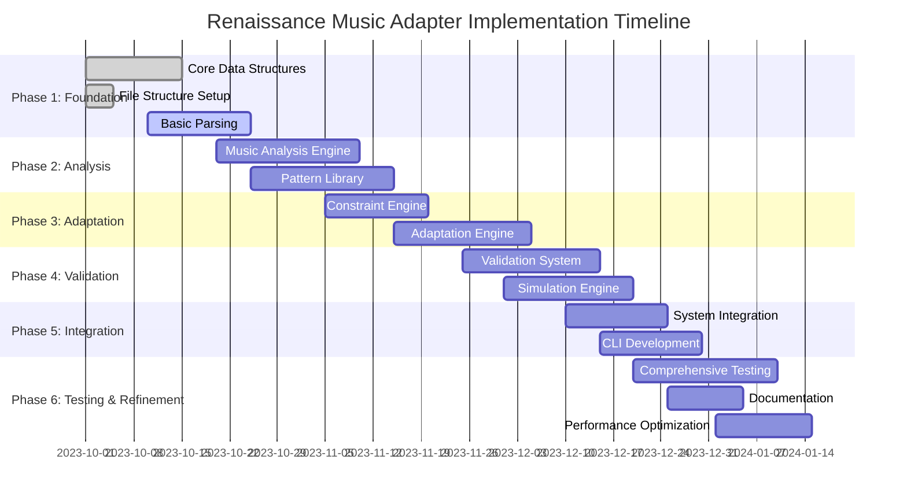

# Implementation Roadmap for Renaissance Music Adapter

## Overview

This document provides a comprehensive roadmap for implementing the Renaissance Music Adapter system. It outlines phases, milestones, dependencies, and estimated timelines for each component, ensuring a structured and efficient development process.

## Implementation Phases

## Phase 1: Foundation (Weeks 1-2)

### 1.1 Core Data Structures (Week 1)

**Priority**: Critical
**Estimated Time**: 5 days
**Dependencies**: None

#### Tasks:
- [ ] Implement core data models in `music_adapter/core/models.py`
  - [ ] MusicalNote class
  - [ ] MusicalScore class
  - [ ] InstrumentConstraints class
  - [ ] EnsembleConfiguration class
- [ ] Implement basic data validation
- [ ] Create unit tests for core models

#### Deliverables:
- Complete core data models
- Unit tests with >90% coverage
- Documentation for core structures

#### Acceptance Criteria:
- All models are properly typed with dataclasses
- Models pass mypy strict mode checks
- Unit tests cover all functionality

### 1.2 File Structure Setup (Week 1)

**Priority**: Critical
**Estimated Time**: 2 days
**Dependencies**: None

#### Tasks:
- [ ] Create complete directory structure
- [ ] Set up package initialization files
- [ ] Configure pytest and mypy
- [ ] Set up pre-commit hooks

#### Deliverables:
- Complete directory structure
- Configured development environment
- CI/CD pipeline configuration

#### Acceptance Criteria:
- All directories created as specified
- Package imports work correctly
- Linting and type checking configured

### 1.3 Basic Parsing (Weeks 1-2)

**Priority**: High
**Estimated Time**: 8 days
**Dependencies**: Core Data Structures

#### Tasks:
- [ ] Implement MIDI parser in `music_adapter/core/midi_parser.py`
  - [ ] Parse header information
  - [ ] Parse note events
  - [ ] Handle tempo and time signature changes
- [ ] Implement ABC parser in `music_adapter/core/abc_parser.py`
  - [ ] Parse header fields
  - [ ] Parse note notation
  - [ ] Handle rhythm and meter
- [ ] Implement score normalizer in `music_adapter/core/score_normalizer.py`
- [ ] Create test data and unit tests

#### Deliverables:
- Functional MIDI parser
- Functional ABC parser
- Score normalizer
- Unit tests with sample files

#### Acceptance Criteria:
- Parsers handle common file formats correctly
- Normalized scores maintain musical information
- Tests include edge cases and error handling

## Phase 2: Analysis (Weeks 3-5)

### 2.1 Music Analysis Engine (Weeks 3-4)

**Priority**: High
**Estimated Time**: 12 days
**Dependencies**: Basic Parsing

#### Tasks:
- [ ] Implement style analyzer in `music_adapter/analysis/style_analyzer.py`
  - [ ] Modal analysis
  - [ ] Ornamentation detection
  - [ ] Period style identification
- [ ] Implement structure analyzer in `music_adapter/analysis/structure_analyzer.py`
  - [ ] Form identification
  - [ ] Section detection
  - [ ] Phrase analysis
- [ ] Implement harmony analyzer in `music_adapter/analysis/harmony_analyzer.py`
  - [ ] Chord identification
  - [ ] Cadence detection
  - [ ] Modal harmony analysis
- [ ] Implement rhythm analyzer in `music_adapter/analysis/rhythm_analyzer.py`
  - [ ] Meter detection
  - [ ] Rhythmic pattern analysis
  - [ ] Tempo analysis
- [ ] Implement voice analyzer in `music_adapter/analysis/voice_analyzer.py`
  - [ ] Voice separation
  - [ ] Texture analysis
  - [ ] Voice leading analysis
- [ ] Implement analysis pipeline in `music_adapter/analysis/analysis_pipeline.py`
- [ ] Create unit tests

#### Deliverables:
- Complete music analysis system
- Analysis pipeline coordinator
- Unit tests with Renaissance music samples

#### Acceptance Criteria:
- Analyzers correctly identify Renaissance features
- Pipeline produces comprehensive analysis
- Tests include validation against known analyses

### 2.2 Pattern Library (Weeks 3-5)

**Priority**: High
**Estimated Time**: 15 days
**Dependencies**: Basic Parsing

#### Tasks:
- [ ] Create pattern data files in `data/renaissance_patterns/`
  - [ ] Dance patterns (pavana, galliard, etc.)
  - [ ] Cadence patterns (authentic, plagal, etc.)
  - [ ] Ornamentation patterns (trills, mordents, etc.)
  - [ ] Modal patterns
- [ ] Implement pattern library in `music_adapter/patterns/pattern_library.py`
- [ ] Implement pattern matcher in `music_adapter/patterns/pattern_matcher.py`
- [ ] Implement pattern applier in `music_adapter/patterns/pattern_applier.py`
- [ ] Create unit tests

#### Deliverables:
- Complete pattern library
- Pattern matching and application system
- Unit tests with pattern examples

#### Acceptance Criteria:
- Pattern library covers major Renaissance patterns
- Matcher correctly identifies patterns in scores
- Applier preserves musical integrity

## Phase 3: Adaptation (Weeks 5-8)

### 3.1 Constraint Engine (Weeks 5-6)

**Priority**: High
**Estimated Time**: 10 days
**Dependencies**: Core Data Structures, Pattern Library

#### Tasks:
- [ ] Create instrument constraint files in `data/instrument_constraints/`
- [ ] Implement constraint engine in `music_adapter/constraints/constraint_engine.py`
- [ ] Implement validators in `music_adapter/constraints/`
  - [ ] pitch_validator.py
  - [ ] voice_validator.py
  - [ ] timing_validator.py
  - [ ] dynamic_validator.py
  - [ ] ensemble_validator.py
- [ ] Implement constraint resolvers
- [ ] Create unit tests

#### Deliverables:
- Complete constraint engine
- Instrument constraint database
- Unit tests with constraint scenarios

#### Acceptance Criteria:
- Engine correctly identifies constraint violations
- Resolvers produce musically coherent solutions
- Tests cover all constraint types

### 3.2 Adaptation Engine (Weeks 6-8)

**Priority**: High
**Estimated Time**: 15 days
**Dependencies**: Music Analysis, Constraint Engine

#### Tasks:
- [ ] Implement voice adapter in `music_adapter/adaptation/voice_adapter.py`
- [ ] Implement range mapper in `music_adapter/adaptation/range_mapper.py`
- [ ] Implement harmony simplifier in `music_adapter/adaptation/harmony_simplifier.py`
- [ ] Implement rhythm adapter in `music_adapter/adaptation/rhythm_adapter.py`
- [ ] Implement tempo adjuster in `music_adapter/adaptation/tempo_adjuster.py`
- [ ] Implement ornamentation adapter in `music_adapter/adaptation/ornamentation_adapter.py`
- [ ] Implement adaptation engine in `music_adapter/adaptation/adaptation_engine.py`
- [ ] Implement adaptation optimizer in `music_adapter/adaptation/adaptation_optimizer.py`
- [ ] Create unit tests

#### Deliverables:
- Complete adaptation system
- Adaptation optimization
- Unit tests with adaptation scenarios

#### Acceptance Criteria:
- Adaptation produces mechanically playable scores
- Musical integrity is preserved
- Optimization improves adaptation quality

## Phase 4: Validation (Weeks 7-9)

### 4.1 Validation System (Weeks 7-8)

**Priority**: High
**Estimated Time**: 12 days
**Dependencies**: Adaptation Engine

#### Tasks:
- [ ] Implement validation system in `music_adapter/validation/validation_system.py`
- [ ] Implement mechanical validator in `music_adapter/validation/mechanical_validator.py`
- [ ] Implement musical validator in `music_adapter/validation/musical_validator.py`
- [ ] Implement validation analyzers in `music_adapter/validation/analysis/`
  - [ ] playability_analyzer.py
  - [ ] risk_analyzer.py
  - [ ] quality_analyzer.py
- [ ] Create unit tests

#### Deliverables:
- Complete validation system
- Validation analysis tools
- Unit tests with validation scenarios

#### Acceptance Criteria:
- Validation correctly identifies issues
- Analyzers provide meaningful metrics
- Reports are comprehensive and actionable

### 4.2 Simulation Engine (Weeks 8-9)

**Priority**: Medium
**Estimated Time**: 10 days
**Dependencies**: Validation System

#### Tasks:
- [ ] Implement mechanical simulator in `music_adapter/validation/simulation/mechanical_simulator.py`
- [ ] Implement performance simulator in `music_adapter/validation/simulation/performance_simulator.py`
- [ ] Implement acoustic simulator in `music_adapter/validation/simulation/acoustic_simulator.py`
- [ ] Create simulation configurations
- [ ] Create unit tests

#### Deliverables:
- Complete simulation system
- Simulation configurations
- Unit tests with simulation scenarios

#### Acceptance Criteria:
- Simulations accurately model mechanical behavior
- Performance metrics are meaningful
- Simulation results inform validation

## Phase 5: Integration (Weeks 9-10)

### 5.1 System Integration (Weeks 9-10)

**Priority**: High
**Estimated Time**: 8 days
**Dependencies**: Validation System, Simulation Engine

#### Tasks:
- [ ] Implement integration interfaces in `music_adapter/integration/`
  - [ ] ensemble_interface.py
  - [ ] audio_interface.py
  - [ ] cad_interface.py
  - [ ] simulation_interface.py
- [ ] Implement data converters in `music_adapter/converters/`
  - [ ] score_converter.py
  - [ ] event_converter.py
  - [ ] parameter_converter.py
- [ ] Extend mechanical_ensemble.py
- [ ] Extend core/audio.py
- [ ] Create integration tests

#### Deliverables:
- Complete integration system
- Extended existing modules
- Integration tests

#### Acceptance Criteria:
- Integration works seamlessly with existing code
- Data conversion preserves information
- Tests verify end-to-end functionality

### 5.2 CLI Development (Weeks 9-10)

**Priority**: Medium
**Estimated Time**: 5 days
**Dependencies**: System Integration

#### Tasks:
- [ ] Implement CLI in `music_adapter/cli.py`
- [ ] Add commands for adaptation, validation, simulation
- [ ] Add configuration options
- [ ] Create CLI tests

#### Deliverables:
- Complete CLI
- Command documentation
- CLI tests

#### Acceptance Criteria:
- CLI provides all necessary functionality
- Commands are intuitive and well-documented
- Tests verify CLI behavior

## Phase 6: Testing & Refinement (Weeks 10-12)

### 6.1 Comprehensive Testing (Weeks 10-11)

**Priority**: Critical
**Estimated Time**: 10 days
**Dependencies**: All previous phases

#### Tasks:
- [ ] Create comprehensive test suite
- [ ] Add integration tests
- [ ] Add performance tests
- [ ] Add edge case tests
- [ ] Achieve >90% code coverage

#### Deliverables:
- Comprehensive test suite
- Test coverage reports
- Performance benchmarks

#### Acceptance Criteria:
- All tests pass consistently
- Code coverage exceeds 90%
- Performance meets requirements

### 6.2 Documentation (Weeks 10-11)

**Priority**: High
**Estimated Time**: 7 days
**Dependencies**: All previous phases

#### Tasks:
- [ ] Create user guide
- [ ] Create developer guide
- [ ] Create API reference
- [ ] Create examples
- [ ] Create architecture documentation

#### Deliverables:
- Complete documentation
- Usage examples
- API reference

#### Acceptance Criteria:
- Documentation is comprehensive and clear
- Examples work correctly
- API reference is complete

### 6.3 Performance Optimization (Weeks 11-12)

**Priority**: Medium
**Estimated Time**: 8 days
**Dependencies**: Comprehensive Testing

#### Tasks:
- [ ] Profile system performance
- [ ] Optimize bottlenecks
- [ ] Improve memory usage
- [ ] Optimize algorithms
- [ ] Verify optimizations

#### Deliverables:
- Optimized system
- Performance benchmarks
- Optimization documentation

#### Acceptance Criteria:
- Performance meets requirements
- Memory usage is efficient
- Optimizations don't break functionality

## Risk Mitigation

### Technical Risks

1. **Complexity of Renaissance Music Analysis**
   - **Risk**: Difficulty accurately analyzing complex Renaissance music
   - **Mitigation**: Start with simpler pieces, gradually increase complexity
   - **Contingency**: Focus on most common Renaissance forms first

2. **Mechanical Constraint Complexity**
   - **Risk**: Underestimating complexity of mechanical constraints
   - **Mitigation**: Early prototyping with simple constraints
   - **Contingency**: Simplify constraint model if needed

3. **Integration Challenges**
   - **Risk**: Difficulties integrating with existing codebase
   - **Mitigation**: Early integration testing, clear interface design
   - **Contingency**: Create adapter layer if direct integration proves difficult

### Schedule Risks

1. **Underestimation of Development Time**
   - **Risk**: Components taking longer than expected
   - **Mitigation**: Regular progress reviews, buffer time in schedule
   - **Contingency**: Prioritize core features, defer advanced features

2. **Dependencies Between Components**
   - **Risk**: Delays in one component affecting others
   - **Mitigation**: Clear dependency tracking, parallel development where possible
   - **Contingency**: Create stubs for dependent components

## Resource Requirements

### Development Team

- **Lead Developer**: 1 person, full-time
- **Music Specialist**: 1 person, part-time (consulting)
- **QA Engineer**: 1 person, part-time
- **Technical Writer**: 1 person, part-time

### Tools and Infrastructure

- **Development Environment**: Python 3.10+, IDE, Git
- **Testing Framework**: pytest, coverage tools
- **Documentation**: Sphinx, Markdown
- **CI/CD**: GitHub Actions or similar
- **Performance Profiling**: Python profilers

### External Resources

- **Renaissance Music Samples**: MIDI and ABC files
- **Historical Music References**: Treatises, scores
- **Mechanical Instrument Documentation**: Technical specifications

## Success Metrics

### Technical Metrics

- **Code Coverage**: >90%
- **Performance**: Adaptation of 5-minute piece in <30 seconds
- **Accuracy**: >95% correct constraint identification
- **Reliability**: <1% failure rate in testing

### Musical Metrics

- **Preservation**: >80% musical integrity preservation
- **Playability**: >90% mechanically playable adaptations
- **Authenticity**: >70% Renaissance style preservation

### User Metrics

- **Usability**: Successful adaptation by non-expert users
- **Documentation**: Clear, comprehensive documentation
- **Community**: Adoption by Renaissance music community

## Post-Implementation Plans

### Maintenance

- Regular updates to pattern library
- Bug fixes and performance improvements
- Compatibility updates with existing codebase

### Enhancement

- Additional Renaissance forms and styles
- Advanced adaptation strategies
- Improved simulation accuracy

### Community

- User feedback collection
- Community contribution guidelines
- Knowledge base development

This roadmap provides a structured approach to implementing the Renaissance Music Adapter system, with clear phases, milestones, and success criteria to ensure successful delivery.