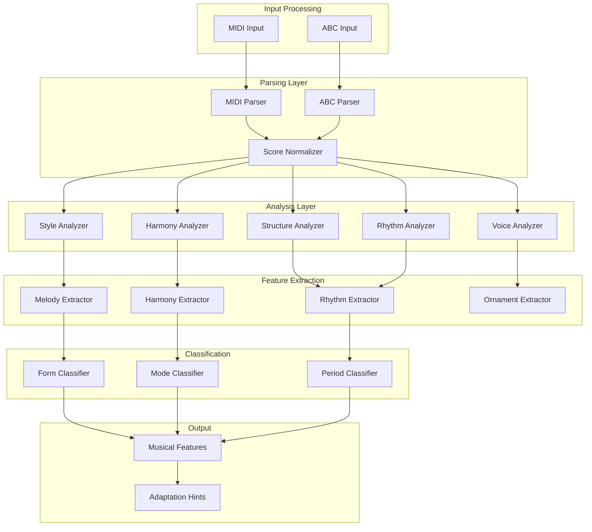

# Music Analysis Module for Renaissance Music Adaptation

## Overview

The Music Analysis Module is responsible for understanding and interpreting Renaissance music from MIDI and ABC notation files. It extracts musical features, identifies structural elements, and provides the foundation for intelligent adaptation to mechanical instruments.

## Module Architecture



## Core Data Structures

### Musical Analysis Results

```python
from dataclasses import dataclass
from typing import List, Dict, Tuple, Optional, Set
from enum import Enum
import numpy as np

class RenaissanceForm(Enum):
    """Common Renaissance musical forms"""
    BASSE_DANSE = "basse_danse"
    PAVANA = "pavana"
    GALLIARD = "galliard"
    ALLEMANDE = "allemande"
    COURANTE = "courante"
    SALTARELLO = "saltarello"
    CHACONNE = "chaconne"
    PASSACAGLIA = "passacaglia"
    MADRIGAL = "madrigal"
    MOTET = "motet"
    CHANSON = "chanson"
    ISORHYTHMIC = "isorhythmic"
    FANTASIA = "fantasia"
    RICERCAR = "ricercar"
    CANZONA = "canzona"
    TOCCATA = "toccata"

class RenaissanceMode(Enum):
    """Renaissance modal system"""
    DORIAN = "dorian"
    PHRYGIAN = "phrygian"
    LYDIAN = "lydian"
    MIXOLYDIAN = "mixolydian"
    AEOLIAN = "aeolian"
    IONIAN = "ionian"
    HYPODORIAN = "hypodorian"
    HYPOPHRYGIAN = "hypophrygian"
    HYPOLYDIAN = "hypolydian"
    HYPOMIXOLYDIAN = "hypomixolydian"
    HYPOAEOLIAN = "hypoaeolian"
    HYPOIONIAN = "hypoionian"

class TextureType(Enum):
    """Musical texture types"""
    MONOPHONIC = "monophonic"
    HOMOPHONIC = "homophonic"
    POLYPHONIC = "polyphonic"
    HETEROPHONIC = "heterophonic"

@dataclass
class MelodicFeatures:
    """Features extracted from melodic lines"""
    contour: List[int]  # Up/down/flat movements
    interval_profile: Dict[str, float]  # Distribution of intervals
    range: Tuple[int, int]  # (min_pitch, max_pitch)
    tessitura: Tuple[int, int]  # Most comfortable range
    phrase_boundaries: List[float]  # Time points of phrase endings
    ornamentation_density: float  # Ornaments per note
    stepwise_motion_ratio: float  # Ratio of stepwise vs. leapwise motion

@dataclass
class HarmonicFeatures:
    """Features extracted from harmonic content"""
    chord_progression: List[Tuple[str, float]]  # (chord, time)
    cadence_points: List[float]  # Time points of cadences
    harmonic_rhythm: float  # Average chord change rate
    dissonance_level: float  # Overall dissonance measure
    modulations: List[Tuple[str, float, float]]  # (new_key, start_time, end_time)
    voice_leading_smoothness: float  # Measure of voice leading quality

@dataclass
class RhythmicFeatures:
    """Features extracted from rhythmic content"""
    meter: Tuple[int, int]  # (numerator, denominator)
    tempo_profile: List[Tuple[float, float]]  # (time, tempo)
    rhythmic_density: float  # Notes per beat
    syncopation_level: float  # Measure of syncopation
    duration_profile: Dict[str, float]  # Distribution of note durations
    accent_pattern: List[bool]  # Strong/weak beat pattern

@dataclass
class StructuralFeatures:
    """Features describing musical structure"""
    form: RenaissanceForm
    sections: List[Tuple[str, float, float]]  # (section_name, start, end)
    repetition_pattern: List[Tuple[float, float]]  # Repeated sections
    phrase_structure: List[Tuple[float, float]]  # Phrases
    climaxes: List[float]  # Points of musical intensity

@dataclass
class TexturalFeatures:
    """Features describing musical texture"""
    texture_type: TextureType
    voice_count: int
    voice_distribution: Dict[int, float]  # Voice activity over time
    density_profile: List[Tuple[float, int]]  # (time, active_voices)
    imitation_points: List[float]  # Points of imitation between voices

@dataclass
class RenaissanceAnalysisResult:
    """Complete analysis of a Renaissance musical piece"""
    
    # Basic metadata
    title: str
    composer: Optional[str]
    estimated_period: str  # "early_renaissance", "mid_renaissance", "late_renaissance"
    
    # Musical features
    melodic_features: Dict[int, MelodicFeatures]  # voice_id -> features
    harmonic_features: HarmonicFeatures
    rhythmic_features: RhythmicFeatures
    structural_features: StructuralFeatures
    textural_features: TexturalFeatures
    
    # Classification results
    primary_mode: RenaissanceMode
    secondary_modes: List[RenaissanceMode]
    tonal_center: int  # MIDI pitch number
    
    # Adaptation hints
    suitable_instruments: List[str]  # Recommended instruments
    adaptation_difficulty: float  # 0-1, how difficult to adapt
    preservation_priorities: Dict[str, float]  # Features to preserve
    potential_issues: List[str]  # Potential adaptation challenges
```

## Analysis Components

### 1. Style Analyzer

```python
class StyleAnalyzer:
    """Analyzes Renaissance musical style characteristics"""
    
    def __init__(self):
        self.mode_patterns = self._load_mode_patterns()
        self.ornamentation_patterns = self._load_ornamentation_patterns()
        self.cadence_patterns = self._load_cadence_patterns()
    
    def analyze_style(self, score: MusicalScore) -> Dict[str, float]:
        """Analyze style characteristics"""
        return {
            "modal_strength": self._calculate_modal_strength(score),
            "ornamentation_density": self._calculate_ornamentation_density(score),
            "cadence_frequency": self._calculate_cadence_frequency(score),
            "imitation_density": self._calculate_imitation_density(score),
            "chromaticism_level": self._calculate_chromaticism_level(score),
            "period_style_confidence": self._estimate_period_style(score)
        }
    
    def _calculate_modal_strength(self, score: MusicalScore) -> float:
        """Calculate how strongly the piece adheres to modal practice"""
        # Analyze pitch distribution against modal patterns
        pass
    
    def _calculate_ornamentation_density(self, score: MusicalScore) -> float:
        """Calculate density of ornamentation"""
        # Count ornaments relative to note density
        pass
    
    def _estimate_period_style(self, score: MusicalScore) -> str:
        """Estimate which Renaissance period the piece belongs to"""
        # Analyze stylistic markers
        pass
```

### 2. Structure Analyzer

```python
class StructureAnalyzer:
    """Analyzes musical structure and form"""
    
    def __init__(self):
        self.form_templates = self._load_form_templates()
        self.phrase_patterns = self._load_phrase_patterns()
    
    def analyze_form(self, score: MusicalScore) -> StructuralFeatures:
        """Identify musical form and structure"""
        form = self._identify_form(score)
        sections = self._identify_sections(score, form)
        repetitions = self._find_repetitions(score)
        phrases = self._identify_phrases(score)
        climaxes = self._find_climaxes(score)
        
        return StructuralFeatures(
            form=form,
            sections=sections,
            repetition_pattern=repetitions,
            phrase_structure=phrases,
            climaxes=climaxes
        )
    
    def _identify_form(self, score: MusicalScore) -> RenaissanceForm:
        """Identify the musical form"""
        # Compare against form templates
        pass
    
    def _identify_sections(self, score: MusicalScore, form: RenaissanceForm) -> List[Tuple[str, float, float]]:
        """Identify musical sections"""
        # Analyze harmonic and thematic material
        pass
```

### 3. Harmony Analyzer

```python
class HarmonyAnalyzer:
    """Analyzes harmonic content and relationships"""
    
    def __init__(self):
        self.renaissance_harmony_rules = self._load_harmony_rules()
        self.cadence_types = self._load_cadence_types()
    
    def analyze_harmony(self, score: MusicalScore) -> HarmonicFeatures:
        """Analyze harmonic content"""
        chord_progression = self._extract_chord_progression(score)
        cadences = self._identify_cadences(score)
        harmonic_rhythm = self._calculate_harmonic_rhythm(chord_progression)
        dissonance = self._calculate_dissonance(score)
        modulations = self._identify_modulations(score)
        voice_leading = self._analyze_voice_leading(score)
        
        return HarmonicFeatures(
            chord_progression=chord_progression,
            cadence_points=cadences,
            harmonic_rhythm=harmonic_rhythm,
            dissonance_level=dissonance,
            modulations=modulations,
            voice_leading_smoothness=voice_leading
        )
    
    def _extract_chord_progression(self, score: MusicalScore) -> List[Tuple[str, float]]:
        """Extract chord progression from score"""
        # Analyze vertical sonorities
        pass
    
    def _identify_cadences(self, score: MusicalScore) -> List[float]:
        """Identify cadence points"""
        # Look for characteristic cadential patterns
        pass
```

### 4. Rhythm Analyzer

```python
class RhythmAnalyzer:
    """Analyzes rhythmic content and patterns"""
    
    def __init__(self):
        self.dance_rhythms = self._load_dance_rhythms()
        self.mensural_patterns = self._load_mensural_patterns()
    
    def analyze_rhythm(self, score: MusicalScore) -> RhythmicFeatures:
        """Analyze rhythmic content"""
        meter = self._identify_meter(score)
        tempo_profile = self._extract_tempo_profile(score)
        rhythmic_density = self._calculate_rhythmic_density(score)
        syncopation = self._calculate_syncopation(score)
        duration_profile = self._analyze_duration_distribution(score)
        accent_pattern = self._identify_accent_pattern(score)
        
        return RhythmicFeatures(
            meter=meter,
            tempo_profile=tempo_profile,
            rhythmic_density=rhythmic_density,
            syncopation_level=syncopation,
            duration_profile=duration_profile,
            accent_pattern=accent_pattern
        )
    
    def _identify_meter(self, score: MusicalScore) -> Tuple[int, int]:
        """Identify the meter"""
        # Analyze accent patterns and note groupings
        pass
    
    def _match_dance_rhythm(self, score: MusicalScore) -> Optional[str]:
        """Match against known dance rhythms"""
        # Compare with dance rhythm templates
        pass
```

### 5. Voice Analyzer

```python
class VoiceAnalyzer:
    """Analyzes voice leading and polyphonic texture"""
    
    def __init__(self):
        self.counterpoint_rules = self._load_counterpoint_rules()
        self.voice_types = self._load_voice_types()
    
    def analyze_voices(self, score: MusicalScore) -> TexturalFeatures:
        """Analyze voice leading and texture"""
        texture_type = self._identify_texture(score)
        voice_count = self._count_voices(score)
        voice_distribution = self._analyze_voice_distribution(score)
        density_profile = self._calculate_density_profile(score)
        imitation_points = self._find_imitation(score)
        
        return TexturalFeatures(
            texture_type=texture_type,
            voice_count=voice_count,
            voice_distribution=voice_distribution,
            density_profile=density_profile,
            imitation_points=imitation_points
        )
    
    def _identify_texture(self, score: MusicalScore) -> TextureType:
        """Identify musical texture type"""
        # Analyze voice independence and rhythmic alignment
        pass
    
    def _analyze_voice_leading(self, score: MusicalScore) -> float:
        """Analyze quality of voice leading"""
        # Check against counterpoint rules
        pass
```

## Feature Extraction

### Melody Extractor

```python
class MelodyExtractor:
    """Extracts melodic features from individual voices"""
    
    def extract_melody(self, voice_notes: List[MusicalNote]) -> MelodicFeatures:
        """Extract features from a single melodic line"""
        contour = self._analyze_contour(voice_notes)
        intervals = self._analyze_intervals(voice_notes)
        range_info = self._calculate_range(voice_notes)
        tessitura = self._calculate_tessitura(voice_notes)
        phrases = self._identify_phrases(voice_notes)
        ornaments = self._count_ornaments(voice_notes)
        stepwise_ratio = self._calculate_stepwise_ratio(voice_notes)
        
        return MelodicFeatures(
            contour=contour,
            interval_profile=intervals,
            range=range_info,
            tessitura=tessitura,
            phrase_boundaries=phrases,
            ornamentation_density=ornaments,
            stepwise_motion_ratio=stepwise_ratio
        )
```

### Harmony Extractor

```python
class HarmonyExtractor:
    """Extracts harmonic features from the score"""
    
    def extract_harmony(self, score: MusicalScore) -> HarmonicFeatures:
        """Extract harmonic features"""
        # Implementation details
        pass
```

## Classification Systems

### Form Classifier

```python
class FormClassifier:
    """Classifies musical form based on analysis features"""
    
    def __init__(self):
        self.form_patterns = self._load_form_patterns()
        self.dance_forms = self._load_dance_forms()
    
    def classify_form(self, features: StructuralFeatures, 
                     rhythm_features: RhythmicFeatures) -> RenaissanceForm:
        """Classify the musical form"""
        # Use pattern matching and heuristics
        pass
```

### Mode Classifier

```python
class ModeClassifier:
    """Classifies the modal system"""
    
    def __init__(self):
        self.mode_profiles = self._load_mode_profiles()
        self.finalis_patterns = self._load_finalis_patterns()
    
    def classify_mode(self, harmonic_features: HarmonicFeatures,
                     melodic_features: Dict[int, MelodicFeatures]) -> Tuple[RenaissanceMode, float]:
        """Classify the primary mode with confidence"""
        # Analyze pitch distribution and cadence patterns
        pass
```

## Adaptation Hints Generation

```python
class AdaptationHintGenerator:
    """Generates hints for adapting music to mechanical instruments"""
    
    def generate_hints(self, analysis: RenaissanceAnalysisResult) -> Dict[str, any]:
        """Generate adaptation hints based on analysis"""
        return {
            "suitable_instruments": self._suggest_instruments(analysis),
            "adaptation_difficulty": self._estimate_difficulty(analysis),
            "preservation_priorities": self._prioritize_features(analysis),
            "potential_issues": self._identify_issues(analysis),
            "tempo_adjustments": self._suggest_tempo_adjustments(analysis),
            "voice_reduction_strategy": self._suggest_voice_reduction(analysis),
            "range_adjustments": self._suggest_range_adjustments(analysis)
        }
    
    def _suggest_instruments(self, analysis: RenaissanceAnalysisResult) -> List[str]:
        """Suggest suitable instruments based on analysis"""
        suggestions = []
        
        # Based on texture
        if analysis.textural_features.texture_type == TextureType.POLYPHONIC:
            suggestions.extend(["viola_organista", "mechanical_organ"])
        
        # Based on form
        if analysis.structural_features.form in [RenaissanceForm.BASSE_DANSE, 
                                                 RenaissanceForm.PAVANA,
                                                 RenaissanceForm.GALLIARD]:
            suggestions.append("mechanical_drum")
        
        # Based on melodic characteristics
        for voice_id, melodic in analysis.melodic_features.items():
            if melodic.ornamentation_density > 0.3:
                suggestions.extend(["programmable_flute", "mechanical_trumpeter"])
        
        return list(set(suggestions))
    
    def _estimate_difficulty(self, analysis: RenaissanceAnalysisResult) -> float:
        """Estimate adaptation difficulty (0-1)"""
        difficulty = 0.0
        
        # Voice count complexity
        if analysis.textural_features.voice_count > 4:
            difficulty += 0.3
        
        # Rhythmic complexity
        if analysis.rhythmic_features.syncopation_level > 0.5:
            difficulty += 0.2
        
        # Range requirements
        for voice_id, melodic in analysis.melodic_features.items():
            range_span = melodic.range[1] - melodic.range[0]
            if range_span > 24:  # More than 2 octaves
                difficulty += 0.1
        
        # Harmonic complexity
        if analysis.harmonic_features.dissonance_level > 0.6:
            difficulty += 0.2
        
        return min(difficulty, 1.0)
```

## Integration with Adaptation System

```python
class MusicAnalysisPipeline:
    """Complete pipeline for analyzing Renaissance music"""
    
    def __init__(self):
        self.style_analyzer = StyleAnalyzer()
        self.structure_analyzer = StructureAnalyzer()
        self.harmony_analyzer = HarmonyAnalyzer()
        self.rhythm_analyzer = RhythmAnalyzer()
        self.voice_analyzer = VoiceAnalyzer()
        
        self.melody_extractor = MelodyExtractor()
        self.harmony_extractor = HarmonyExtractor()
        
        self.form_classifier = FormClassifier()
        self.mode_classifier = ModeClassifier()
        
        self.hint_generator = AdaptationHintGenerator()
    
    def analyze(self, score: MusicalScore) -> RenaissanceAnalysisResult:
        """Complete analysis of a musical score"""
        # Analyze different aspects
        style_features = self.style_analyzer.analyze_style(score)
        structural_features = self.structure_analyzer.analyze_form(score)
        harmonic_features = self.harmony_analyzer.analyze_harmony(score)
        rhythmic_features = self.rhythm_analyzer.analyze_rhythm(score)
        textural_features = self.voice_analyzer.analyze_voices(score)
        
        # Extract melodic features for each voice
        voice_notes = self._separate_voices(score)
        melodic_features = {}
        for voice_id, notes in voice_notes.items():
            melodic_features[voice_id] = self.melody_extractor.extract_melody(notes)
        
        # Classify
        primary_mode, mode_confidence = self.mode_classifier.classify_mode(
            harmonic_features, melodic_features)
        
        # Generate adaptation hints
        adaptation_hints = self.hint_generator.generate_hints(
            RenaissanceAnalysisResult(
                title=score.title,
                composer=score.composer,
                estimated_period=style_features["period_style_confidence"],
                melodic_features=melodic_features,
                harmonic_features=harmonic_features,
                rhythmic_features=rhythmic_features,
                structural_features=structural_features,
                textural_features=textural_features,
                primary_mode=primary_mode,
                secondary_modes=[],
                tonal_center=harmonic_features.chord_progression[0][0] if harmonic_features.chord_progression else 0,
                suitable_instruments=[],
                adaptation_difficulty=0.0,
                preservation_priorities={},
                potential_issues=[]
            )
        )
        
        return RenaissanceAnalysisResult(
            title=score.title,
            composer=score.composer,
            estimated_period=style_features["period_style_confidence"],
            melodic_features=melodic_features,
            harmonic_features=harmonic_features,
            rhythmic_features=rhythmic_features,
            structural_features=structural_features,
            textural_features=textural_features,
            primary_mode=primary_mode,
            secondary_modes=[],
            tonal_center=harmonic_features.chord_progression[0][0] if harmonic_features.chord_progression else 0,
            suitable_instruments=adaptation_hints["suitable_instruments"],
            adaptation_difficulty=adaptation_hints["adaptation_difficulty"],
            preservation_priorities=adaptation_hints["preservation_priorities"],
            potential_issues=adaptation_hints["potential_issues"]
        )
```

This music analysis module provides comprehensive understanding of Renaissance music, enabling intelligent adaptation decisions that preserve the essential character of the original music while making it compatible with Leonardo's mechanical instruments.