# Renaissance Pattern Library for Music Adaptation

## Overview

The Renaissance Pattern Library contains authentic musical patterns, figures, and structures from the Renaissance period. These patterns serve as building blocks for the adaptation system, ensuring that modified music maintains historical authenticity while working within mechanical constraints.

## Pattern Categories

```mermaid
graph TB
    subgraph "Pattern Library"
        RhythmicPatterns[Rhythmic Patterns]
        MelodicPatterns[Melodic Patterns]
        HarmonicPatterns[Harmonic Patterns]
        CadencePatterns[Cadence Patterns]
        OrnamentPatterns[Ornamentation Patterns]
        DancePatterns[Dance Patterns]
        FormPatterns[Form Patterns]
        TexturePatterns[Texture Patterns]
    end
    
    subgraph "Rhythmic Patterns"
        MensuralRhythms[Mensural Rhythms]
        DanceRhythms[Dance Rhythms]
        DivisionPatterns[Division Patterns]
    end
    
    subgraph "Melodic Patterns"
        ModalScales[Modal Scales]
        IntervalPatterns[Interval Patterns]
        PhrasePatterns[Phrase Patterns]
    end
    
    subgraph "Harmonic Patterns"
        ModalHarmony[Modal Harmony]
        CounterpointPatterns[Counterpoint Patterns]
        VoiceLeadingPatterns[Voice Leading Patterns]
    end
    
    subgraph "Cadence Patterns"
        AuthenticCadences[Authentic Cadences]
        PlagalCadences[Plagal Cadences]
        EvadedCadences[Evaded Cadences]
    end
    
    subgraph "Ornamentation Patterns"
        Trills[Trills]
        Mordents[Mordents]
        Turns[Turns]
        Passaggi[Passaggi]
    end
    
    RhythmicPatterns --> MensuralRhythms
    RhythmicPatterns --> DanceRhythms
    RhythmicPatterns --> DivisionPatterns
    
    MelodicPatterns --> ModalScales
    MelodicPatterns --> IntervalPatterns
    MelodicPatterns --> PhrasePatterns
    
    HarmonicPatterns --> ModalHarmony
    HarmonicPatterns --> CounterpointPatterns
    HarmonicPatterns --> VoiceLeadingPatterns
    
    CadencePatterns --> AuthenticCadences
    CadencePatterns --> PlagalCadences
    CadencePatterns --> EvadedCadences
    
    OrnamentPatterns --> Trills
    OrnamentPatterns --> Mordents
    OrnamentPatterns --> Turns
    OrnamentPatterns --> Passaggi
```



## Core Data Structures

### Pattern Base Classes

```python
from dataclasses import dataclass
from typing import List, Dict, Tuple, Optional, Any, Union
from enum import Enum
import numpy as np

class PatternType(Enum):
    """Types of musical patterns"""
    RHYTHMIC = "rhythmic"
    MELODIC = "melodic"
    HARMONIC = "harmonic"
    CADENCE = "cadence"
    ORNAMENTATION = "ornamentation"
    DANCE = "dance"
    FORM = "form"
    TEXTURE = "texture"

class Period(Enum):
    """Renaissance periods"""
    EARLY_RENAISSANCE = "early_renaissance"  # c. 1400-1470
    MID_RENAISSANCE = "mid_renaissance"      # c. 1470-1530
    LATE_RENAISSANCE = "late_renaissance"    # c. 1530-1600

class Region(Enum):
    """Geographic regions"""
    ITALIAN = "italian"
    FRENCH = "french"
    SPANISH = "spanish"
    ENGLISH = "english"
    GERMAN = "german"
    NETHERLANDISH = "netherlandish"

@dataclass
class MusicalPattern:
    """Base class for musical patterns"""
    pattern_id: str
    name: str
    pattern_type: PatternType
    period: Period
    region: Optional[Region]
    source: Optional[str]  # Historical source
    description: str
    tags: List[str]
    mechanical_suitability: float  # 0-1, how suitable for mechanical instruments
    adaptation_notes: str
```

### Rhythmic Patterns

```python
@dataclass
class RhythmicPattern(MusicalPattern):
    """Rhythmic pattern specification"""
    durations: List[float]  # Note durations in quarter notes
    accents: List[bool]  # Accent pattern
    tempo_range: Tuple[float, float]  # Suitable tempo range
    meter: Tuple[int, int]  # (numerator, denominator)
    division_level: int  # Mensural division level
    historical_notes: str

@dataclass
class DancePattern(RhythmicPattern):
    """Dance-specific rhythmic pattern"""
    dance_type: str
    step_pattern: List[str]  # Dance step descriptions
    characteristic_rhythms: List[str]  # Defining rhythmic features
    performance_context: str  # Court, street, etc.

@dataclass
class MensuralPattern(RhythmicPattern):
    """Mensural notation rhythmic pattern"""
    mensuration: str  # Tempus, prolatio, etc.
    coloration: Optional[str]  # Coloration information
    imperfection_rules: List[str]  # Rules for imperfection
    alteration_rules: List[str]  # Rules for alteration
```

### Melodic Patterns

```python
@dataclass
class MelodicPattern(MusicalPattern):
    """Melodic pattern specification"""
    intervals: List[int]  # Intervallic pattern (semitones)
    contour: List[int]  # Contour direction (-1, 0, 1)
    mode: str  # Modal context
    tessitura: Tuple[int, int]  # Preferred range
    phrase_structure: List[Tuple[int, int]]  # Phrase boundaries
    characteristic_intervals: List[int]  # Defining intervals

@dataclass
class ModalScale(MelodicPattern):
    """Modal scale pattern"""
    mode_name: str
    finalis: int  # Final note
    reciting_tone: int  # Reciting tone
    mediated: Optional[int]  # Mediated note
    characteristic_intervals: List[Tuple[int, str]]  # (degree, quality)
    mutation_points: List[int]  # Points for mode mutation

@dataclass
class IntervalPattern(MelodicPattern):
    """Specific intervallic pattern"""
    interval_type: str  # "3rd", "4th", "5th", etc.
    interval_quality: str  # "perfect", "imperfect", "diminished", "augmented"
    melodic_function: str  # "passing", "neighbor", "arpeggiation", etc.
    resolution_tendency: Optional[int]  # Tendency to resolve
```

### Harmonic Patterns

```python
@dataclass
class HarmonicPattern(MusicalPattern):
    """Harmonic pattern specification"""
    chord_progression: List[Tuple[str, float]]  # (chord, duration)
    modal_context: str
    voice_leading: List[List[int]]  # Voice leading between chords
    dissonance_treatment: str  # How dissonances are handled
    cadence_preparation: Optional[str]  # Cadence preparation

@dataclass
class CounterpointPattern(HarmonicPattern):
    """Counterpoint pattern specification"""
    counterpoint_type: str  # "first_species", "second_species", etc.
    interval_rules: List[str]  # Intervallic rules
    dissonance_rules: List[str]  # Dissonance treatment rules
    voice_crossing: bool  # Whether voice crossing is allowed
    parallel_motion_rules: List[str]  # Rules for parallel motion

@dataclass
class VoiceLeadingPattern(HarmonicPattern):
    """Voice leading pattern specification"""
    leading_type: str  # "contrapuntal", "harmonic", "melodic"
    common_tone_handling: str  # How common tones are treated
    resolution_patterns: List[Tuple[int, int]]  # Resolution patterns
    preparation_patterns: List[Tuple[int, int]]  # Preparation patterns
```

### Cadence Patterns

```python
@dataclass
class CadencePattern(MusicalPattern):
    """Cadence pattern specification"""
    cadence_type: str  # "authentic", "plagal", "deceptive", etc.
    approach_chords: List[Tuple[str, float]]  # Chords leading to cadence
    cadence_chords: List[Tuple[str, float]]  # Cadence chords
    voice_leading: List[List[int]]  # Voice leading to cadence
    formula_variants: List[Dict[str, Any]]  # Variants of the cadence formula

@dataclass
class AuthenticCadence(CadencePattern):
    """Authentic cadence pattern"""
    final_strength: str  # "strong", "weak", "evaded"
    preparation_type: str  # "suspension", "passing", "neighbor"
    ornamentation_options: List[str]  # Possible ornamentations

@dataclass
class PlagalCadence(CadencePattern):
    """Plagal cadence pattern"""
    plagal_type: str  # "IV-I", "ii-I", etc.
    use_context: str  # When typically used
    alternative_approaches: List[str]  # Alternative approaches
```

### Ornamentation Patterns

```python
@dataclass
class OrnamentationPattern(MusicalPattern):
    """Ornamentation pattern specification"""
    ornament_type: str  # "trill", "mordent", "turn", etc.
    starting_note: int  # Interval above/below main note
    pattern_intervals: List[int]  # Interval pattern
    rhythmic_realization: List[float]  # Rhythmic values
    execution_notes: str  # Performance notes
    mechanical_feasibility: float  # 0-1, feasibility on mechanical instruments

@dataclass
class TrillPattern(OrnamentationPattern):
    """Trill ornamentation pattern"""
    trill_interval: int  # Interval of trill (usually 1 or 2 semitones)
    initiation_style: str  # How trill begins
    termination_style: str  # How trill ends
    rhythmic_variations: List[List[float]]  # Possible rhythmic variations

@dataclass
class PassaggioPattern(OrnamentationPattern):
    """Passaggio (diminution) pattern"""
    diminution_type: str  # "scale", "arpeggio", "mixed"
    target_interval: int  # Interval being diminished
    note_count: int  # Number of notes in diminution
    idiomatic_patterns: List[List[int]]  # Common patterns
```

## Pattern Library Structure

### Dance Pattern Collection

```python
class DancePatternLibrary:
    """Collection of Renaissance dance patterns"""
    
    def __init__(self):
        self.patterns = self._initialize_dance_patterns()
    
    def _initialize_dance_patterns(self) -> Dict[str, DancePattern]:
        """Initialize dance patterns"""
        return {
            "basse_danse": DancePattern(
                pattern_id="basse_danse_binario",
                name="Basse Danse (Binary)",
                pattern_type=PatternType.DANCE,
                period=Period.EARLY_RENAISSANCE,
                region=Region.ITALIAN,
                source="Fifteenth-century dance treatises",
                description="Slow, dignified court dance in binary meter",
                tags=["court", "slow", "processional", "binary"],
                mechanical_suitability=0.9,
                adaptation_notes="Excellent for mechanical instruments due to steady rhythm and limited range",
                durations=[1.0, 0.5, 0.5, 1.0, 0.5, 0.5],  # Quarter-eighth-eighth pattern
                accents=[True, False, False, True, False, False],
                tempo_range=(40, 60),
                meter=(2, 2),
                division_level=2,
                historical_notes="Primary processional dance of the early Renaissance court",
                dance_type="basse_danse",
                step_pattern=["step", "step", "lift", "step", "step", "lift"],
                characteristic_rhythms=["dotted", "sustained"],
                performance_context="court ceremony"
            ),
            
            "pavana": DancePattern(
                pattern_id="pavana_quadernario",
                name="Pavana (Quaternary)",
                pattern_type=PatternType.DANCE,
                period=Period.MID_RENAISSANCE,
                region=Region.ITALIAN,
                source="Late 15th-century Italian dance manuals",
                description="Stately duple-time dance in four repeated sections",
                tags=["court", "stately", "processional", "quaternary"],
                mechanical_suitability=0.85,
                adaptation_notes="Well-suited to mechanical instruments with moderate tempo adjustments",
                durations=[2.0, 1.0, 1.0, 2.0],  # Half-quarter-quarter-half pattern
                accents=[True, False, False, True],
                tempo_range=(50, 70),
                meter=(4, 4),
                division_level=4,
                historical_notes="Evolved from basse danse, became standard processional dance",
                dance_type="pavana",
                step_pattern=["step", "step", "step", "step", "lift"],
                characteristic_rhythms=["dotted", "sustained", "pauses"],
                performance_context="court entry/exit"
            ),
            
            "galliard": DancePattern(
                pattern_id="galliard_cinque_passi",
                name="Galliard (Cinque Passi)",
                pattern_type=PatternType.DANCE,
                period=Period.MID_RENAISSANCE,
                region=Region.ITALIAN,
                source="16th-century dance treatises",
                description="Lively triple-time dance with five-step pattern",
                tags=["court", "lively", "triple", "athletic"],
                mechanical_suitability=0.7,
                adaptation_notes="Challenging for mechanical instruments due to quick tempo and complex rhythms",
                durations=[0.67, 0.33, 0.67, 0.33, 0.67, 0.33],  # Compound duple pattern
                accents=[True, False, True, False, True, False],
                tempo_range=(80, 120),
                meter=(6, 8),
                division_level=3,
                historical_notes="Athletic dance often following a pavana",
                dance_type="galliard",
                step_pattern=["kick", "step", "kick", "step", "kick", "step", "jump"],
                characteristic_rhythms=["hemiola", "syncopation"],
                performance_context="court entertainment"
            ),
            
            "saltarello": DancePattern(
                pattern_id="saltarello_leaping",
                name="Saltarello (Leaping)",
                pattern_type=PatternType.DANCE,
                period=Period.LATE_RENAISSANCE,
                region=Region.ITALIAN,
                source="Italian folk and court dance traditions",
                description="Fast triple-time dance with leaping steps",
                tags=["lively", "folk", "triple", "leaping"],
                mechanical_suitability=0.6,
                adaptation_notes="Difficult for mechanical instruments due to rapid tempo and accents",
                durations=[0.33, 0.33, 0.33, 0.33, 0.33, 0.33],  # Six eighth notes
                accents=[True, False, False, True, False, False],
                tempo_range=(100, 140),
                meter=(3, 8) or (6, 8),
                division_level=3,
                historical_notes="Popular folk dance adopted by the court",
                dance_type="saltarello",
                step_pattern=["leap", "step", "leap", "step", "leap", "step"],
                characteristic_rhythms=["rapid", "jumping", "accented"],
                performance_context="festive occasions"
            )
        }
    
    def get_pattern_by_id(self, pattern_id: str) -> Optional[DancePattern]:
        """Get a dance pattern by ID"""
        return self.patterns.get(pattern_id)
    
    def find_suitable_patterns(self, tempo_range: Tuple[float, float],
                             meter: Tuple[int, int],
                             mechanical_suitability_threshold: float = 0.7) -> List[DancePattern]:
        """Find dance patterns suitable for given constraints"""
        suitable = []
        
        for pattern in self.patterns.values():
            # Check tempo compatibility
            tempo_compatible = (
                pattern.tempo_range[0] <= tempo_range[1] and
                pattern.tempo_range[1] >= tempo_range[0]
            )
            
            # Check meter compatibility
            meter_compatible = pattern.meter == meter or (
                (pattern.meter, meter) in [(2, 2), (4, 4), (3, 4), (6, 8)]  # Compatible meters
            )
            
            # Check mechanical suitability
            mechanically_suitable = pattern.mechanical_suitability >= mechanical_suitability_threshold
            
            if tempo_compatible and meter_compatible and mechanically_suitable:
                suitable.append(pattern)
        
        return suitable
```

### Cadence Pattern Collection

```python
class CadencePatternLibrary:
    """Collection of Renaissance cadence patterns"""
    
    def __init__(self):
        self.patterns = self._initialize_cadence_patterns()
    
    def _initialize_cadence_patterns(self) -> Dict[str, CadencePattern]:
        """Initialize cadence patterns"""
        return {
            "authentic_cadence": AuthenticCadence(
                pattern_id="authentic_cadence_strong",
                name="Strong Authentic Cadence",
                pattern_type=PatternType.CADENCE,
                period=Period.MID_RENAISSANCE,
                region=Region.ITALIAN,
                source="Standard Renaissance practice",
                description="V-I cadence with strong finality",
                tags=["standard", "final", "strong"],
                mechanical_suitability=0.9,
                adaptation_notes="Excellent for mechanical instruments with clear voice leading",
                cadence_type="authentic",
                approach_chords=[("IV", 1.0), ("V", 1.0)],
                cadence_chords=[("I", 2.0)],
                voice_leading=[[4, 4, 2, 1], [6, 5, 7, 1], [1, 2, 2, 1], [4, 2, 5, 1]],  # SATB
                formula_variants=[
                    {"suspension": True, "preparation": "IV"},
                    {"suspension": False, "preparation": "ii"},
                    {"suspension": True, "preparation": "ii6"}
                ],
                final_strength="strong",
                preparation_type="suspension",
                ornamentation_options=["trill", "turn"]
            ),
            
            "plagal_cadence": PlagalCadence(
                pattern_id="plagal_cadence_amen",
                name="Plagal Cadence (Amen)",
                pattern_type=PatternType.CADENCE,
                period=Period.MID_RENAISSANCE,
                region=Region.NETHERLANDISH,
                source="Church music tradition",
                description="IV-I cadence often used for 'Amen'",
                tags=["church", "amen", "concluding"],
                mechanical_suitability=0.95,
                adaptation_notes="Very suitable for mechanical instruments with simple voice leading",
                cadence_type="plagal",
                approach_chords=[("I", 1.0)],
                cadence_chords=[("IV", 1.0), ("I", 2.0)],
                voice_leading=[[1, 4, 4, 1], [3, 6, 5, 3], [5, 1, 1, 1], [1, 4, 1, 1]],  # SATB
                formula_variants=[
                    {"approach": "direct", "plagal": "IV-I"},
                    {"approach": "passing", "plagal": "IV6-I"}
                ],
                plagal_type="IV-I",
                use_context="concluding phrases, amen endings",
                alternative_approaches=["ii6-I", "VI-I"]
            ),
            
            "evaded_cadence": CadencePattern(
                pattern_id="evaded_cadence_deceptive",
                name="Evaded/Deceptive Cadence",
                pattern_type=PatternType.CADENCE,
                period=Period.LATE_RENAISSANCE,
                region=Region.ITALIAN,
                source="Late Renaissance harmonic practice",
                description="V-vi cadence that evades expected resolution",
                tags=["late", "deceptive", "dramatic"],
                mechanical_suitability=0.75,
                adaptation_notes="Moderately suitable, requires careful voice leading",
                cadence_type="evaded",
                approach_chords=[("IV", 1.0), ("V", 1.0)],
                cadence_chords=[("vi", 2.0)],
                voice_leading=[[4, 6, 4, 6], [6, 5, 3, 1], [1, 7, 1, 3], [4, 2, 5, 1]],  # SATB
                formula_variants=[
                    {"target": "vi", "preparation": "IV"},
                    {"target": "iii", "preparation": "ii"}
                ]
            )
        }
    
    def get_pattern_by_id(self, pattern_id: str) -> Optional[CadencePattern]:
        """Get a cadence pattern by ID"""
        return self.patterns.get(pattern_id)
    
    def find_suitable_cadences(self, mode: str,
                             mechanical_suitability_threshold: float = 0.7) -> List[CadencePattern]:
        """Find cadence patterns suitable for given mode"""
        suitable = []
        
        for pattern in self.patterns.values():
            # Check modal compatibility
            mode_compatible = self._check_mode_compatibility(pattern, mode)
            
            # Check mechanical suitability
            mechanically_suitable = pattern.mechanical_suitability >= mechanical_suitability_threshold
            
            if mode_compatible and mechanically_suitable:
                suitable.append(pattern)
        
        return suitable
```

### Ornamentation Pattern Collection

```python
class OrnamentationPatternLibrary:
    """Collection of Renaissance ornamentation patterns"""
    
    def __init__(self):
        self.patterns = self._initialize_ornamentation_patterns()
    
    def _initialize_ornamentation_patterns(self) -> Dict[str, OrnamentationPattern]:
        """Initialize ornamentation patterns"""
        return {
            "trill": TrillPattern(
                pattern_id="renaissance_trill",
                name="Renaissance Trill",
                pattern_type=PatternType.ORNAMENTATION,
                period=Period.MID_RENAISSANCE,
                region=Region.ITALIAN,
                source="Renaissance performance practice treatises",
                description="Alternation between main note and upper neighbor",
                tags=["common", "melodic", "expressive"],
                mechanical_suitability=0.6,
                adaptation_notes="Challenging for mechanical instruments due to rapid alternation",
                ornament_type="trill",
                starting_note=1,  # Upper neighbor
                pattern_intervals=[1, -1, 1, -1],  # Up-down pattern
                rhythmic_realization=[0.25, 0.25, 0.25, 0.25],  # Sixteenth notes
                execution_notes="Begin on upper neighbor, end on main note",
                mechanical_feasibility=0.6,
                trill_interval=1,  # Semitone
                initiation_style="upper_neighbor",
                termination_style="main_note",
                rhythmic_variations=[
                    [0.33, 0.33, 0.33],  # Triplet eighths
                    [0.5, 0.5],  # Eighths
                    [0.25, 0.25, 0.25, 0.25]  # Sixteenths
                ]
            ),
            
            "mordent": OrnamentationPattern(
                pattern_id="renaissance_mordent",
                name="Renaissance Mordent",
                pattern_type=PatternType.ORNAMENTATION,
                period=Period.MID_RENAISSANCE,
                region=Region.GERMAN,
                source="German Renaissance keyboard music",
                description="Single alternation with lower neighbor",
                tags=["keyboard", "quick", "accent"],
                mechanical_suitability=0.7,
                adaptation_notes="Moderately suitable for mechanical instruments",
                ornament_type="mordent",
                starting_note=-1,  # Lower neighbor
                pattern_intervals=[-1, 1],  # Down-up pattern
                rhythmic_realization=[0.33, 0.33],  # Triplet eighths
                execution_notes="Quick dip to lower neighbor and return",
                mechanical_feasibility=0.7
            ),
            
            "turn": OrnamentationPattern(
                pattern_id="renaissance_turn",
                name="Renaissance Turn",
                pattern_type=PatternType.ORNAMENTATION,
                period=Period.LATE_RENAISSANCE,
                region=Region.FRENCH,
                source="French keyboard ornamentation practice",
                description="Four-note pattern: upper neighbor, main, lower, main",
                tags=["expressive", "melodic", "french"],
                mechanical_suitability=0.5,
                adaptation_notes="Difficult for mechanical instruments due to four-note pattern",
                ornament_type="turn",
                starting_note=1,  # Upper neighbor
                pattern_intervals=[1, -1, -1, 1],  # Up-down-down-up
                rhythmic_realization=[0.25, 0.25, 0.25, 0.25],  # Sixteenth notes
                execution_notes="Upper neighbor, main, lower neighbor, main",
                mechanical_feasibility=0.5
            ),
            
            "passaggio": PassaggioPattern(
                pattern_id="diminution_passaggio",
                name="Diminution Passaggio",
                pattern_type=PatternType.ORNAMENTATION,
                period=Period.LATE_RENAISSANCE,
                region=Region.ITALIAN,
                source="Italian diminution treatises",
                description="Division of longer notes into faster passages",
                tags=["virtuosic", "diminution", "italian"],
                mechanical_suitability=0.3,
                adaptation_notes="Very difficult for mechanical instruments due to speed and complexity",
                ornament_type="passaggio",
                starting_note=0,  # Start on main note
                pattern_intervals=[2, 2, 1, 2, 1],  # Scale-like pattern
                rhythmic_realization=[0.2, 0.2, 0.2, 0.2, 0.2],  # Fast quintuplets
                execution_notes="Fast scale-like division of longer note",
                mechanical_feasibility=0.3,
                diminution_type="scale",
                target_interval=4,  # Diminishing a fourth
                note_count=5,
                idiomatic_patterns=[
                    [2, 2, 1, 2, 1],  # Scale pattern
                    [3, 1, 3, 1],  # Third-skip pattern
                    [2, 1, 2, 1, 2]  # Mixed pattern
                ]
            )
        }
    
    def get_pattern_by_id(self, pattern_id: str) -> Optional[OrnamentationPattern]:
        """Get an ornamentation pattern by ID"""
        return self.patterns.get(pattern_id)
    
    def find_suitable_ornaments(self, note_duration: float,
                               mechanical_suitability_threshold: float = 0.5) -> List[OrnamentationPattern]:
        """Find ornamentation patterns suitable for given note duration"""
        suitable = []
        
        for pattern in self.patterns.values():
            # Check duration compatibility
            total_duration = sum(pattern.rhythmic_realization)
            duration_compatible = total_duration <= note_duration * 0.8  # Must fit within note
            
            # Check mechanical suitability
            mechanically_suitable = pattern.mechanical_feasibility >= mechanical_suitability_threshold
            
            if duration_compatible and mechanically_suitable:
                suitable.append(pattern)
        
        return suitable
```

## Pattern Matching and Application

### Pattern Matcher

```python
class PatternMatcher:
    """Matches and applies patterns to musical scores"""
    
    def __init__(self):
        self.dance_library = DancePatternLibrary()
        self.cadence_library = CadencePatternLibrary()
        self.ornamentation_library = OrnamentationPatternLibrary()
    
    def match_dance_patterns(self, score: MusicalScore) -> List[Tuple[DancePattern, float, List[int]]]:
        """Find matching dance patterns in score"""
        matches = []
        
        # Extract rhythmic patterns from score
        rhythmic_patterns = self._extract_rhythmic_patterns(score)
        
        # Compare with dance patterns
        for pattern_id, dance_pattern in self.dance_library.patterns.items():
            similarity_score = self._calculate_rhythmic_similarity(
                rhythmic_patterns, dance_pattern.durations
            )
            
            if similarity_score > 0.7:  # Threshold for matching
                location_indices = self._find_pattern_locations(
                    score, dance_pattern.durations
                )
                matches.append((dance_pattern, similarity_score, location_indices))
        
        return matches
    
    def apply_cadence_patterns(self, score: MusicalScore,
                             mode: str) -> MusicalScore:
        """Apply appropriate cadence patterns to score"""
        # Find cadence points
        cadence_points = self._identify_cadence_points(score)
        
        # Select suitable cadences
        suitable_cadences = self.cadence_library.find_suitable_cadences(mode)
        
        # Apply cadences at appropriate points
        adapted_score = score.copy()
        for point in cadence_points:
            cadence = self._select_best_cadence(point, suitable_cadences, score)
            adapted_score = self._apply_cadence(adapted_score, point, cadence)
        
        return adapted_score
    
    def apply_ornamentation_patterns(self, score: MusicalScore,
                                    instrument_constraints: Dict[str, InstrumentConstraints]) -> MusicalScore:
        """Apply appropriate ornamentation patterns to score"""
        adapted_score = score.copy()
        
        for note_idx, note in enumerate(score.notes):
            # Find suitable ornaments for this note
            suitable_ornaments = self.ornamentation_library.find_suitable_ornaments(
                note.duration, mechanical_suitability_threshold=0.6
            )
            
            # Select best ornament based on context
            if suitable_ornaments:
                ornament = self._select_best_ornament(note, suitable_ornaments, score)
                adapted_score = self._apply_ornament(adapted_score, note_idx, ornament)
        
        return adapted_score
```

## Integration with Adaptation System

```python
class PatternLibrary:
    """Main interface for pattern library"""
    
    def __init__(self):
        self.dance_library = DancePatternLibrary()
        self.cadence_library = CadencePatternLibrary()
        self.ornamentation_library = OrnamentationPatternLibrary()
        self.pattern_matcher = PatternMatcher()
    
    def adapt_with_patterns(self, score: MusicalScore,
                          analysis: RenaissanceAnalysisResult,
                          instrument_constraints: Dict[str, InstrumentConstraints]) -> MusicalScore:
        """Adapt score using pattern library"""
        adapted_score = score.copy()
        
        # Apply dance patterns if appropriate
        if analysis.structural_features.form in [RenaissanceForm.BASSE_DANSE,
                                                 RenaissanceForm.PAVANA,
                                                 RenaissanceForm.GALLIARD]:
            dance_matches = self.pattern_matcher.match_dance_patterns(adapted_score)
            if dance_matches:
                best_match = max(dance_matches, key=lambda x: x[1])
                adapted_score = self._apply_dance_pattern(adapted_score, best_match[0])
        
        # Apply cadence patterns
        adapted_score = self.pattern_matcher.apply_cadence_patterns(
            adapted_score, analysis.primary_mode.value
        )
        
        # Apply ornamentation patterns conservatively
        adapted_score = self.pattern_matcher.apply_ornamentation_patterns(
            adapted_score, instrument_constraints
        )
        
        return adapted_score
```

The Renaissance Pattern Library provides authentic musical patterns that help maintain historical character during adaptation while ensuring compatibility with mechanical instruments. These patterns serve as building blocks for intelligent adaptation decisions.