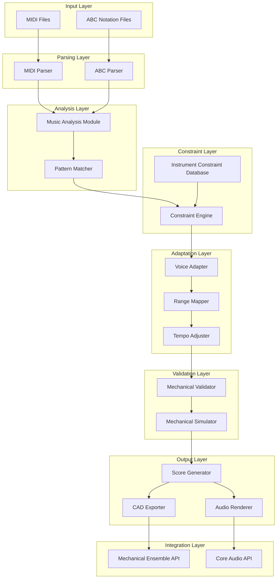

# Renaissance Music Adapter Architecture for Leonardo's Mechanical Ensemble

## System Overview

The Renaissance Music Adapter is a specialized system that adapts existing Renaissance music (from MIDI and ABC notation files) to be playable on Leonardo's mechanical instruments. Rather than generating new music, it preserves the beauty of historical compositions while adapting them to work within the mechanical constraints of the ensemble.

### High-Level Architecture



## Core Modules

### 1. Music Input Module
- **MIDI Parser**: Processes MIDI files to extract note sequences, timing, and voice information
- **ABC Parser**: Parses ABC notation files (common for Renaissance/folk music)
- **Format Normalizer**: Converts different input formats to a unified internal representation

### 2. Historical Music Analysis Module
- **Style Analyzer**: Identifies Renaissance musical characteristics (modes, cadences, forms)
- **Structure Analyzer**: Detects musical forms (dance forms, isorhythmic patterns, binary/ternary forms)
- **Voice Leading Analyzer**: Analyzes harmonic relationships and voice movement

### 3. Instrument Constraint Database
- **Mechanical Limits**: Stores pitch ranges, voice limits, and timing constraints for each instrument
- **Timbral Characteristics**: Documents sound qualities and suitable musical roles
- **Interaction Rules**: Defines how instruments can effectively combine

### 4. Constraint Engine
- **Range Validator**: Ensures notes fall within instrument pitch capabilities
- **Voice Limit Enforcer**: Restricts polyphony to mechanical limits (typically 3 voices)
- **Timing Constraint Checker**: Validates rhythm patterns against mechanical timing capabilities

### 5. Pattern Library
- **Renaissance Patterns**: Stores authentic musical figures appropriate for the period
- **Dance Patterns**: Includes basse danse, pavana, galliard rhythm patterns
- **Ornamentation Library**: Contains period-appropriate decorative figures

### 6. Adaptation Engine
- **Voice Adapter**: Reduces voice count while preserving musical essence
- **Range Mapper**: Transposes and adjusts melodies to fit instrument ranges
- **Harmonic Simplifier**: Maintains harmonic integrity while reducing complexity
- **Rhythm Adapter**: Adjusts rhythms to match mechanical timing capabilities

### 7. Validation System
- **Mechanical Feasibility Checker**: Verifies that adapted music can be played mechanically
- **Musical Integrity Validator**: Ensures adaptations preserve Renaissance character
- **Simulation Engine**: Tests adaptations against mechanical instrument models

### 8. Integration Layer
- **Mechanical Ensemble API**: Connects with existing mechanical_ensemble.py
- **Audio Rendering Pipeline**: Integrates with core/audio.py for sound generation
- **CAD Visualization**: Links with CAD components for mechanical visualization

## Data Structures

### Musical Representation
```python
@dataclass
class MusicalNote:
    pitch: int  # MIDI pitch number
    velocity: int  # Note velocity (0-127)
    start_time: float  # Start time in seconds
    duration: float  # Duration in seconds
    voice: int  # Voice/part number

@dataclass
class MusicalScore:
    notes: List[MusicalNote]
    tempo: float  # BPM
    time_signature: Tuple[int, int]  # (numerator, denominator)
    key_signature: int  # Number of sharps/flats
    title: str
    composer: str
    era: str  # "Renaissance"
    form: str  # "dance", "isorhythmic", etc.
```

### Instrument Constraints
```python
@dataclass
class InstrumentConstraints:
    slug: str  # Instrument identifier
    pitch_range: Tuple[int, int]  # Min/max MIDI pitch
    max_voices: int  # Maximum simultaneous notes
    min_duration: float  # Shortest playable note
    max_duration: float  # Longest sustainable note
    suitable_roles: List[str]  # "melody", "harmony", "bass", "rhythm"
    tempo_range: Tuple[float, float]  # Min/max BPM
    transition_time: float  # Time between notes
    noise_characteristics: Dict[str, float]  # Timing noise, pitch noise
```

### Adaptation Configuration
```python
@dataclass
class AdaptationConfig:
    preserve_melody: bool = True
    preserve_harmony: bool = True
    preserve_rhythm: bool = False  # Often needs adaptation
    preserve_form: bool = True
    max_voice_reduction: int = 1  # Maximum voices to remove
    transposition_allowed: bool = True
    ornamentation_level: str = "moderate"  # "minimal", "moderate", "full"
```

## File Structure

```
src/davinci_codex/music_adapter/
├── __init__.py
├── core/
│   ├── __init__.py
│   ├── models.py           # Data structures
│   ├── midi_parser.py      # MIDI file parsing
│   ├── abc_parser.py       # ABC notation parsing
│   └── score_normalizer.py # Format unification
├── analysis/
│   ├── __init__.py
│   ├── style_analyzer.py   # Renaissance style detection
│   ├── structure_analyzer.py # Musical form analysis
│   └── voice_analyzer.py   # Voice leading analysis
├── constraints/
│   ├── __init__.py
│   ├── instrument_db.py    # Instrument constraint database
│   ├── constraint_engine.py # Constraint enforcement
│   └── pattern_library.py  # Renaissance musical patterns
├── adaptation/
│   ├── __init__.py
│   ├── voice_adapter.py    # Voice reduction
│   ├── range_mapper.py     # Pitch range adaptation
│   ├── harmonic_simplifier.py # Harmony reduction
│   └── rhythm_adapter.py   # Rhythm adjustment
├── validation/
│   ├── __init__.py
│   ├── mechanical_validator.py # Mechanical feasibility
│   ├── musical_validator.py   # Musical integrity
│   └── simulator.py           # Mechanical simulation
├── integration/
│   ├── __init__.py
│   ├── ensemble_interface.py  # Mechanical Ensemble API
│   ├── audio_interface.py     # Audio rendering
│   └── cad_interface.py       # CAD visualization
└── cli.py                     # Command-line interface

tests/
├── test_midi_parser.py
├── test_abc_parser.py
├── test_style_analyzer.py
├── test_constraint_engine.py
├── test_adaptation_engine.py
├── test_validator.py
└── test_integration.py

data/
├── renaissance_patterns/     # Pattern library data
│   ├── dance_patterns.yaml
│   ├── cadence_patterns.yaml
│   └── ornamentation_patterns.yaml
├── instrument_constraints/    # Instrument constraint data
│   ├── mechanical_drum.yaml
│   ├── mechanical_organ.yaml
│   ├── mechanical_trumpeter.yaml
│   ├── mechanical_carillon.yaml
│   ├── viola_organista.yaml
│   └── programmable_flute.yaml
└── sample_music/             # Sample Renaissance pieces
    ├── midi/
    └── abc/
```

## Implementation Roadmap

### Phase 1: Foundation (Core Parsing and Analysis)
1. Implement basic MIDI parser
2. Implement basic ABC notation parser
3. Create core data structures
4. Build basic music analysis module
5. Create instrument constraint database

### Phase 2: Constraint System
1. Implement constraint engine
2. Create pattern library with basic Renaissance patterns
3. Build validation system
4. Test with simple mechanical constraints

### Phase 3: Adaptation Engine
1. Implement voice adapter for reducing polyphony
2. Create range mapper for pitch adaptation
3. Build rhythm adapter for mechanical timing
4. Implement harmonic simplifier
5. Test adaptation with sample pieces

### Phase 4: Integration and Validation
1. Integrate with existing Mechanical Ensemble code
2. Connect to audio rendering pipeline
3. Implement CAD visualization links
4. Build comprehensive test suite
5. Create CLI interface

### Phase 5: Refinement and Optimization
1. Add more sophisticated Renaissance patterns
2. Improve adaptation algorithms
3. Optimize performance
4. Add comprehensive documentation
5. Create example demonstrations

## Integration Points

### With Mechanical Ensemble (mechanical_ensemble.py)
- Extend the `_extract_events` function to handle adapted scores
- Add new `adapt_music` function to the ensemble module
- Connect to existing simulation and CAD generation pipelines

### With Audio System (core/audio.py)
- Extend `render_score_to_wav` to handle adapted scores
- Add instrument-specific sound profiles
- Implement realistic mechanical timing variations

### With CAD Visualization
- Generate visual representations of adapted music
- Create animations of mechanical performances
- Export timing profiles for mechanical synchronization

## Key Design Principles

1. **Preservation over Generation**: Maintain the integrity of Renaissance compositions
2. **Constraint-Driven Design**: Embrace mechanical limitations as creative constraints
3. **Modular Architecture**: Enable independent development and testing of components
4. **Extensibility**: Allow for adding new instruments, patterns, and adaptation strategies
5. **Historical Authenticity**: Respect Renaissance musical conventions and practices

This architecture provides a comprehensive framework for adapting beautiful Renaissance music to work with Leonardo's mechanical instruments, preserving historical artistry while embracing the unique character of mechanical performance.